# 조각 B — 방 규모 GLB 무대 호환 실험 (2026-09-23)

> 발단: 기억마다 "방"을 생성기(Higgsfield 3D Jutsu / World Labs Marble)로 만들어 무대에 심는 안. 무대는 Three.js r128 전역 빌드(지형 셰이더·안개 벽·마네킹·FBX 로더가 한 묶음)라 스플랫 렌더러는 못 들어오고, **GLB 경로만** 검증했다. 저장소에는 사물 GLB(상징 사물 1.725 m 규격)만 있고 방 규모 표본은 없어서 공개 표본 3종 + 페이지 안에서 만든 합성 방 1종으로 대신했다.
> 선례 형식: `docs/생애전승_T2_유령표현비교-260922.md`. **본 코드 0줄 수정 · 서버 0 · 저장 0.** 신규 파일은 `test/` 와 `docs/` 아래에만.
> 판정은 사용자 몫이다. 이 문서는 관찰과 수치만 적고 "읽힌다/안 읽힌다"를 단정하지 않는다.

---

## 0. 결과 한 줄

실험 페이지 `test/glb-room-test.html` 하나로 GLB 표본 4종(디오라마·램프·도시·합성 방)을 r128 무대 잠금값(배경·안개·조명 3종·유령 재질) 안에 넣어 시점 3종(밖·입구·안)으로 캡처했다 — 4종 모두 로드됨, 콘솔 오류 0, 표본별 새 경고 0. 자동으로 걸리는 손질은 셋: 단위 맞춤(cm 파일은 8 m 로), 내장 조명 감쇠(최대 세기를 2 로), 내부 유무 판정(5방향 광선). 무대 안개 0.045 는 방 규모에서 사실상 0 이라는 것이 수식과 캡처 양쪽에서 확인됐고, 방 안의 가림 수단(안개 vs 어둠+국소 조명)은 §6 의 사용자 판정으로 넘긴다.

---

## 1. 무엇을 만들었나

| 항목 | 내용 |
|---|---|
| 파일 | `test/glb-room-test.html` (신규 1개). 선례 `test/life-t2-test.html`(조절판 틀·조명 상수·훅 형식) + `test/ghost-mannequin-test.html`(FBX 로더·유령 재질) + `js/ui/lumen_scene_mannequins.js` 의 사물 몸 bbox 맞춤·발바닥 보정 방식을 방에 그대로 적용 |
| 표본 | `test/assets_glb/` — `LittlestTokyo.glb`(3.94 MB) · `LightsPunctualLamp.glb`(4.14 MB) · `VC.glb`(2.94 MB) + 페이지 안에서 GLTFExporter 로 만들어 다시 읽는 **합성 방**(59,036 bytes). 출처·라이선스·재다운로드 명령은 `test/assets_glb/README-출처.md` |
| 여는 법 | 저장소 루트에서 `npx vite --port 5173 --strictPort --host 127.0.0.1` → `http://127.0.0.1:5173/test/glb-room-test.html` (유령 `/test/ybot.fbx` 로컬, three.js r128 + DRACOLoader + MeshoptDecoder 는 jsdelivr 전역 빌드) |
| 화면 | 방(GLB) 바닥 y=0 · 중심 x/z=0 자동 정렬 · 유령(ybot 1.8 m) 자리 4종 · 카메라 프리셋 4종(밖·입구·안·크기 비교) · 상단 안내문 + 하단 상태줄(메시·삼각형·텍스처·내장 조명·확장·로드 시간·경고 증가분·단위 판별·내부 판정) |
| 조절판 | 표본 4칩 · 시점 4칩 · 배율 슬라이더(0.05~4) · 단위 강제(자동/그대로/8 m 맞춤) · 안개 밀도(0~0.30) · 유령 켜기/자리 · 무대 조명 켜기 · 내장 조명 켜기/배율(0.01~3) · sRGB·물리 조명 비교 체크 · 안내문/상태줄 숨기기 |
| 자동화 훅 | `window.__b1 = { ready, load(url), setSample(key), setView(v, {instant}), view(), setScale, setUnits, setFog, setGhost, setGhostAt, setStageLights, setGlbLights, setGlbLightGain, setPhysLights, setPanel, setHud, stats(), warnings(), settled() }`. `stats()` 가 캡처 수치의 정본(카메라 위치·내부 판정·조명 감쇠·안개까지). **캡처는 `ready` 만 믿지 말고 `settled()` 까지 기다린다** — 첫 표본 로드가 실패해도 `ready` 는 참이 된다 |
| 캡처 | playwright(저장소 devDependency, 헤드리스 SwiftShader) 스크립트 — 스크랩패드에 두고 `test/` 엔 남기지 않음. 23장 + 수치 기록 `docs/GLB방_스크린샷/_report.json`. 콘솔: pageerror 0 · console.error 0 · requestfailed 0 |

**표본 4종이 각각 대신하는 것** — Tokyo = "방 규모·사물 여러 개·압축(Draco)" 대역. 램프 = "GLB 안에 조명이 실려 온다"(점광 5개, 1.5~180 cd) + 투과 재질. VC = "사물 군집"(THREE.Mesh 167 / 텍스처 28) + 확장 0. 합성 방 = 진짜 실내 표본이 없어서 r128 GLTFExporter 로 벽 3·바닥·사물 6·점광 2·캔버스 텍스처 1 을 GLB 로 내보내고 GLTFLoader 로 다시 읽는 **왕복** — "내장 조명·텍스처·재질이 GLB 왕복을 견디는가"만 본다.

## 2. 잠금값과 규칙 (수식·매핑·출처)

| 값 | 수치 | 출처 |
|---|---|---|
| 배경 / 안개 | 0x0b0b12 / FogExp2 0x12121a 밀도 0.045 (슬라이더 0~0.30) | `tem_af_strata_terrain.js` (life-t2-test 와 동일) |
| 조명 ambient/key/fill | 0x1a1828 1.3 / 0xc4a882 0.7 / 0x3a4a80 0.3 | 동상 |
| 렌더러 | outputEncoding Linear · toneMapping 없음 · physicallyCorrectLights 꺼짐 (무대와 같음). sRGB·물리 조명은 비교용 체크만 | play-test 무대 |
| 유령 | `test/ybot.fbx` → 항상 `scale = 1.8 / bbox.y` 로 1.80 m · 재질 grey 128 · opacity 0.7 · Additive · DoubleSide · depthWrite=false | `ghost-mannequin-test` / `lumen_scene_mannequins.js` DEFAULTS |
| 유령 자리 | 방 옆 (max.x+0.9, max.z−0.4) / 입구 (0, max.z+0.3) / 방 안 (중심 z+0.6) / **같은 깊이 옆** (max.x+0.6, c.z) | 같은 깊이 옆 = 검토 반영(원근 편향 0) |
| 배치 순서 | 로드 → bbox → 스케일 → 바닥 min.y 를 0 으로 → 가운데 x/z 를 원점으로 | `lumen_scene_mannequins.js` 사물 몸 보정과 같은 순서 |
| 단위 자동 판별 | 가장 긴 **가로변(x/z)** 이 0.5~60 이면 미터로 보고 ×1, 아니면 `fit = 8 / longest`. 배율 슬라이더는 그 위에 곱 | 실측: Tokyo z=552.04 → ×0.0145 · VC z=169.13 → ×0.0473 · 램프 1.13 m → ×1 · 합성 6 m → ×1 |
| 내장 조명 자동 감쇠 | 파일 안 최대 세기 > 4 이면 `gain = 2 / max` (목표 2). 배율 슬라이더(기본 1)는 그 위에 곱 → 배율 5 = 옛 목표 10 재현 | 첫 회차 목표 10 은 램프 갓·유령·합성 방 벽이 순백 클리핑(b1-20 대조). 램프 180 cd → ×0.0111, 합성 12 → ×0.1667 |
| 카메라 밖 | pos (c.x+maxDim·0.75, max(sz.y·0.9, 2.2), max.z+**max(maxDim·0.95, 4.0)**) → tgt (c.x, sz.y·0.35, c.z) | 하한 4 m = 검토 반영(작은 표본도 전신+주변) |
| 카메라 입구 | pos (c.x, 1.6, max.z+max(1.2, sz.z·0.15)) → tgt (c.x, 1.28, c.z) | 눈높이 1.6 m |
| 카메라 안 | pos (c.x, eye, door.z − **max(2.5, sz.z·0.5)**) → tgt (c.x − sz.x·0.3, eye·0.8, min.z), eye = min(1.6, max(0.3, sz.y·0.6)) | 이동 폭 보장 + 타깃 뒷벽 좌측 1/3 = T2 교훈 "회전보다 이동" |
| 카메라 크기 비교 | pos (c.x+0.3, 1.0, c.z+max(6, maxDim·3)) → tgt (c.x+0.3, 0.95, c.z), fov 25 (다른 프리셋 42) | 같은 깊이·좁은 렌즈 = 원근 편향 0 |
| 전환 | 지수 접근 `k = 1 − exp(−dt/(2.5/3))` (시간상수 0.83 s) — **2.5 s 에 95 % 도달**, 완전 정지(`settled`, 잔여 < 1 cm)는 약 5~6 s. 끌면 그 자리에서 멈춤 | 작가 결 "느리고 넓고 무겁게". 헤드리스는 dt 상한 0.1 때문에 더 김(램프 4.3~5.0 s · 합성 4.8~5.5 s · Tokyo 13~15 s) |
| 내부 판정 | 안 카메라 자리에서 ±x·±z·−y 5방향 Raycaster(잠시 DoubleSide 로 바꿔 쏘고 복원). 5 뒷면 → "내부 없음(벽 속)" / 앞면 ≥ 3 → "내부 있음" / 그 외 "열림" | 검토 반영. 상태줄 배지 + `stats().interior` |
| 안개 가림률 | `1 − exp(−(d·dist)²)` → 0.045 는 6 m 에서 7 %, 8 m 에서 12 %. 0.15 는 6 m 에서 55 %. 0.25 는 6 m 에서 89 % | FogExp2 정의 |
| 경고 계수 | console.warn/error 를 감싸 페이지 누적 + 로드별 증가분(warnNew/errorNew) | 유령 FBX 고정 경고 2(ShininessExponent·스킨 가중치 4 초과)는 GLB 무관 |
| 결정론 | 페이지 로직에 난수 없음(합성 방 배치 상수표). `performance.now()` 는 로드 시간 계측에만 | — |

**r128 GLTFLoader 확장 표** (jsdelivr `examples/js/loaders/GLTFLoader.js` 소스 실독, 검토에서 재확인):

| 확장 | r128 | 비고 |
|---|---|---|
| KHR_draco_mesh_compression | ○ | DRACOLoader + `setDRACOLoader`(대문자 — 첫 시도 오류 1건) |
| KHR_texture_basisu (KTX2) | △ | 코드는 있으나 `setKTX2Loader` 필수인데 r128 `examples/js` 에 KTX2Loader 없음(404). 전역 빌드 무대에선 사실상 불가 → 생성기가 KTX2 를 내보내면 PNG/JPG 재변환 전제 |
| pbrSpecularGlossiness · clearcoat · transmission · unlit | ○ | 램프에서 transmission 실측 |
| ior · sheen · specular · volume | ✕ | r129~131 추가. 있으면 무시되고 기본 PBR |
| KHR_lights_punctual | ○ | decay 2 · range→distance · 세기 파일 값 그대로(→ 감쇠 규칙 필요) |
| KHR_mesh_quantization · KHR_texture_transform · EXT_texture_webp | ○ | texture_transform 은 합성 방에서 실측 |
| EXT_meshopt_compression | ○ | `meshopt_decoder.js` 전역 MeshoptDecoder 0.14 연결 |
| MSFT_texture_dds | ✕ | throw |

**생성기 내보내기 (공개 문서 기준, 260923)** — Higgsfield 3D Jutsu: "animated MP4, a static frame, or a GLB file"; 조명 3종(sun/point/spot) 편집 가능하나 GLB 에 실리는지 **미확인**; 압축·텍스처 형식 **미확인**. Marble(World Labs): 스플랫 SPZ/PLY(약 2M, 저해상 500k) + 메시 GLB 3종 — 충돌용 10~20만 삼각형 3~4 MB / 고품질 텍스처 약 60만 / 고품질 정점색 약 100만(100~200 MB, 최대 1시간, 시간당 4회, 소유 월드만); 좌표계 OpenCV → Y·Z 에 −1; 압축 형식 **미확인**.

## 3. 실측 표

로드 시간은 헤드리스 SwiftShader 기준(회차마다 흔들림, 범위로 적음). "메시" = THREE.Mesh(= glTF primitive) 수. VC 는 glTF mesh 135 / primitive 167 이라 두 수가 모두 문서에 돌아다니는데 이 표는 167.

| 표본 | 크기 | 로드 | 메시 / 삼각형 / 텍스처 | 내장 조명 | 확장 | 경고(새) | 단위 판별 → 무대 크기 | 조명 감쇠 | 내부 판정 | 뜨는가 · 손질 |
|---|---|---|---|---|---|---|---|---|---|---|
| LittlestTokyo | 3.94 MB | 0.9~3.2 s | 71 / 141,802 / 4 | 0 | Draco(**필수**) | 0 | z 552 → ×0.0145 → 7.90×6.29×8.00 m | — | **내부 없음(벽 속)** (5 뒷면, +x 0.13 m) | 뜬다. 텍스처·트램 애니 정상. 안 시점은 건물 메시 속 |
| LightsPunctualLamp | 4.14 MB | 0.4~2.6 s | 3 / 6,000 / 7 | 5 (1.5~180 cd) | transmission + lights_punctual | 0 | 1.13 m → ×1 → 1.13×**1.864**×0.72 m | 180 → ×0.0111 (목표 2) | 열림(5 빈) | 뜬다. 투과 갓·금속 반사. 목표 10 이면 갓·유령 순백 클리핑(b1-20) |
| VC | 2.94 MB | 0.4~0.9 s | 167 / 8,383 / 28 | 0 | (없음) | 0 | z 169 → ×0.0473 → 7.87×4.64×8.00 m | — | 내부 있음(하늘 상자 5 앞면) | 뜬다. 방이 아니라 하늘 상자 + 미니 도시 |
| 합성 방(왕복) | 59,036 B | 1.4~1.8 s | 10 / 1,628 / 1 | 2 (세기 12) | texture_transform + lights_punctual (Exporter 가 붙임) | 0 | 6 m → ×1 → 6.00×2.80×6.00 m | 12 → ×0.1667 (목표 2) | 내부 있음(앞면 4, +z 빈 = 앞 벽 없음) | 왕복 성공 — 벽·사물·체크 바닥(반복 유지)·점광 2 그대로 |

유령 기준자: `ghostHeightM` 1.800 · `ghostScale` 0.0102 (ybot cm 단위). 램프 bboxStage y = 1.864 → 차 0.064 m. 크기 비교 컷(b1-12, 같은 깊이·fov 25·카메라 6 m)에서 이 차는 화면 약 15 px.

페이지 전체 경고 최종값 `warnings()` = {warn 2, error 0} — 둘 다 유령 FBX 고정 경고. 헤드리스 캡처 중 "GPU stall due to ReadPixels" 드라이버 성능 알림 4건은 스크린샷 자체가 원인, 페이지 로직 무관.

## 4. 캡처 표

폴더 `docs/GLB방_스크린샷/` (1280×800, 헤드리스 SwiftShader — 실제 GPU 화면과 밝기·안티앨리어싱이 다를 수 있음, T2 문서와 같은 주의). **전량 안내문·상태줄 없이(`setHud(false)`) 촬영**했고 수치는 `_report.json` 에 따로 있다. 아래 "관찰"은 캡처를 눈으로 직접 본 기록이다.

### 4.1 표본 4종 × 시점 3종 (안개 0.045 · 내장 조명 목표 2 · 유령 방 옆)

| 표본 | 밖 | 입구 | 안 |
|---|---|---|---|
| Tokyo | 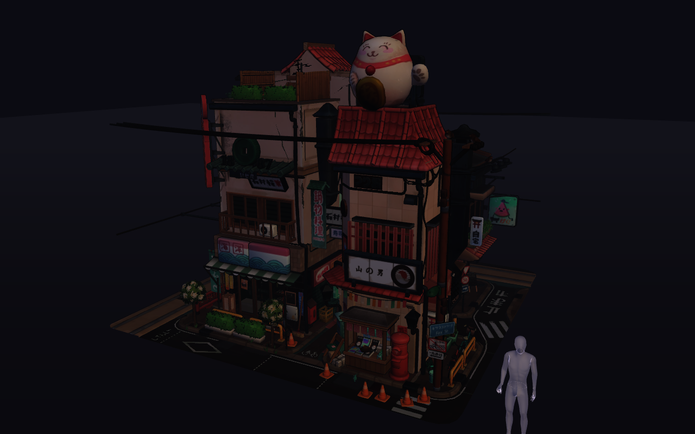 | 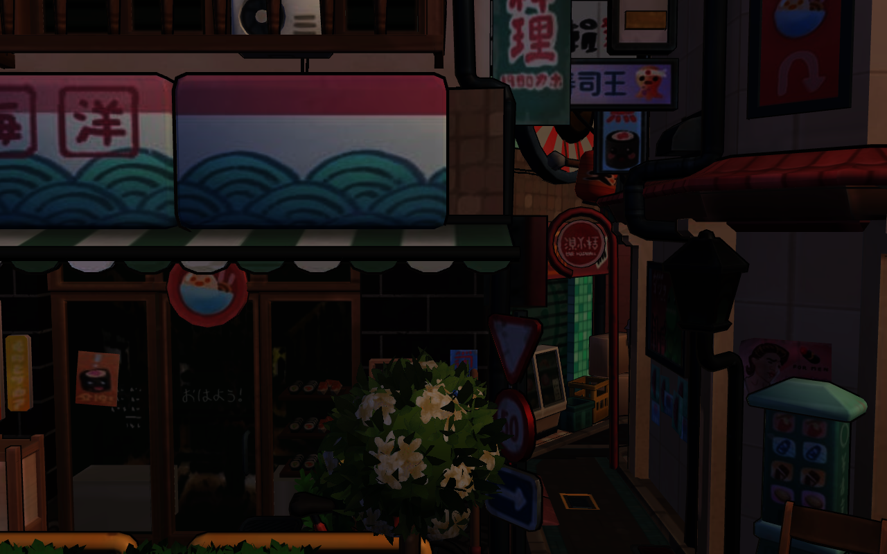 | 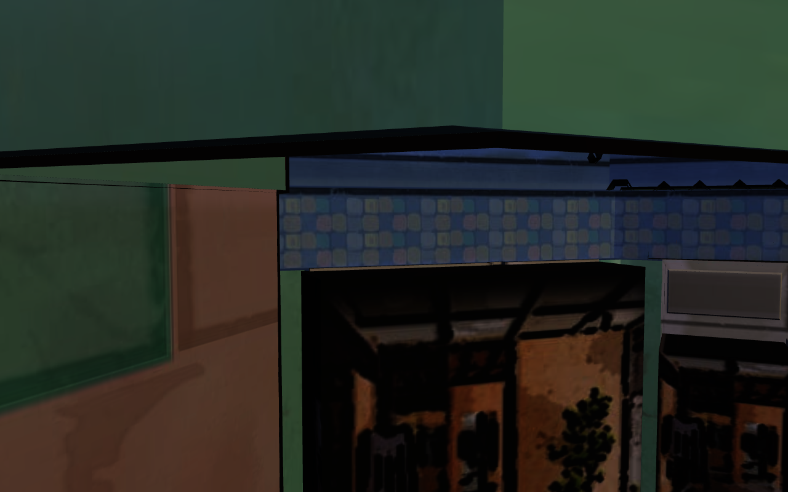 |
| 램프 | 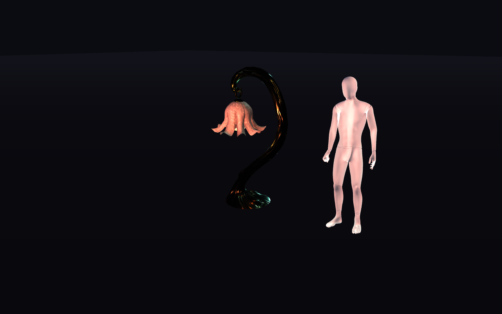 | 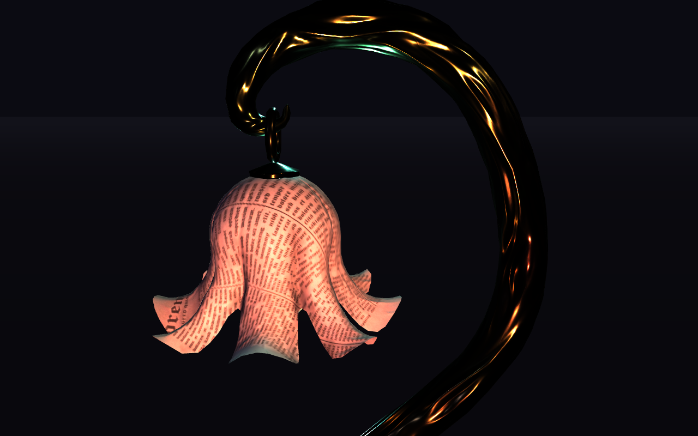 | 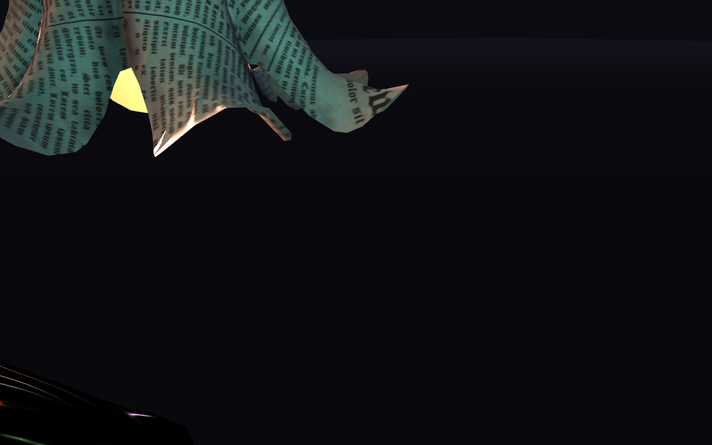 |
| VC | 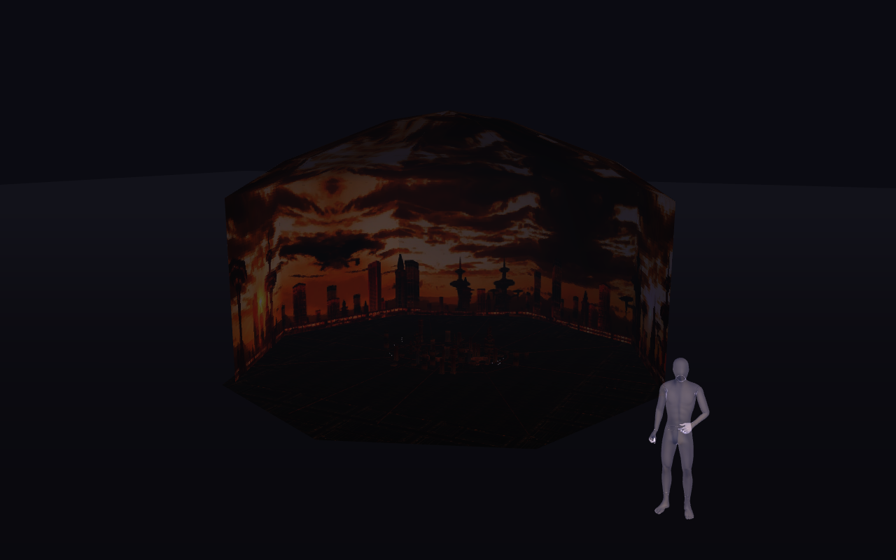 | 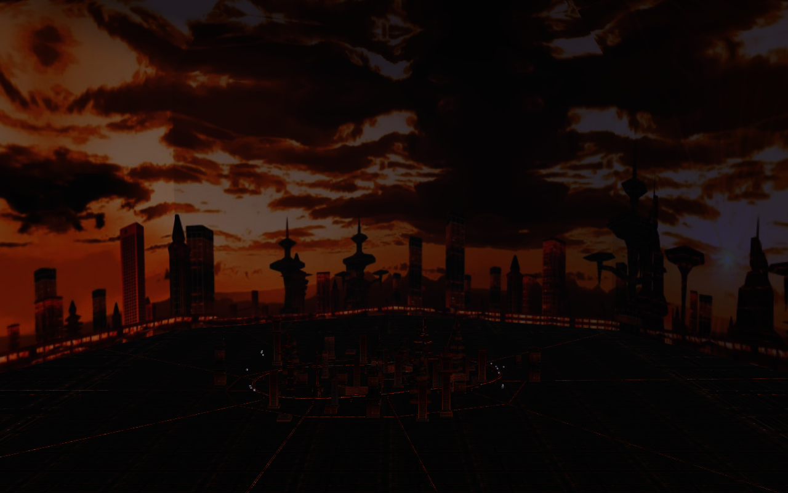 | 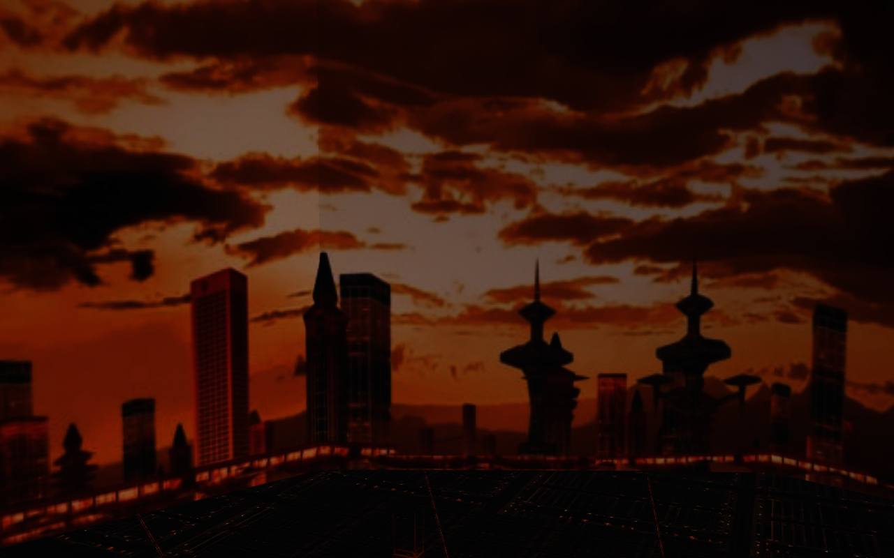 |
| 합성 방 | 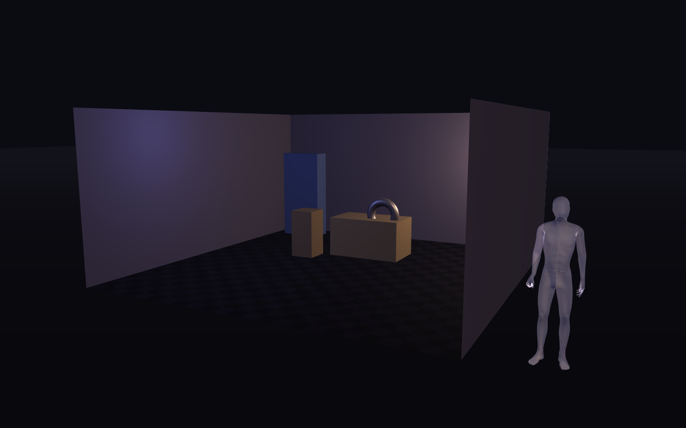 | 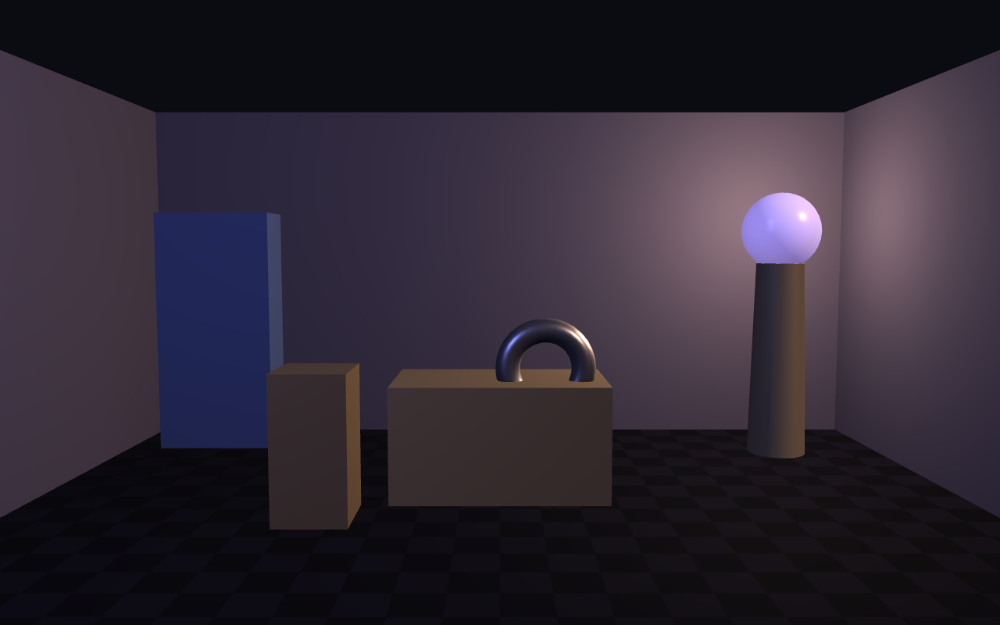 | 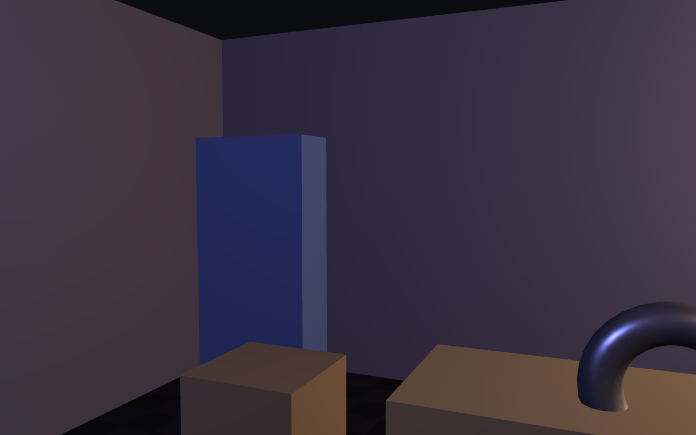 |

| 컷 | 카메라 (pos → tgt) | 관찰 |
|---|---|---|
| b1-00 Tokyo 밖 | (6, 5.66, 11.6) → (0, 2.2, 0) | 3층 디오라마 전체가 프레임 안. 마네키네코·붉은 기와·간판·화분·콘·도로선 색 살아 있음. 오른쪽 아래 유령 1.8 m 가 건물(6.3 m) 옆에서 규모 비교 됨. 안개로 먼 바닥이 검게 잠김. 깨짐 없음 |
| b1-01 Tokyo 입구 | (0, 1.6, 5.2) → (0, 1.28, 0) | 눈높이에서 골목 초입 — 왼쪽 가게 차양·"海洋" 간판·흰 꽃 화분·표지판·자판기·포스터가 사람 크기로. 골목 끝까지 선명(안개 흔적 없음). 유령 프레임 밖 |
| b1-02 Tokyo 안 | (0, 1.6, 1.2) → (−2.37, 1.28, −4) | 첫 회차(목표 10·옛 프리셋)에선 전면 검정이었으나 이번 자리에선 초록 벽면·파란 타일 처마·가게 안쪽이 아주 가까이 크게 보임 — 카메라가 건물 메시 안팎 경계에 걸려 있음. 내부 판정 배지 "내부 없음(벽 속)" 과 일치(+x 0.13 m 에 뒷면). 디오라마는 실내가 없으므로 안 시점은 무의미 → **방 GLB 는 실내가 모델링돼 있어야 한다** |
| b1-03 램프 밖 | (3.16, 2.2, 4.36) → (0, 0.65, 0) | 하한 4 m 덕에 램프 전신 + 유령 전신 + 바닥 지평선이 한 프레임. 갓의 인쇄물 텍스처 읽힘(목표 2). 유령은 램프 점광을 가까이 받아 옅은 분홍빛 — Tokyo/VC 컷의 회색 반투명과 결이 다름 |
| b1-04 램프 입구 | (0, 1.6, 1.56) → (0, 1.28, 0) | 갓 클로즈업, 줄기가 오른쪽 위로 휘어 올라감. 갓 표면 활자 텍스처와 금속 줄기 반사(노랑·청록) 선명. 밖(b1-03)과 자막 없이 구분됨 |
| b1-05 램프 안 | (0, 1.12, −0.94) → (−0.34, 0.89, −0.36) | 카메라가 램프 뒤(z=−0.94)로 나가 갓 아랫면과 전구 노란 점만 왼쪽 위에 걸림, 나머지 검정. 안 = 입구 z − max(2.5, 0.36) 공식을 그대로 따른 결과. 램프는 방이 아니라 "열림" 배지. 작은 표본엔 안 시점이 뜻이 없음 |
| b1-06 VC 밖 | (6, 4.18, 11.6) → (0, 1.63, 0) | 주황 노을 하늘 텍스처가 발린 팔각 상자(8 m)에 뒷면이 컬링돼 안이 들여다보임, 바닥에 미니 도시. 오른쪽 아래 유령 회색 반투명. 방이 아니라 "하늘 상자 + 도시" |
| b1-07 VC 입구 | (0, 1.6, 5.2) → (0, 1.28, 0) | 상자 안 — 붉은 구름 하늘이 벽처럼 둘러싸고 초고층 실루엣, 발밑에 도시 격자(빨간 도로선). 왼쪽에 텍스처 이음새 세로 단차. 전체가 어둡고 붉음 |
| b1-08 VC 안 | (0, 1.6, 1.2) → (−2.36, 1.28, −4) | 4 m 전진 + 시선 좌측 — 하늘이 더 크게, 바닥 격자 도시가 프레임 아래쪽 1/3 로 넓어짐. 입구(b1-07)와 구도가 닮았다(둘을 나란히 놓으면 줌 차이로 읽힘). 오른쪽 아래 흰 점 몇 개 = 유령 손끝 |
| b1-09 합성 밖 | (4.5, 2.52, 8.7) → (0, 0.98, 0) | 벽 3면·체크 바닥·파란 장·상자 2·토러스가 왕복 후 그대로. 왼쪽 벽 보라, 뒷벽 오른쪽 노란 빛 웅덩이 = 점광 2 왕복 성공. 유령 회색 반투명이 오른쪽 벽(2.8 m) 옆에 서서 비율 비교. **스탠드 램프는 오른쪽 벽에 가려 이 컷엔 안 보임**(b1-10 에서 확인) |
| b1-10 합성 입구 | (0, 1.6, 4.2) → (0, 1.28, 0) | 입구 눈높이 — 파란 장·작은 상자·긴 상자 위 토러스·오른쪽 스탠드 램프(보라 구체 갓)가 사람 척도로. 오른쪽 벽이 연보라로 밝지만 목표 2 라 **순백 클리핑은 없음**(첫 회차 목표 10 에선 하얗게 탔음). 천장 없음(검정). 방 전체가 한 프레임에 다 드러남 |
| b1-11 합성 안 | (0, 1.6, 1.2) → (−1.8, 1.28, −3) | 3 m 전진 + 시선 좌측 1/3 — 파란 장이 화면 왼쪽 가운데로, 작은 상자·긴 상자 모서리와 토러스 반쪽이 전경. 입구와 확실히 다른 구도(사물 배치가 바뀜) |

### 4.2 유령 크기 비교 · 조명 대비 · 안개 대비

| 컷 | 조건 | 관찰 |
|---|---|---|
| 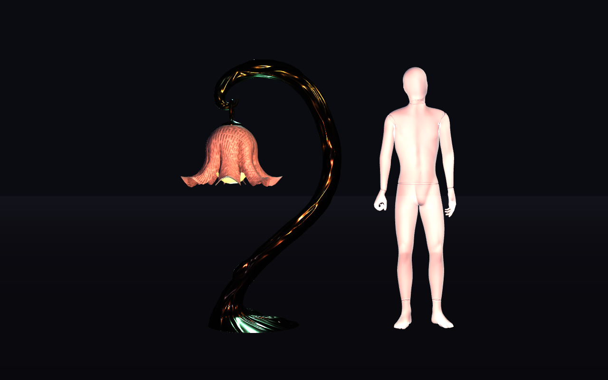 b1-12 | 램프 · 유령 **같은 깊이 옆**(x=1.16, z=0) · 카메라 (0.3, 1.0, 6) 정면 · fov 25 | 램프와 유령 전신이 모두 프레임 안, 발이 같은 지평선. 램프 줄기 꼭대기가 유령 정수리보다 약간(십수 px) 높음 — 수치(1.864 m 대 1.800 m)와 방향이 맞음. 유령은 램프 점광 영향으로 분홍빛 반투명. 첫 회차 컷(옆자리·원근 편향 18~25 %·줄기 잘림)은 폐기하고 이 조건으로 재촬영 |
| 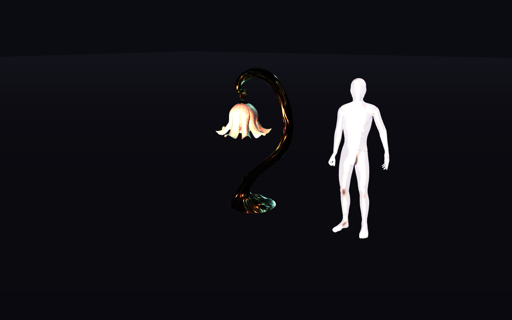 b1-20 | 램프 밖 · 내장 배율 5 = 옛 목표 10 | b1-03 과 같은 카메라. 갓이 순백으로 클리핑돼 활자 텍스처가 가장자리에만 남고, 유령도 순백 실루엣. **목표 10 = 탐 / 목표 2 = 텍스처 남음** 의 대조 근거 |
| 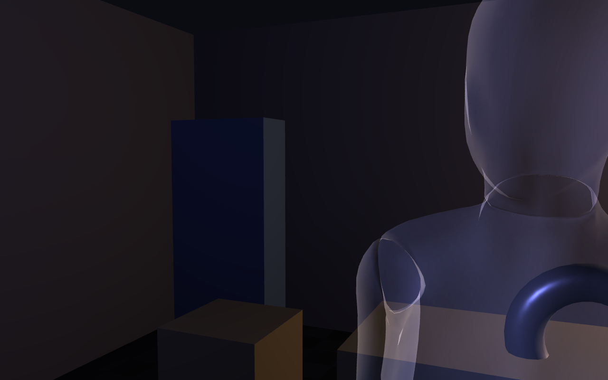 b1-13 | 합성 안 · 무대 조명 OFF · 내장 점광만(목표 2) · 유령 방 안 | 유령이 연보라 반투명으로 방 가운데 서서 토러스를 가리는데 뒤가 비침(Additive 정상). 방 밝기는 b1-11 과 거의 같음 → 이 방에선 내장 점광 2개가 조명을 지배(ambient 0x1a1828 은 미미) |
| 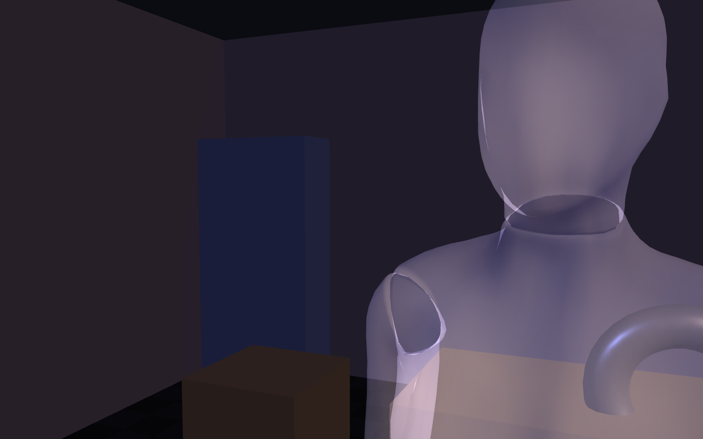 b1-14 | 합성 안 · 무대 조명만(내장 OFF) · 유령 방 안 | 방 전체가 무대 잠금값만으로 낮게 가라앉음 — 벽 탐 없음, 파란 장은 남색, 상자 갈색 톤. 유령이 배경보다 밝아 도드라짐. T2 무대와 같은 어두운 결 |
| 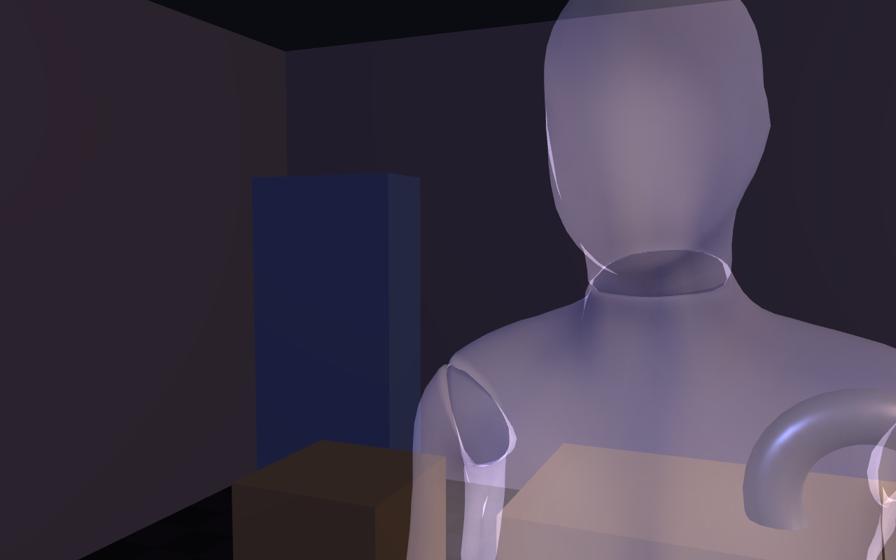 b1-15 | 합성 안 · 무대 + 내장 배율 0.15 (실효 세기 0.3) | b1-14 보다 오른쪽 벽이 조금 따뜻해지고 상자 노란 면이 살아남. 무대 톤 유지 + 국소 빛 웅덩이 |
| 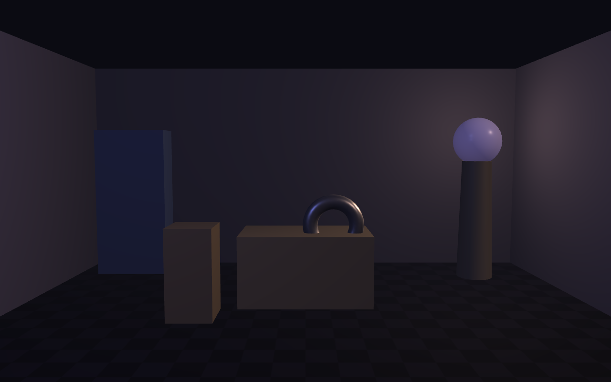 b1-16 | 합성 입구 · 안개 **0.15** (b1-10 과 비교) | 전체가 한 단 어두워지고 뒷벽(4.2 m)이 연보라에서 회보라로 가라앉음. 그러나 장·상자·토러스·램프 전부 여전히 보임 — 수식대로 4 m 에서 30 % 가림 |
| 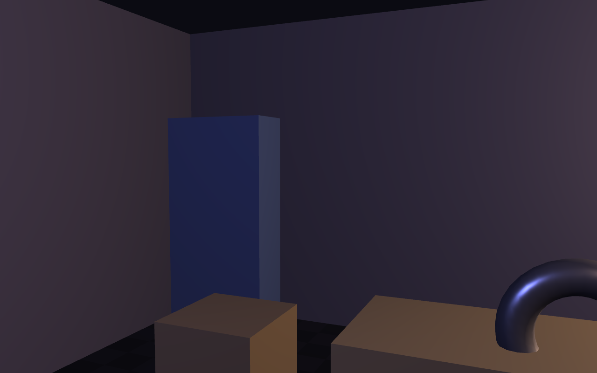 b1-17 | 합성 안 · 안개 0.15 (b1-11 과 비교) | b1-11 과 거의 같음(사물 1~3 m 라 4~18 % 가림). 안 시점에선 안개가 거의 안 먹힘 |
| 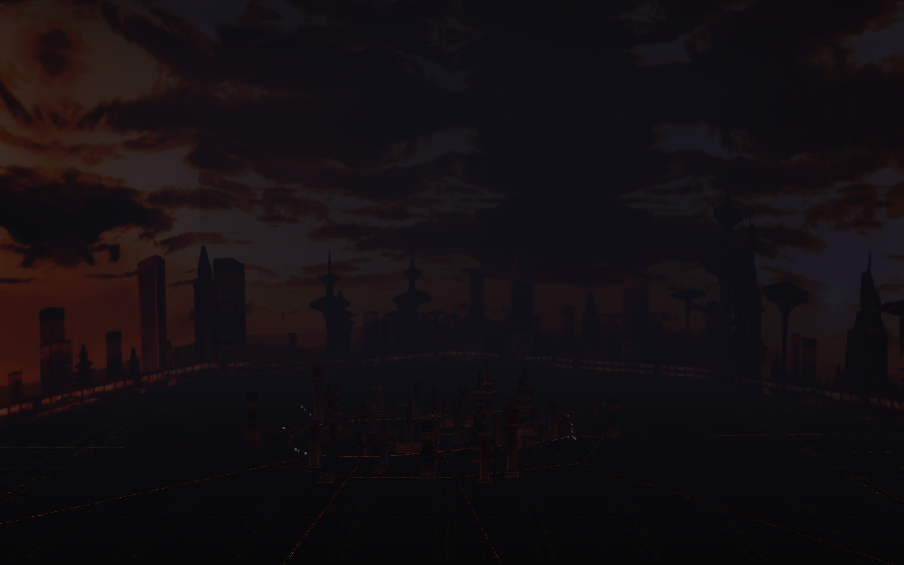 b1-18 | VC 입구 · 안개 0.15 (b1-07 과 비교) | 하늘 상자(3~5 m)가 검붉게 잠기고 미니 도시가 어둠에 묻힘. 안개 색(0x12121a)이 붉은 텍스처 위에 덮여 채도가 빠짐 |
| 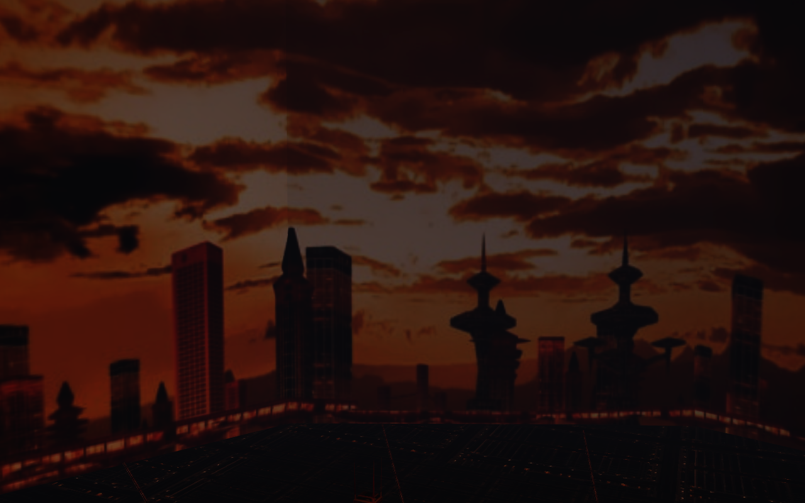 b1-19 | VC 안 · 안개 0.15 (b1-08 과 비교) | b1-08 보다 한 단 어둡지만 구도·실루엣은 그대로 |
| 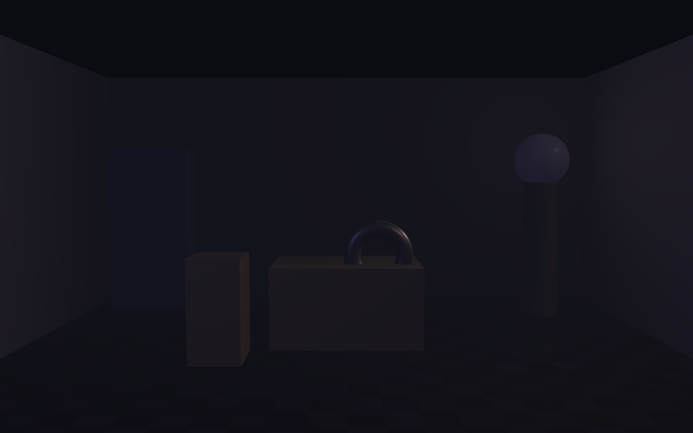 b1-21 | 합성 입구 · 안개 **0.25** | 뒷벽·파란 장이 거의 잠기고 상자·토러스·램프 구체 실루엣만 남음. 6 m 에서 89 %. "안개 속 감각"에 가장 가까운 컷이지만 방 톤이 무대 안개색으로 균일해짐 |
| 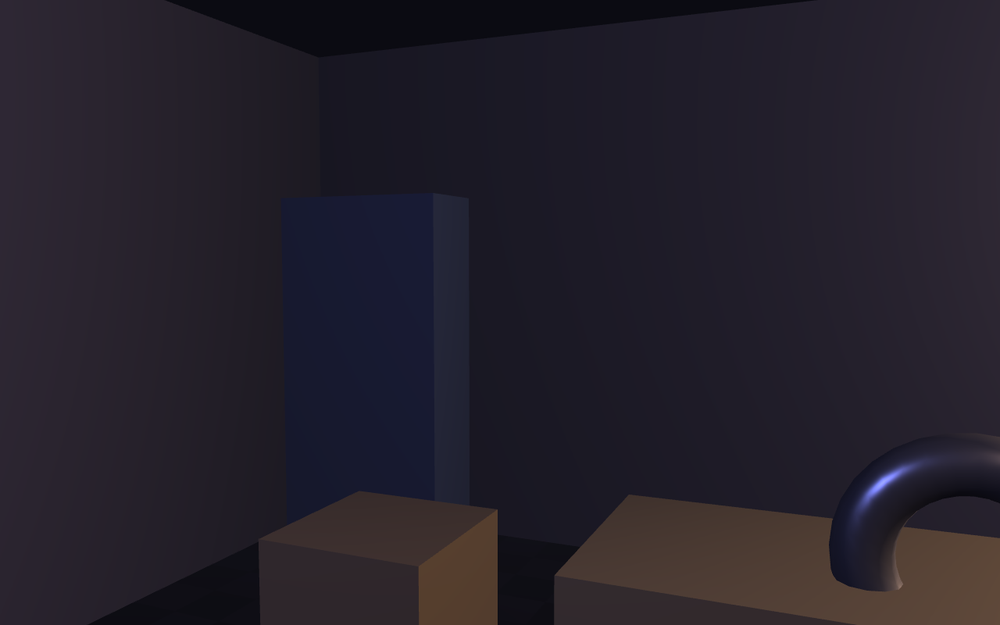 b1-22 | 합성 안 · 안개 0.25 | b1-11 보다 조금 어두워졌을 뿐 파란 장·상자·토러스 다 보임. 가까운 사물엔 0.25 도 약함 |

`_report.json` 에는 b1-00~b1-20 의 21건 수치가 있고 b1-21/22 는 안개값(0.25)만 다르고 나머지는 b1-10/11 과 같다(별도 항목 없음 — §7 참고).

## 5. 검토 결과 (3렌즈)

세 검토자(원칙·시각·수치)의 발견을 발견 → 수정 → 잔여 로 나눠 적는다. "pass" 는 검토자가 문제 없다고 본 것.

| # | 렌즈 | 발견 | 수정(이번 회차) | 잔여 |
|---|---|---|---|---|
| 1 | 원칙 | 표본 GLB 3개(11 MB)가 미추적 상태인데 `git add -A` 한 번이면 실림 — README 의 "커밋 금지"는 문장뿐 | `.git/info/exclude` 에 `test/assets_glb/*.glb` 한 줄(`.gitignore` 미수정). `git check-ignore` 로 3파일 매칭 확인. README 에 장치 설명 추가 | 클론엔 그 줄이 안 따라옴 → 커밋 전 `git status` 확인 절차를 README 에 명시 |
| 2 | 원칙 | "밖" 프리셋 = 전체 조감. 작가용 조절판이라 위반 아니지만 무대 이식 시 §6.5 #5(플레이어는 안개를 본다) 위반. 방 안 안개 0.045 는 6 m 에서 7 % 라 사실상 없음 — 원칙을 벽·문·조명으로 다시 정의해야 한다는 관찰 누락 | 머리 주석·조절판에 두 줄 명시. 안개 0.15/0.25 비교 컷 + 무대 조명만/배율 0.15 컷을 "방 규모 안개 대체안"으로 라벨 | **"밖 프리셋 = 작가 계측 전용, 무대 이식 금지"** — 이 문서가 정본. 대체안 선택은 §6 판정 |
| 3 | 원칙 | `relayout()` 이 `applyView(view, true)` 로 두 번째 인자를 넘기지만 받는 쪽은 인자 하나 → 배율·단위 바꿀 때마다 카메라 전환 재점화, 끌어서 잡은 자리 풀림 | — | **미수정.** 실험 페이지 조작감 문제. 배율 변경 시 `camGoal` 만 갱신하도록 한 줄 |
| 4 | 원칙 | 첫 표본 로드 실패해도 `ready` 가 true | — | **미수정.** 문서·머리 주석에 "`settled()` 대기 필수" 명시로 대신 |
| 5 | 원칙 | 유령 1.8 m 맞춤이 조건부(`sz.y > 10` 일 때만)인데 상태줄은 "1.80 m" 고정 문자열 | 항상 `1.8 / sz.y` 로 맞추고 상태줄·`stats()` 에 실측 `ghostHeightM` 기록 | — |
| 6 | 원칙 | `clearRoom()` 이 geometry 만 dispose, 재질·텍스처 누적. 머리 주석 `setDracoLoader` 오기 | 주석 `setDRACOLoader` 정정 | **재질·텍스처 dispose 미수정**(표본 반복 전환 시 GPU 메모리 누적, 실험 페이지라 치명 아님) |
| 7 | 원칙 | 결정론·본 코드 미수정·확장 표 — pass (난수 0건, 본 코드 diff 는 RECORD v4 뿐, 확장 표 소스와 1:1) | — | — |
| 8 | 시각 | 유령 크기 비교 컷이 원근 편향(옆자리 z 차 0.44 m → 18~25 % 크게) + 램프 꼭대기 잘림 + 유령이 갓 가림 → 비교 불성립 | 'scale' 프리셋(같은 깊이 옆 · 정면 · fov 25) 신설, b1-12 재촬영. 관찰 문구에서 "눈으로 일치" 제거, 수치(1.864 / 1.800)로 대체 | — |
| 9 | 시각 | 3시점이 4표본 중 2표본에서 자막 없이 구분 안 됨(램프 밖=입구 줌 차이뿐 · VC 입구=안 같은 구도), Tokyo 안은 검은 화면 | 밖 거리 하한 4 m · 안 = 입구 − max(2.5, 깊이/2) · 안 타깃 좌측 1/3 · 5방향 광선 내부 판정 배지 | 램프 밖/입구·합성 입구/안은 구분됨. **VC 입구/안은 재촬영 후에도 구도가 닮음**(하늘 상자라 어디서 봐도 하늘). Tokyo 안은 검정 대신 벽면 클로즈업 — 배지가 이유를 말해 줌 |
| 10 | 시각 | 내장 점광 자동 감쇠 목표 10 이 탄다 — 램프 갓·유령·합성 방 벽 순백 클리핑, 보고 "탐 없음"과 모순 | 목표 2 (`LIGHT_AUTO_MAX` 4). 램프 ×0.0111 · 합성 ×0.1667. b1-20 으로 대조 보존 | 램프 옆 유령은 목표 2 에서도 분홍빛(회색 아님) — 0.5~1 m 거리 점광 + Additive. 무대에서 유령이 GLB 조명 가까이 설 때 재질 보정 필요 여부는 미결 |
| 11 | 시각 | 1인칭 컷이 안개 원칙을 못 보여 줌 — 방 전체가 한 프레임에 노출 | 안개 상한 0.30, 0.15/0.25 비교 쌍 + 어둠 대체안 컷 | **판정 항목으로 이관**(§6 Q2) |
| 12 | 시각 | 상태줄·안내문이 스크린샷에 구워져 "자막 없이 읽히는가" 검증 불가 | `setHud(bool)` 훅, 23장 전량 HUD 없이 재촬영, 수치는 `_report.json` | — |
| 13 | 시각 | 유령이 입구·안 컷 대부분에서 프레임 밖 | 시점별 유령 자리 옵션(방 안·같은 깊이) 추가, b1-13~15 는 방 안 배치 | **기본 자리 자동 전환은 미구현** — 4.1 표의 입구·안 컷은 여전히 유령 프레임 밖(b1-08 손끝만). 캡처 시 `setGhostAt` 으로 직접 고름 |
| 14 | 시각 | 전환 코드는 "느리고 넓고 무겁게" 통과. 단 끌기 직후 프리셋 누르면 OrbitControls 관성과 지수 접근이 겹칠 수 있음(코드 읽기, 캡처 미확인) | — | **미수정·미검증.** `applyView` 진입 시 damping 끄고 도착 후 복구 한 줄 |
| 15 | 수치 | b1-12 첫 컷 관찰 "눈으로 일치" 불성립(#8 과 동일 지적, 독립 재현) | #8 과 같음 | — |
| 16 | 수치 | VC "메시" 수가 문서마다 다름(167 vs 135) — 167 = primitive(THREE.Mesh), 135 = glTF mesh | 이 문서 §3 에 기준 명시 | README·머리 주석은 "메시 135·재질 167" 그대로(기준을 적어 두었으니 모순 아님) |
| 17 | 수치 | "전환 2.5 초" 는 95 % 도달이고 `settled` 는 5~6 s. 헤드리스는 dt 상한 때문에 1.5배 | §2 에 두 값 병기 | — |
| 18 | 수치 | `setSample()`/`load()` 가 돌려주는 값은 로드 통계 일부뿐(bbox·단위·조명 감쇠 없음), 추월된 로드는 null | — | **미수정.** 전체 수치는 이어서 `stats()` 호출 — §1 훅 설명에 명시 |
| 19 | 수치 | 단위 실측 문구 "Tokyo 545 → ×0.014 / VC 166 → ×0.047" 은 짧은 변 기준 — 긴 변은 z 552 / 169 | §2·§3 정정(0.0145 / 0.0473, 긴 변 z) | — |
| 20 | 수치 | b1-09 관찰 "스탠드 램프까지 왕복 후 그대로" — 그 컷에선 오른쪽 벽이 가려 안 보임 | §4.1 관찰 정정(근거를 b1-10 으로 이동) | — |
| 21 | 수치 | 실측 전수 재현 — ready 3.4 s · 오류 0 · 표본 4종 warnNew 0 · 확장 표 소스 일치 · KTX2Loader 404 · b1-14/15 밝기 41→71 · b1-11/13 171 vs 165 → pass | — | — |

## 6. 사용자 판정 — 세 질문

캡처(또는 페이지를 직접 열어)를 보고 답한다. 헤드리스 밝기는 실제 화면과 다를 수 있으니 가능하면 페이지에서.

1. **방 GLB 가 무대 톤(어둡고 안개 낀 지형·회색 반투명 유령) 안에 "같은 세계"로 앉는가, "이물"로 앉는가?** — b1-09/10/11(합성 방, 목표 2) 과 T2 캡처를 나란히. 특히 램프 옆 유령의 분홍빛(b1-03/12)이 허용 범위인가.
2. **방 안에서 가림 수단은 무엇인가?** — (가) 안개 0.15~0.25 로 잠그기(b1-16/21: 방 톤이 안개색으로 균일해짐, 가까운 사물엔 약함) / (나) 어둠 + 국소 조명(b1-14/15: 무대 조명만 또는 내장 배율 0.1~0.2, 사물은 다 보이되 낮게 가라앉음) / (다) 벽·문 자체가 가림(방 구조로 해결, 안개·조명은 보조).
3. **생성기 방을 실제로 하나 받아 볼 것인가?** — Higgsfield GLB(조명·압축·텍스처 형식 미확인) 또는 Marble 충돌용 GLB(10~20만 삼각형, 좌표계 Y·Z 반전). 받아 보기 전엔 §7 의 "미확인" 세 항목이 안 풀린다.

| 답 | 다음 |
|---|---|
| 1 이물 | 무대 이식 보류. 재질 후처리(GLB 재질을 무대 팔레트로 되씌우기) 실험을 이 페이지에 한 슬라이더로 추가해 재캡처. 유령 재질 보정도 여기서 |
| 1 같은 세계 + 2 (가) | 안개 밀도를 방 진입 시 별도 값(0.15~0.25)으로 올리는 규칙이 무대 쪽에 필요 — 지형 안개 벽과 충돌 여부 조사(§7) |
| 1 같은 세계 + 2 (나) | 내장 조명 자동 감쇠 목표 2 + 무대 조명 우선을 규칙으로 고정. 무대 이식 시 방 안 ambient 를 별도로 낮추는 값 하나 추가 |
| 1 같은 세계 + 2 (다) | 생성기에 "문 있는 방·천장 있는 방" 프롬프트 조건이 붙음. 3번 답이 "예"여야 진행 가능 |
| 3 예 | 받은 GLB 를 `test/assets_glb/` 에 넣고 조절판 표본 드롭다운에 한 줄 추가 → 같은 절차로 12컷 + 내부 판정. 미확인 3항목 해소 |
| 3 아니오 | 이 실험은 여기서 동결. 합성 방이 "GLB 가 들어온다"의 증거로 남고, 방 생성은 사물 GLB 파이프라인(Tripo, `docs/사물앵커` 설계 §6)과 같은 뼈대로 가는 것만 기록 |

## 7. 알려진 한계 · 본 코드 수정이 필요한 항목

**한계 (이 실험 안에서)**
- **진짜 실내 방 공개 표본 미확보** — Khronos Sponza 는 분리형 60 MB 초과, ABeautifulGame 은 jsdelivr 403. 디오라마·램프·도시 + 합성 방 왕복으로 대체. "실내가 모델링된 GLB 가 무대 안 시점에서 어떻게 보이는가"는 합성 방 하나가 유일한 근거.
- **KTX2(KHR_texture_basisu) 실측 불가** — r128 전역 빌드에 KTX2Loader 없음(404). 모듈판은 별도 three 인스턴스를 끌고 와 섞이지 않음. 생성기가 KTX2 를 내보내면 PNG/JPG 재변환 전제.
- **Higgsfield/Marble 의 압축(Draco/meshopt)·텍스처 형식·조명 포함 여부 미확인** — 공개 문서에 없음. 실제 파일을 받아야 풀림.
- 램프처럼 깊이가 얕은 표본은 "안" 카메라가 표본 뒤로 나감(공식 그대로). 하한을 `min.z` 로 묶는 한 줄로 고칠 수 있으나 "열림" 배지가 붙으므로 그대로 둠.
- 안개 0.15~0.25 는 입구 시점에만 효과, 안 시점(사물 1~3 m)에선 미세. 안 시점의 가림은 안개로는 안 됨(수식·캡처 일치).
- 헤드리스 SwiftShader 라 밝기·AA 가 실제 GPU 와 다를 수 있고, Tokyo(14만 삼각형) 카메라 전환이 13~15 s 걸림(GPU 화면에선 2.5 s 규칙).
- `_report.json` 에 b1-21/22 의 수치 항목이 없음(안개 0.25 외에는 b1-10/11 과 동일).
- 미수정 잔여(§5 #3·#4·#6·#13·#14·#18)는 실험 페이지 조작감·메모리·훅 반환형 문제로, 결과 수치에는 영향 없음.
- 표본 GLB 3개는 `.git/info/exclude` 로 로컬 제외 — 클론엔 안 따라오니 커밋 전 `git status` 확인.

**본 코드 수정이 필요한 항목 (이번엔 0줄, 이식하려면)**
- **GLTFLoader 에 DRACOLoader·MeshoptDecoder 연결** — 현재 `lumen_scene_mannequins.js` 의 `_loadGlb` 는 사물 GLB(비압축) 전제. 생성기 GLB 가 Draco/meshopt 면 로더 설정 추가 + jsdelivr 디코더 경로(또는 로컬 복사) + 캐시버스터.
- **단위 자동 판별·바닥/중심 정렬을 방 규모로 확장** — 사물 몸 보정(`symbolMaxDim` 1.725 m)은 "가장 긴 변을 규격에 맞춤"이라 방(6~8 m)에는 별도 규격값 필요.
- **내장 조명 감쇠 규칙(목표 2)** — 무대엔 KHR_lights_punctual 을 받는 자리가 없음. 방 GLB 조명을 켤지(감쇠 적용) 끌지(무대 조명만) 규칙 하나.
- **방 진입 시 안개 밀도·ambient 별도 값** — 2번 판정 결과에 따라. 지형 안개 벽(`tem_af_strata_terrain.js`)과의 충돌 조사 선행.
- **밖 프리셋은 이식 금지** — 관객 카메라는 입구·안 두 시점만. 전체 조감은 admin 전용.
- **내부 판정(5방향 광선)** — 방 GLB 등록 시 검사기로 쓰면 "실내 없는 파일"을 저작 단계에서 걸러냄. 저작 도구(`tools/`) 쪽 후보.
- 유령이 GLB 조명 가까이 설 때 재질(Additive) 포화 — 유령 재질에 조명 무시(emissive/unlit) 옵션이 필요할 수 있음. 1번 판정 후.

## 8. 파일 목록 · 롤백

| 구분 | 경로 |
|---|---|
| 신규 | `test/glb-room-test.html` |
| 신규(미추적, 커밋 금지) | `test/assets_glb/LittlestTokyo.glb` · `LightsPunctualLamp.glb` · `VC.glb` — `.git/info/exclude` 로 로컬 제외 |
| 신규 | `test/assets_glb/README-출처.md` |
| 신규 | `docs/GLB방_스크린샷/` (png 23 + `_report.json`) |
| 신규 | 이 문서 |
| 수정 | `.git/info/exclude` (한 줄, 저장소 밖 로컬 파일 — 커밋 대상 아님) |
| 미수정 | `.gitignore` · 본 코드 전부(`js/**`, `play-test.html`, `index.html`, `supabase/**`, `tools/**`) |

롤백 = 위 신규 파일·폴더 삭제 + `.git/info/exclude` 의 한 줄 제거. 본 코드는 건드린 것이 없어 되돌릴 것도 없다.
