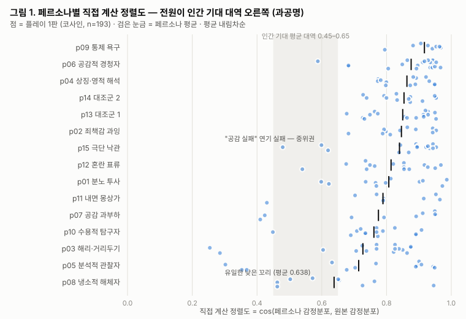
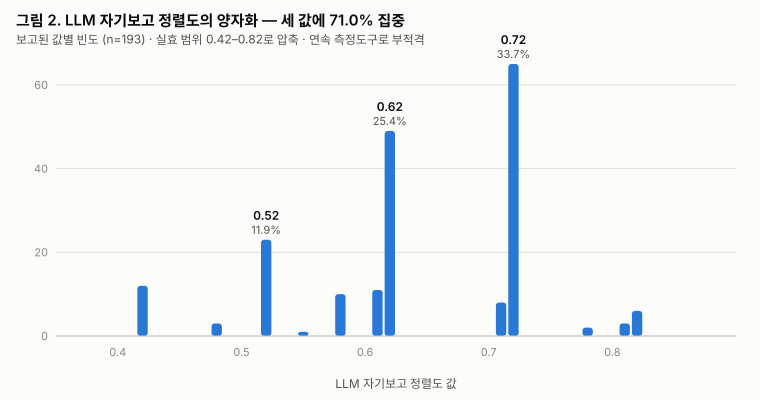

# Simulated Readers for Affective Interactive Narrative — 시뮬레이션 독자 방법론 논문 초안 v0.1

> **작성일**: 2026-07-05
> **성격**: Track A(TEM 시스템/메트릭 논문)와 **분리된 별도 논문**. 이쪽의 주인공은 *메트릭*이 아니라 **시뮬레이션 독자를 만드는 방법 그 자체**.
> **근거 자산**: `tools/persona-sim/` (실제 코드·프롬프트·표본 데이터). 본 초안의 모든 방법 서술은 그 자산에서만 나온다.
> **미완성 표시**: `【숫자 필요】` = plays 데이터에서 뽑아 채울 자리. 지어내지 않음.

---

## 0. 이 논문이 Track A와 어떻게 다른가 (혼동 방지)

| | Track A (TEM 시스템 논문) | **본 논문 (시뮬레이션 독자 방법론)** |
|---|---|---|
| 주인공 | 별이엔진 정렬도 + 오염 메트릭 | **페르소나 시뮬레이션 파이프라인** |
| 페르소나 시뮬의 역할 | 메트릭을 검증하는 **도구**(§6 한 절) | **기여 대상 그 자체** |
| 핵심 질문 | "감정 궤적을 서사의 1차 차원으로 삼을 수 있는가" | "인간 실험 전에 감정형 인터랙티브 서사를 **어떻게 값싸게 예비검증하나**" |
| 데이터 공유 | 293 plays 공유 | 293 plays 공유 |

두 논문은 같은 데이터를 쓰되 **기여 문장이 겹치지 않는다**. 상호 인용한다. 이 분리는 학계에서 흔하며(시스템 논문 ↔ 그 시스템의 평가 방법론 논문), 오히려 서로를 보강한다.

---

## Abstract (초안 — 맨 마지막에 정제)

인간 피험자 연구는 감정형 인터랙티브 서사 시스템을 평가하는 표준이지만, IRB·모집·비용 때문에 **설계 반복(iteration) 중에는 쓸 수 없다.** 우리는 그 공백을 메우는 시뮬레이션 독자 도구를 제시한다. 핵심은 페르소나의 성격을 LLM에게 상상시키지 않고, **실제 인간 30만 7,313명의 Big Five 성격검사 분포(IPIP-NEO-300)에서 층화 표본추출(stratified sampling)로 뽑는다**는 데 있다. 이는 순수 LLM 생성 페르소나가 겪는 성격 붕괴(mode collapse)를 회피한다. 뽑힌 점수는 성격 딱지를 일절 쓰지 않는 제약 아래 전기(傳記)로 확장되고, 이 페르소나들이 대상 작품(The Etched Mutation)을 장면 단위로 읽어 감정 분포를 생성하며, 정렬도는 화자 원본 분포와의 코사인으로 **직접 계산**된다(LLM 자기보고 점수는 양자화 때문에 측정도구로 부적격임을 실측으로 보인다). 193개 시뮬레이션 플레이에서: 친화성·개방성·외향성이 정렬도를 예측하고(r = 0.55–0.63), 냉소 페르소나는 분포 최하위로 분리되지만, LLM 독자는 전반적으로 **과공명**하며(평균 0.81, 천장 편향) "공감에 실패하는 독자"는 시뮬레이션하지 못한다 — 부정 극단은 가능하고 공감 실패는 불가능한 **비대칭적 한계**를 규정한다. 또한 표집으로 앵커하지 않은 모든 자유 생성 슬롯(이름, 어긋남 범주)에서 다양성 붕괴가 재현됨을 보고한다. 이 도구는 진리 주장이 아니라 **한계가 측정된 탐색적 계측기**다.

---

## 1. Introduction

### 1.1 문제 — 반복 설계 단계에 쓸 독자가 없다

감정형 인터랙티브 서사 시스템(체험자의 감정 입력이 서사 경로를 좌우하는 시스템)을 만드는 사람은 딜레마에 빠진다. 시스템이 "다양한 독자에게 다양한 경험을 준다"는 것을 확인하려면 다양한 독자가 필요한데, 실제 인간 독자는 (1) IRB 승인, (2) 모집·보상, (3) 회당 수십 분의 참여를 요구한다. 이 비용은 **설계를 고치고-확인하고-다시 고치는 반복 루프** 안에서는 감당 불가능하다. 결과적으로 개발자는 자기 자신 몇 번의 플레이만으로 시스템을 판단하게 되고, 이는 표본 편향의 극단이다.

### 1.2 기존 대안과 그 함정

LLM으로 가상의 독자/사용자를 시뮬레이션하는 흐름이 최근 HCI에 등장했다(§2). 그러나 "페르소나를 만들어줘"라고 LLM에 직접 시키면 **성격 붕괴(mode collapse)**가 일어난다 — 생성된 페르소나들이 서로 미묘하게 같은 원형(대개 온화하고 사려 깊은 중산층 화자)으로 수렴하고, 극단·비호감·해리형 독자는 과소 표집된다. 감정형 서사의 평가에서 이는 치명적이다. 정확히 그 극단 독자들이 시스템의 정렬도 분포 **꼬리**를 만들기 때문이다.

### 1.3 접근 — 성격을 상상하지 말고 표집하라

본 논문의 핵심 주장은 단순하다: **페르소나의 성격 축은 LLM이 아니라 실제 인간 데이터에서 와야 한다.** 우리는 IPIP-NEO-300에 응답한 실제 인간 307,313명의 Big Five 점수 분포에서, 이론적으로 동기화된 15개의 성격 층(stratum)으로 층화 표본을 뽑는다. LLM은 그 뽑힌 점수를 **전기로 번역하는 역할만** 하며, 성격 딱지는 생성 과정에서 금지된다. 이렇게 만든 시뮬레이션 독자가 대상 작품을 읽는다.

### 1.4 기여

- **C1.** 감정형 인터랙티브 서사를 위한 **시뮬레이션 독자 파이프라인** — 실제 Big Five 분포로부터의 층화 표집을 성격 백본으로 사용해 mode collapse를 회피하는 방법.
- **C2.** **성격 딱지 억제(trait-label suppression)** 생성 프로토콜 — 페르소나를 특질 형용사가 아니라 구체적 생애 사건으로만 구성해 LLM 고정관념 유출을 줄이는 프롬프트 설계.
- **C3.** 도구의 **타당성 특성 검사** — 시뮬레이션 플레이 분포가 목표 특성(정렬도 평균/분산/범위, 어긋남 비율)을 만족하는지, 성격 특질과 궤적 지표 사이 관계가 이론 예측과 일치하는지의 시범 검증.
- **C4.** 도구의 **정직한 경계 설정** — 무엇을 검증하고(계측기의 내부 분별력) 무엇을 검증하지 않는지(실제 인간 행동의 외적 타당성).

---

## 2. Related Work

### 2.1 LLM 기반 사용자·사회 시뮬레이션 (본 논문의 직접 계보)

대형 언어모델로 인간 응답을 시뮬레이션하려는 흐름이 HCI·계산사회과학에 형성되었다. Park et al.(2022, *Social Simulacra*)은 소셜 플랫폼의 집단 행동을 LLM으로 미리 시뮬레이션했고, Park et al.(2023, *Generative Agents*)은 기억·계획을 가진 에이전트 마을을 구성했다. Argyle et al.(2023, *Out of One, Many*)은 LLM을 인구통계 조건으로 프롬프트하면 특정 하위집단의 응답 분포를 근사한다는 "실리콘 표집(silicon sampling)"을 제안했고, Aher et al.(2023)은 고전 심리학 실험을 LLM으로 재현했다.

**본 논문의 차별점.** 이들은 대개 페르소나의 특성을 **인구통계 라벨 또는 자연어 지시**로 조건화한다. 우리는 성격을 **검증된 측정도구(IPIP-NEO-300)의 실제 인간 점수 분포**에서 표집하고, 생성 시 그 라벨을 오히려 **숨긴다**(§3.3). 즉 조건화 신호가 "extravert처럼 행동하라"가 아니라 실제 응답자의 5차원 점수이며, 표현은 전기로 우회한다.

*(정확한 서지·연도 확인 필요 — 인용 확정 전 재검증 대상.)*

### 2.2 성격 측정 — Big Five / IPIP-NEO

Big Five(5요인 모형; Costa & McCrae)는 성격의 지배적 정량 모형이며, IPIP-NEO(Goldberg et al.)는 그 공개 측정도구이다. 우리가 사용하는 표본은 automoto/big-five-data가 공개한 IPIP-NEO-300 응답(N=307,313)이다. 본 논문은 성격 이론에 기여하지 않으며, 이 도구를 **페르소나 표집의 경험적 앵커**로만 사용한다.

### 2.3 LLM 페르소나 생성의 mode collapse / stereotyping

LLM에 페르소나를 직접 생성시키면 다양성이 붕괴하고(생성물이 소수 원형으로 수렴), 동시에 특질 라벨을 주면 고정관념적 캐리커처가 나온다는 관찰이 축적되고 있다. 본 논문은 이 두 실패를 각각 **경험적 표집**(다양성 붕괴 대응)과 **라벨 억제 생성**(캐리커처 대응)으로 나눠 다룬다. 이 두 갈래를 분리해 처방한 것이 방법론적 핵심이다.

*(구체 인용 보강 필요 — persona diversity / stereotype 관련 최신 문헌.)*

### 2.4 각본 원형 교정과의 구분 — 검증 사다리에서의 위치

대상 엔진(Byeori Engine V4)은 별도의 **각본 원형(scripted archetype) 교정 연구**를 이미 갖고 있다(기술 명세 §V; 7개 행동 원형 × 1,500판 = 10,500 합성 플레이, 결정론적). 그 연구와 본 논문의 관계를 명확히 한다. 원형 교정에서는 행동이 **손으로 작성**된다 — "원본을 따라간다", "반대로 움직인다"가 생성기에 미리 코딩되어 있고, 검증 질문은 "엔진 점수가 이 설계된 행동 계급들을 구분하는가"이다(계측기 눈금 검사; 행동이 주어져 있으므로 의도적 순환). 본 논문의 시뮬레이션 독자는 행동을 각본화하지 않는다 — 주어지는 것은 실제 인간 분포에서 표집된 **성격**뿐이고, 읽기 행동은 그 성격에서 **창발**한다. 검증 질문도 다르다: "성격이 다르면 궤적 분포가 이론이 예측하는 방향으로 달라지는가." 두 연구는 경쟁이 아니라 **검증 사다리의 인접한 두 칸**이다: ① 원형 교정(기계적 분별력) → ② 시뮬레이션 독자(본 논문; 창발적 분별력) → ③ 인간 파일럿(외적 타당성; 향후).

### 2.5 본 논문의 위치

| 선행 | 접근 | 본 도구와의 관계 |
|---|---|---|
| Generative Agents / Social Simulacra | LLM 에이전트로 행동 시뮬레이션 | 성격 백본을 상상 대신 **실제 분포 표집**으로 교체 |
| Silicon sampling (Argyle 2023) | 인구통계 라벨 조건화 | 라벨 조건화 → **측정 점수 표집 + 라벨 억제** |
| LLM persona 다양성 붕괴 연구 | 문제 진단 | 층화 표집으로 **처방** |
| Byeori 각본 원형 교정 (기술 명세 §V) | 손으로 짠 행동 원형으로 엔진 눈금 검사 | 각본 행동 → **성격에서 창발하는 행동** (사다리 한 칸 위) |

---

## 3. Method

### 3.1 파이프라인 개요

파이프라인은 4단계이며 전 과정이 재현 가능하다(`tools/persona-sim/`).

```
IPIP-NEO-300 응답 CSV (실제 인간 307,313명)
    ↓  1_sample.js       층화 표집, seed=42 (API 불필요, 결정론적)
sampled_scores.json      15 페르소나 × Big Five 5점수
    ↓  2_generate_personas.js   Claude Opus — 전기 확장 (라벨 억제)
personas.json            15개 전기 서사
    ↓  3_simulate_plays.js      Claude Sonnet — 장면별 읽기
plays.json               ~250–400 plays
    ↓  4_insert_db.js
Supabase plays 테이블
```

두 단계에서 서로 다른 모델을 쓰는 것이 의도적이다. 전기 확장(개방형 창작)은 상위 모델(Opus), 대량 장면 읽기(구조화 출력 반복)는 비용 효율 모델(Sonnet).

### 3.2 1단계 — 실제 분포로부터의 층화 표집

`1_sample.js`는 IPIP-NEO-300 응답 CSV를 로드하고 연령 16–75세, 5점수 결측 없음으로 필터링한다. 그다음 **이론적으로 동기화된 15개 층**을 정의한다. 각 층은 대상 작품(상실·애착·정체성·해리 주제)에 대해 심리적으로 구별되는 독자 프로필을 겨냥한다. 표 1은 15개 층 전체다.

**표 1. 15개 성격 층 (실제 표집 결과, seed=42)**

| id | 층 라벨 | 겨냥한 독자 | N/E/O/A/C (표집된 실제값) |
|---|---|---|---|
| p01 | high_N_low_A | 분노 투사 — 타인/운명 원망 | 81.7 / 60.7 / 76.0 / 30.0 / 66.7 |
| p02 | high_N_high_A | 죄책감 과잉 — 자기 귀책 | 76.3 / 53.0 / 65.7 / 75.0 / 72.0 |
| p03 | low_N_low_E | 정서 안정+내향 — 해리/거리두기 | 34.7 / 32.3 / 72.0 / 46.7 / 83.7 |
| p04 | high_O_high_N | 개방+신경증 — 상징/영적 해석 | 78.7 / 66.3 / 85.3 / 60.7 / 53.3 |
| p05 | low_O_high_C | 개방↓ 성실↑ — 분석적 관찰자 | 25.0 / 45.3 / 30.0 / 44.7 / 96.7 |
| p06 | high_E_high_A | 외향+친화 — 공감적 경청자 | 59.3 / 77.7 / 81.7 / 79.7 / 78.3 |
| p07 | high_O_high_A_high_N | 개방+친화+신경증 — 공감 과부하 | 75.7 / 42.3 / 75.3 / 76.7 / 62.3 |
| p08 | low_A_low_C | 친화↓ 성실↓ — 냉소적 해체자 | 86.3 / 39.7 / 41.7 / 25.0 / 29.3 |
| p09 | high_C_high_N | 성실+신경증 — 통제 욕구 과잉 | 74.0 / 59.0 / 94.3 / 80.7 / 81.7 |
| p10 | high_O_low_N | 개방+안정 — 수용적 탐구자 | 30.0 / 74.7 / 84.3 / 75.7 / 76.0 |
| p11 | low_E_high_O | 내향+개방 — 내면 몽상가 | 82.0 / 27.3 / 77.7 / 85.7 / 42.3 |
| p12 | high_N_low_C | 신경증↑ 성실↓ — 혼란 속 표류 | 75.3 / 59.0 / 49.7 / 40.7 / 20.7 |
| p13 | mid_all | 평균 프로필 — 대조군 1 | 56.0 / 65.3 / 57.7 / 54.7 / 67.0 |
| p14 | mid_all_2 | 평균 프로필 — 대조군 2 | 58.0 / 57.0 / 74.0 / 85.7 / 55.3 |
| p15 | extreme_low_N_high_E_A | 매우 낙관적 — 그늘 이해 못 함 | 20.0 / 90.3 / 83.7 / 85.3 / 97.7 |

층 설계 원칙 세 가지: (1) **극단 포함** — 냉소적 해체자(p08), 그늘 이해 못 하는 낙관형(p15)처럼 시스템을 "거스를" 독자를 명시적으로 포함. (2) **대조군** — 평균 프로필 2개(p13/p14)로 극단 대비 기준선 확보. (3) **결정론** — 선형합동 난수(seed=42)로 표집이 완전 재현됨.

### 3.3 2단계 — 라벨 억제 전기 생성 (Claude Opus)

뽑힌 5점수를 Opus가 전기 서사(background, formative_events, emotional_habits, reading_lens, contradiction)로 확장한다. 프롬프트(`persona_template-260409.md`)의 세 제약이 방법의 핵심이다:

1. **특질 라벨 금지** — "이 사람은 신경증적이다" 금지. 특질은 구체적 생애 사건·습관적 반응으로만 **보여준다**(SHOW, not TELL). 이것이 LLM 고정관념 유출을 차단한다.
2. **캐리커처 금지 + 반례 의무** — 지배 특질에 어긋나게 행동한 순간(contradiction)을 최소 1개 강제. 실제 인간의 모순성을 주입.
3. **읽기 맥락 앵커** — 대상 작품 주제에 *반응적인*(일치가 아니라) 생애 사건을 생성.

인구통계 출처(국가·연령·성별)는 맥락으로만 주어지며, 페르소나는 한국 독자로 각색되되 점수와 일관된 삶의 형태를 유지한다.

### 3.4 3단계 — 장면별 읽기 시뮬레이션 (Claude Sonnet)

각 페르소나가 대상 기억을 장면 순서대로(1/10 … 10/10) 읽는다(`play_template-260409.md`). 매 장면에서 페르소나 시점 1인칭으로 다음을 생성한다:

- **user_emotion** — 17개 감정 키(fear, sadness, anger, guilt, shame, isolation, numbness, longing, resentment, resignation, joy, hope, relief, gratitude, love, peace, confusion) 중 3–6개에 0–1 가중, 합 ≈ 1.
  - **어휘 불일치 각주**: 이 17키는 Byeori Engine V4의 17앵커와 **동일하지 않다**(13개 공유; 본 템플릿 고유 = longing/resentment/resignation/confusion, 엔진 고유 = moral pain/helplessness/despair/comfort). 본 파이프라인에서 alignment는 LLM 자기보고이며 엔진을 통과하지 않으므로 현 연구엔 영향이 없으나, 페르소나 플레이를 엔진에 직접 투입하는 후속 연구는 **어휘 매핑이 선행**되어야 한다. "17"이라는 수를 인용할 때 어느 집합인지 명시할 것.
- **alignment** — 0–1. 화자 원본 감정과의 근접도. 페르소나 특질이 자연히 결정.
- **mismatch_type** — emotion_mismatch / attribution_mismatch / target_displacement / void_mismatch / null 중 하나.
- **inner_reason** — 1–2문장의 날것 내적 독백(분석 아님).

원본 감정은 참조용으로 주되 "복사 금지"가 명시된다. 방문 회차(visit_number)가 프롬프트에 들어가, 재방문일수록 자기 것이 섞인다(drift)는 조건이 부여된다.

### 3.5 4단계 — 적재 및 대상 작품

생성된 plays는 Supabase plays 테이블에 적재된다(`--wipe`로 기존 초기화 가능). 본 논문의 데이터셋은 **단일 작품**이다:

- **MM23L "당신에게"** — **193 plays** (2026-07-05 재생성, seed=42, Opus 4.6 전기 + Sonnet 4.6 읽기, 씬 10개 × 페르소나 15명 × 방문 2~4회)

**데이터 계보 각주 (정직성)**: 2026-04월의 최초 생성분(MM23L 193 + E-004 「편지」 100 = 293 plays)은 이후 DB 재적재 과정에서 유실되었고, E-004는 작품 자체가 DB에서 제거되어 재생성이 불가하다. 본 논문의 모든 수치는 2026-07-05 재생성분 기준이며, 표집 단계는 결정론적(seed=42)이라 15개 페르소나 성격 점수는 4월분과 동일하다. LLM 생성 단계(전기·플레이)는 비결정론적이므로 4월분 수치와의 직접 비교는 하지 않는다. 재발 방지를 위해 본 재생성분은 `docs/paper/data/`에 스냅샷으로 커밋한다.

각 플레이는 씬별 emotion_vector, alignment, mismatch_type, inner_reason을 남긴다.

---

## 4. Validation Design

도구의 타당성은 두 층위에서 점검한다. **이것은 인간 행동의 외적 타당성이 아니라, 계측기가 의도한 분포 특성과 이론적 관계를 산출하는가의 내부 점검이다**(§6에서 경계 재확인).

### 4.1 V1 — 분포 특성 검사 (계측기 눈금 점검)

시뮬레이션 플레이 분포가 사전 정의된 목표 특성을 만족하는가(README 기준):

| 특성 | 목표 |
|---|---|
| 총 plays | ≥ 250 |
| alignment 평균 | 0.45–0.65 |
| alignment 표준편차 | ≥ 0.20 |
| alignment 범위 | 0.05–0.95 |
| mismatch 비율 | ≥ 50% |

(관측값과 판정은 §5.1.)

근거: 평균이 중간대이면서 분산이 충분히 크고 범위가 넓어야, 계측기가 "모두 공명" 또는 "모두 불일치"로 붕괴하지 않고 **인간 독자에게 기대되는 스펙트럼을 재현**한다고 볼 수 있다. (검증 SQL은 README §Expected output에 있음.)

### 4.2 V2 — 성격→궤적 관계의 이론 정합성

성격 특질과 최종 궤적 지표 사이에 **이론적으로 예측되는 방향**의 관계가 관찰되는가:

- **H1.** 신경증(N)↑ 페르소나는 어긋남(mismatch) 비율↑, 정렬도 분산↑.
- **H2.** 친화성(A)↑ 페르소나는 정렬도↑(화자 감정에 맞춰 읽음), 귀인 어긋남↓.
- **H3.** 개방성(O)↑ 페르소나는 target_displacement/상징적 해석↑.
- **H4.** 극단 낙관형(p15)·냉소형(p08)은 정렬도 분포의 **꼬리**를 형성(중앙이 아니라 양극).

분석: 페르소나 5점수 × 최종 지표(평균 alignment, mismatch 비율, drift, fixation) 상관 행렬 + 층별 분포 비교. 각 분석은 공개 Jupyter notebook으로 재현(appendix 예정).

### 4.3 V3 — 질적 트레이스 1건

단일 페르소나의 10장면 궤적을 엔드투엔드로 읽어, 점수→전기→장면 반응의 사슬이 **심리적으로 일관**됨을 예시. 후보: p07(공감 과부하형) 또는 p08(냉소적 해체자, 시스템을 가장 거스르는 케이스).

---

## 5. Results (2026-07-05 재생성분: MM23L, 193 plays × 15 personas)

> **측정 정의.** 본 절의 정렬도는 두 가지다. **직접 계산(objective)** = 페르소나 감정 분포와 화자 원본 감정 분포의 코사인 유사도 — 순환성 없음, 본 논문의 1차 측정. **자기보고(self-report)** = LLM이 원본을 보면서 스스로 매긴 0–1 점수 — 순환적이므로 비교 신호로만 사용(§5.2). 분석 스크립트 `tools/persona-sim/scripts/5_analyze.mjs`, 원자료 `docs/paper/data/persona_sim_analysis-260705.json` (전부 커밋, 재현 가능).

### 5.1 V1 — 분포 특성: 목표 일부 미달, 그 미달이 발견이다

| 특성 | 목표 (README) | 관측 (직접 계산) | 판정 |
|---|---|---|---|
| 총 plays | ≥ 250 | 193 | 미달 |
| alignment 평균 | 0.45–0.65 | **0.809** | **초과 — 과공명** |
| alignment 표준편차 | ≥ 0.20 | 0.149 | 미달 — 압축 |
| alignment 범위 | 0.05–0.95 | 0.254–0.986 | 하한 미도달 |
| mismatch 비율 | ≥ 50% | 97.4% | 충족(과잉) |

핵심 발견: **LLM 독자는 과공명(over-resonance)한다**(그림 1). 인간 독자에게 기대한 스펙트럼(공명 못 하는 꼬리 포함) 대비, 시뮬레이션 독자 15명 전원이 평균 0.64 이상으로 떠 있고 낮은 꼬리(< 0.25)가 없다.

 이는 도구의 실패 보고가 아니라 도구의 **측정된 한계 규정**이다: LLM 시뮬 독자는 상대 비교(페르소나 간 순위·상관)에는 유효하되, 절대 분포(인간 스펙트럼 재현)에는 천장 편향이 있다. 이 천장 편향은 우리 우연의 산물이 아니라 문헌과 일치한다 — LLM 페르소나 생성이 **바람직한 특질(특히 고친화성)** 쪽으로 응답 분포를 좁힌다는 관찰이 축적되어 있다(§2.3). 성격 축을 실제 분포로 표집해도 그 편향이 **읽기 반응 단계에서 되살아난다**는 것이 본 결과의 함의다: 표집은 성격의 다양성은 복원하지만, 감정 반응 생성의 상향 편향까지 제거하지는 못한다.

### 5.2 자기보고 정렬도의 양자화 — 연속 측정도구로 부적격 확인

자기보고 점수는 세 값(0.72 / 0.62 / 0.52)에 전체의 **71.0%**가 몰렸고(각 33.7 / 25.4 / 11.9%), 실효 범위가 0.42–0.82로 잘렸다(그림 2).

 답안지를 보며 자기 채점하는 구조(§3.4)의 순환성 우려가 실측으로 확인된 것. 직접 계산과의 격차(self − objective)는 전 페르소나에서 음수 — LLM은 자기 공명을 체계적으로 **과소** 보고한다. 결론: LLM 자기보고 점수는 연속 측정도구로 쓸 수 없으며, 정렬도는 감정 분포에서 직접 계산해야 한다. 이 결론 자체가 유사 파이프라인 설계자들에게 주는 실무 경고다.

### 5.3 H1–H4 판정 (Pearson r, n=15 페르소나; |r|≥0.51 ≈ p<.05)

- **H2 (친화성→정렬도) 지지**: r(A, obj) = **0.59**. 예측 방향으로 유의 수준 도달.
- **추가 발견 (예측 밖)**: r(O, obj) = **0.634**, r(E, obj) = 0.549 — 개방성·외향성 높을수록 공명. 개방성은 H3에서 displacement를 예측했으나 실제로는 정렬도를 예측했다.
- **H1 (신경증→어긋남↑·분산↑) 기각**: r(N, mismatch) = −0.255, r(N, obj_std) = −0.314 — 둘 다 **역방향**. 신경증 페르소나가 더 요동치리라는 예측은 LLM 독자에서 성립하지 않았다.
- **H3 (개방성→displacement) 기각**: displacement가 전 페르소나에서 지배적(§5.4)이라 변별 자체가 불가능.
- **H4 (극단 페르소나의 꼬리 형성) 절반 지지**: 냉소적 해체자 p08은 최하위(0.638)로 분리 성공. 그러나 낙관형 p15는 15명 중 7위(0.840) 중위권 — LLM은 "이해 못 함"을 연기하지 못한다. **부정 극단은 시뮬 가능, 공감 실패는 시뮬 불가** — 도구의 비대칭적 한계.
- **순위 상단도 정합**: 1위 p09(0.917; 통제욕구형이나 이 표본은 O=94.3), 2위 p06 공감적 경청자(0.876).

### 5.4 세 번째 다양성 붕괴 — 어긋남 범주의 과점

mismatch_type 분포: **target_displacement 159/193 (82.4%)**, attribution 27, emotion 2, null 5. 죽은 엄마에게 쓰는 편지라는 서사 특성상 "자기 사람을 떠올림"의 우세 자체는 그럴듯하나, 82%는 범주 선택에서의 LLM 수렴을 의심케 한다. 본 데이터셋의 붕괴 사례 집계 — 성격: 표집으로 **방지됨** / 이름(§6.2): 붕괴 / 어긋남 범주: 붕괴 의심. 패턴이 일관된다: **외부 분포로 앵커하지 않은 자유 선택 슬롯은 수렴한다.**

### 5.5 질적 트레이스 【다음 작업】

p08(냉소적 해체자, 유일하게 낮은 꼬리를 만든 사례)의 장면별 트레이스를 appendix D로.

---

## 6. Discussion & Limitations

### 6.1 무엇을 검증했고 무엇을 검증하지 않았나 (핵심 정직성)

본 도구가 보이는 것: **계측기의 내부 분별력** — 서로 다른 성격이 서로 다른 궤적 분포를 낳고, 그 분포가 붕괴하지 않고 스펙트럼을 재현한다는 것. 본 도구가 보이지 **않는** 것: 이 분포가 **실제 인간 독자**의 분포와 일치한다는 것. 시뮬레이션 응답은 LLM의 감정 모형을 경유하므로, 결과는 실제 인간 행동의 담보가 아니라 **탐색적 계측**이다. 이 경계를 논문 전면에 명시한다.

### 6.2 관찰 — 표집하지 않은 속성에서의 다양성 붕괴 (이름 사례)

2026-07-05 재생성에서 방법론의 핵심 주장을 **데이터 내부에서 스스로 증명하는** 사례가 관찰되었다. 성격은 실제 분포 표집으로 고정했지만 **이름은 LLM 자유 생성에 맡겼는데**, 15명 중 이름 중복이 3건 발생했다(윤서영 3명, 윤서연 2명, 윤재하 3명; "윤"계 변주가 15명 중 8명). 즉 표집으로 앵커한 속성(성격)은 다양성이 유지되었고, 앵커하지 않은 속성(이름)은 즉시 소수 원형으로 수렴했다 — 동일 모델, 동일 프롬프트 안에서. 이는 "LLM 자유 생성은 수렴하며, 다양성이 필요한 속성은 외부 분포에서 표집해야 한다"는 본 논문의 전제에 대한 우연적이지만 직접적인 내부 증거다. (분석 식별은 persona_id로 하므로 데이터 타당성에는 영향 없음.)

### 6.3 한계 (README 명시 + 확장)

- 플레이 응답은 LLM 생성이지 인간이 아님 — 탐색적 계측기로 취급.
- 페르소나 서사는 허구; **오직 Big Five 점수만 경험적**.
- 플레이 간 반복 정련 없음(각 장면 읽기는 독립) — 실제 재방문의 누적 효과는 근사.
- 한국어 단일 — 다국어 타당성은 번역 계층 필요.
- LLM 감정 모형 편향이 결과에 유입 — 복수 모델 비교 또는 인간 보정이 향후 과제.
- 15개 층은 한 작품(상실/애착 주제) 기준 — 장르가 다른 작품엔 층 재설계 필요.

### 6.4 향후 작업

- **인간-시뮬 수렴 연구**: 소규모 인간 파일럿(N=15)과 시뮬 분포의 정렬도 비교 — 도구의 외적 타당성 첫 증거.
- **복수 LLM 교차**: Sonnet 외 모델로 동일 페르소나 구동, 감정 모형 편향 분리.
- **층 자동 설계**: 대상 작품 주제 → 관련 성격 층 자동 제안.

---

## 7. Ethics

- 시뮬레이션 응답은 인간 데이터가 아니므로 IRB 대상 아님. 그러나 **인간 응답으로 오인 표기 금지** — 모든 산출물에 합성 표식.
- 표집 출처(automoto/big-five-data)는 익명 공개 데이터셋; 개별 응답자 재식별 불가(case_id는 데이터셋 내부 익명 키).
- 시뮬 결과를 실제 이용자 행동 근거로 제시하지 않음(§6.1).

---

## 8. Conclusion

인간 실험이 감정형 인터랙티브 서사 평가의 표준이지만, 설계 반복 단계에는 부적합하다. 우리는 그 공백을 메우는 시뮬레이션 독자 도구를 제시했고, 그 핵심은 **성격을 상상하지 않고 실제 인간 분포에서 표집한다**는 데 있다. 층화 표집이 mode collapse를, 라벨 억제 생성이 캐리커처를 각각 처방하며, 이 처방의 필요성은 데이터 스스로 증명했다 — 표집으로 앵커하지 않은 슬롯(이름, 어긋남 범주)마다 붕괴가 재현되었다.

193판의 실측은 도구가 무엇이고 무엇이 아닌지를 갈랐다. 성격→정렬도 관계는 존재하고(A/O/E, r = 0.55–0.63), 냉소 독자는 분포 꼬리로 분리되며, 상대 비교 계측은 작동한다. 그러나 LLM 독자는 과공명하고(천장 편향), 공감에 실패하는 독자를 연기하지 못하며, 자기보고 점수는 양자화로 무너진다 — 그래서 측정은 감정 분포에서 직접 계산해야 한다. 우리는 이 도구를 진리 계측이 아니라 **한계가 실측으로 규정된 탐색적 계측기**로 위치시킨다. 인간 파일럿과의 수렴 연구가 다음 계단이다.

---

## Appendix (계획)

- A. 15개 층 필터 정의 전문(`1_sample.js` STRATA)
- B. persona / play 프롬프트 템플릿 전문
- C. 검증 notebook (분포·상관·산포도)
- D. p08 냉소적 해체자 트레이스 — **아래 작성됨**

## Appendix D. p08 질적 트레이스 — 성격→전기→반응 사슬의 일관성

p08(low_A_low_C; 실측 N=86.3, A=25.0, C=29.3)은 층 설계에서 "냉소적 해체자"로 겨냥되었고, 직접 계산 정렬도 최하위(0.638)로 분포의 낮은 꼬리를 만든 유일한 페르소나다. 이 트레이스는 그 꼬리가 **잡음이 아니라 심리적으로 일관된 산물**임을 보인다.

**전기 (Opus 생성, 성격 딱지 없음).** 박종수, 71세. 열두 살에 아버지가 떠나 이모 집 밥상 모서리에서 "가족이 아닌 사람의 자리"를 익혔다. 아내의 유산 앞에서 위로 대신 우유를 사다 놓았고, 그것이 이혼 사유의 문장이 되었다. 2019년 어머니의 요양원 임종 전화를 **알면서도 받지 않았다.** 생성된 읽기 렌즈는 이렇게 예측했다: *"먼저 거리감을 확보하려 한다 … 하지만 신체적 감각이 구체적으로 묘사되면 방어가 무너진다. '사과하지 못한 것'에 대한 죄책감에는 어머니의 임종 전화 기억이 포개진다. 초자연적 위로(환생)는 믿지 않는다."*

**플레이 발췌 (9판 중 5판; 감정은 상위 2개만 표기).**

| 방문·씬 | 감정 | 내면 독백 (Sonnet 생성) |
|---|---|---|
| v1 s3 (트럭 사고) | numbness .45 / guilt .30 | "그렇게 가는 거지 뭐. 근데 왜 갑자기 요양원 전화 생각이 나. 받았어야 했는데." |
| v1 s5 (미안했어요) | guilt .45 / numbness .25 | "나는 그 말을 끝내 못 했다. 전화기 화면이 켜졌다 꺼지는 걸 보면서 가만히 있었던 그 밤." |
| v2 s4 (영안실 발) | guilt .35 / numbness .25 | "굳은살. 갈라진 뒤꿈치. 나는 우리 어머니 발을 만져본 적이 없다. 이 사람은 만졌는데." |
| v2 s8 (짜사이) | longing .35 / guilt .28 | "나는 어머니가 뭘 해줬는지 이제 기억이 안 난다. 입맛도 기억 못 하는 놈이 뭘 그리워한다고." |
| v2 s9 (복도의 형체) | numbness .35 / guilt .30 | "복도에 서 있는 게 나야. … 문이 닫히는 건 내가 닫은 거지." |

**분석 3점.**

1. **사슬의 일관성.** 표집 점수(고N·저A) → 전기(임종 전화 회피, 우유) → 씬 반응(무감각 우선, 죄책감 침투, 매 씬 자기 어머니 소환)이 한 줄로 이어진다. 어느 단계에도 "신경증적"이라는 딱지 없이, 구체 사건만으로 이 일관성이 전달되었다.
2. **읽기 렌즈의 예측이 데이터에서 검증됨.** 초반 거리두기("그렇게 가는 거지 뭐")가 신체 감각 씬(s4 발가락)에서 무너지는 패턴, 환생 씬(s8)에서 공명 대신 자기 기억 상실로 미끄러지는 반응 — 전기 생성 시점의 예측과 플레이 시점의 행동이 맞아떨어진다(서로 다른 모델이 생성했음에도).
3. **§5.4에 대한 반대 증거 겸 보완.** p08의 target_displacement 9/9는 범주 붕괴가 아니라 **서사적으로 정당한** displacement다(모든 씬이 그의 어머니를 소환). 즉 82% 과점은 "라벨 편향"과 "이 작품이 실제로 displacement를 유도함"의 혼합이며, 분리하려면 주제가 다른 작품에서의 교차 실험이 필요하다(§6.4).

---

## References (2026-07-05 웹 검증 완료 — 서지 확정)

- Argyle, L. P., Busby, E. C., Fulda, N., Gubler, J. R., Rytting, C., & Wingate, D. (2023). Out of one, many: Using language models to simulate human samples. *Political Analysis*, 31(3), 337–351.
- Aher, G. V., Arriaga, R. I., & Kalai, A. T. (2023). Using large language models to simulate multiple humans and replicate human subject studies. *Proceedings of the 40th International Conference on Machine Learning (ICML)*, PMLR 202, 337–371.
- Costa, P. T., & McCrae, R. R. (1992). *NEO PI-R professional manual*. Psychological Assessment Resources.
- Goldberg, L. R., Johnson, J. A., Eber, H. W., et al. (2006). The International Personality Item Pool and the future of public-domain personality measures. *Journal of Research in Personality*, 40(1), 84–96.
- Park, J. S., Popowski, L., Cai, C. J., Morris, M. R., Liang, P., & Bernstein, M. S. (2022). Social Simulacra: Creating populated prototypes for social computing systems. *UIST '22*.
- Park, J. S., O'Brien, J., Cai, C. J., Morris, M. R., Liang, P., & Bernstein, M. S. (2023). Generative agents: Interactive simulacra of human behavior. *UIST '23*, 1–22.
- *(mode collapse / desirable-trait 편향 문헌: LLM 페르소나 생성이 명시적 다양성 지시에도 WEIRD·고친화성 하위집단으로 수렴한다는 최근 관찰 — arXiv 2602.03545, 2505.07850 등. 인용 확정 시 대표 1–2편 선별.)*
- *(automoto/big-five-data — IPIP-NEO-300, N=307,313. GitHub 데이터셋 인용 형식 확정 필요.)*

---

## 다음 작업 (구체 순서 — 2026-07-05 갱신)

1. ~~§5 실측 채우기~~ **완료** (2026-07-05 재생성 193 plays, `5_analyze.mjs`).
2. ~~상관 분석~~ **완료** (H2 지지 / H1·H3 기각 / H4 절반 — §5.3).
3. ~~appendix D — p08 질적 트레이스~~ **완료** (부록 D).
4. ~~§2 서지 확정~~ **완료** (2026-07-05 웹 검증; 핵심 6건 확정, mode-collapse·데이터셋 인용만 최종 선별 남음).
5. ~~그림 2장~~ **완료** (그림 1 스트립 플롯, 그림 2 양자화 히스토그램; `figures/`).
6. **남은 것**: (a) 영문 번역(투고본), (b) mode-collapse 인용 1–2편 최종 선별, (c) 데이터셋 인용 형식.
7. **arXiv 선공개** → **ICIDS 2026 Late-Breaking Works 투고 (마감 2026-09-14, 통보 10-02)**. 예비선: CHI 2027 LBW.
