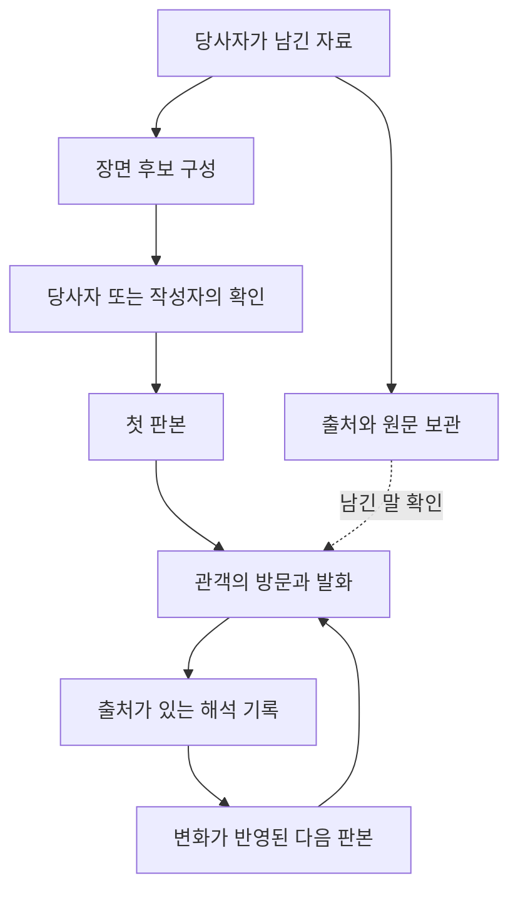

# 생애 그릇 · 영생 — 브레인스토밍 기록 (2026-09-21 ~ 22)

> 발단(사용자): "전쟁나거나 그러면 이 프로젝트 노선을 바꾸는 것도 아니라 한 가지 사용법을 추가하는 느낌으로다가 유언장이나 인생 자체를 담는 그릇으로도 쓸 수 있는 거 아냐?"
> → "한 사람의 기억을 보존하는 걸 넘어서, 하나의 이야기로서 사람들에게 기억되고 변형되면서 결국 영생한다는 이야기잖아."
> → "이걸 어떻게 사용하게 해야 할까."
>
> **상태 = 브레인스토밍 기록. 결정 아님.** 코드 0줄. 결정 대기 목록은 §6.
> 관련 정본: `docs/이본지층/`(지형 엔진), `docs/귀환_시스템_정합성_재정의-260613.md`(전이), `docs/RECORD_v4_구현-260909.md`(기록 회로), `docs/씬은_사건이다_결정-260727.md`.

---

## 0. 결과 한 줄

**노선 변경이 아니라 사용법 추가가 맞다.** RECORD v4(첫 서술 → 씨앗 → 유령) + 전이(유령이 방문자 쪽으로 물듦) + 이본 지층(느낀 만큼 솟고, 지나간 만큼 깎이고, 안 찾으면 굳음)이 이미 "한 사람이 이야기가 되어 살아남는" 구조다. 빠진 건 기능이 아니라 **문장 세 개**(입장 시 전승자 자리 안내, 퇴장 시 "나가서 한 사람에게 이 이야기를 해 줘", 봉인 시 변이 동의)와 **실제 한 사람으로 세 고개(본인→아는 사람→모르는 사람)를 밟아 보는 일**이다. 첫 시제품 후보 = "비 오는 날 창문을 열어두던 한 사람"을 관객 셋이 이어받는 판(§5-B).

---

## 1. 자리매김 — 왜 노선 변경이 아닌가

이미 있는 것 / 없는 것 (2026-09-21 기준 실측):

| 이미 있음 | 없음 |
|---|---|
| 봉인어(가족만 아는 단어를 열쇠로 쓸 수 있음) | 받을 사람 지정 |
| "남긴 사람만 본다" 공개 규칙(`tem_record_visibility.js`) | 조건부 개봉(날짜·미접속·사건) |
| 원문 그대로 병행 보존(`scenes.meta.record.utterances`) | 한 사람의 기억 여러 개를 묶는 단위 |
| 방문마다 쌓이는 이본 지층(`tem_variant_strata.js`) | 서버 없이 열리는 단독 파일 |
| 접촉(회차당 최대 1회, 승리 아님) | 유령이 물려받는 말의 넉넉한 분량(현재 기억당 30마디 상한 = dialog-turn drift 풀 limit) |
| 장면별 소리 자리 / 사물 GLB 파이프라인 | 죽음을 담담히 말하는 사람과 위기 상태를 구분하는 안전 설계 |

**"전쟁코인" 질문에 대한 답**: "전쟁 대비 유언 앱"은 최악의 자리(공포 마케팅으로 읽힘, 전쟁 안 나면 증발, 나면 아무도 안 깖, 유언 시장은 법률·보험·장례 영역). 이길 자리는 **"원본은 불탄다, 이본은 살아남는다"** — 실록 4벌 분산(보존 전략) vs 춘향·판소리(이본 전략). 세 겹: ① 맞은편 = AI 고인 산업(HereAfter·StoryFile·리메모리, "고인이 그대로 다시 말한다"는 보존의 거짓말; *Eternal You* 2024, Hollanek 고인 챗봇 논문)의 반례 작가로 서기 ② 발화 자격 = 휴전국·이산가족(KBS 이산가족 찾기 = 유네스코 기록유산)·징병제·구전 이본 전통 ③ 첫 사례 = 작가 본인(1월 출국 전 가족과 기억 하나). 전쟁은 본체가 아니라 예시 한 줄. 문서·영상에 "떠남과 남음" 축을 **미리** 넣어 두면 시의성이 왔을 때 올라탄 사람이 아니라 먼저 말해 둔 사람으로 읽힌다. 학계 접점: 존엄 치료(Chochinov), 죽음 고려 설계 HCI(Massimi).

---

## 2. 1차 — 남기는 그릇 (20)

**가. 남기는 그릇**
1. 재산은 공증인에게, 기억은 여기에. 법적 유언이 못 담는 "그 집에서 이사 가던 밤 내가 뭘 느꼈는지"가 TEM 자리.
2. 봉인어 = 열쇠. 비밀번호 대신 같이 가진 기억으로 연다("수박").
3. 조건부 개봉 — "딸이 서른 되는 날", "1년 미접속", "전쟁이 끝나면".
4. 질문할 수 있는 유언. 편지는 되묻지 못하지만 유령에게는 "그 뒤엔 어떻게 됐어?"를 물을 수 있음(이미 동작).
5. 육성 한 줄을 장면 소리 자리에. **합성 음성 금지**(없는 말을 지어내는 일).
6. 유품 → 사물 모형 → 지형 위에.

**나. 인생 그릇**
7. **같은 기억을 매년 다시 말한다.** 서른의 "그 밤"과 쉰의 "그 밤"은 다르다 — 기억유전학 1번 작용(회상이 원본을 덮어씀)을 본인 생애에 걸쳐 기록. 인생을 사건 목록이 아니라 "그 사건을 말해 온 역사"로 담는다. ← 가장 TEM다운 인생 그릇 정의.
8. 연도순이 아니라 감정 지도로. 가장 무서웠던 곳 옆에 가장 따뜻한 기억.
9. 자기 유령 방문 — 10년 전 내가 남긴 기억에 지금의 내가 들어감.
10. 치매 초기에 쓴다(의료 효과 주장 없음).

**다. 전쟁·상실 특화**
11. **흩어진 가족이 같은 밤을 각자 남긴다** — "각자 기억했더니 달라져 있었다"가 그대로 일어남. 이산가족 = 70년 각자 기억한 고향의 이본.
12. 사라진 장소를 지형으로.
13. **재개발로 사라지는 동네** — 전쟁 없이도 한국에서 매일 일어나는 장소의 죽음. 주민 50명이 같은 동네를 각자 남김 = 500명 시뮬을 실제 사람으로. 당장 가능한 현장.
14. 입대·이민·유학 전에 남긴다(작가 본인 포함).
15. 세 세대가 같은 사건을 — 릴레이가 가장 자연스럽게 서는 단위.

**라. 받는 쪽**
16. 추모의 시간이 눈에 보인다(3년 뒤 내 자국이 지층으로).
17. 접촉이 가장 세게 작동하는 자리 — "아버지가 그때 느낀 걸 내가 지금 느꼈다". 승리가 아니라 "일어났다".
18. 형제가 서로 다른 아버지를 만나고 나온다.
19. **알파 결함이 뒤집힌다** — 8월 관객 3명은 관찰자였기에 자기 기억 소환 0/3. 가족은 당사자라 자기 기억이 저절로 끌려 나옴. 가족 기억 = TEM에 가장 잘 맞는 재료.
20. 답장 — 유족이 같은 사건을 자기 말로 남겨 고인 것 옆에 나란히.

**부딪히는 다섯 곳**
- **"유언"이라는 단어 금지.** 법적 효력으로 읽히고, 위기 상태인 사람을 끌어당김. 현행 `safety.js`는 "죽고 싶다"를 위기 신호로 잡지만 죽음을 담담히 말하는 사람과 구분하는 설계는 없음 → 이 용도의 설계 1순위. 이름은 "남기는 기억 / 물려주는 기억 / 이야기 하나 맡기기".
- 유령이 없는 말을 지어내면 유족에게 해. 남긴 말 밖의 질문에는 **침묵**("그건 내가 말한 적 없어") — 그 침묵이 죽음을 가장 정직하게 표현하는 방식.
- **본인이 살아서 직접 남긴 것만.** 유족이 고인의 메신저를 긁어 유령을 만드는 것은 금지선.
- 증언 도구로 쓰지 말 것 — "기억은 변한다" 장치가 역사 증언에 쓰이면 부정론에 빌미.
- 1인 운영으로 "백 년 간다" 약속 불가 → 서비스가 아니라 작품 형식으로. (§4의 "나가서 한 사람에게 말해 줘"가 이 문제의 답.)

---

## 3. 2차 — 영생: 보존은 미라, 영생은 노래

변이는 영생의 대가가 아니라 **영생이 뛰고 있다는 표시**.

**족보**
- 소크라테스·예수 — 직접 쓴 글 0줄, 제자들의 이본으로 2천 년. 복음서 4권은 어긋나고, 2세기 합본(디아테사론)을 교회가 버리고 어긋나는 4권을 나란히 두는 쪽을 택함 = 이본 지층을 고른 것.
- 춘향 — 이본 100종 넘음, 아무도 원본을 안 찾는데 안 죽음.
- 제사 — 매년 같은 사람, 매년 조금 다른 이야기. 4대 지나면 개인 제사가 조상 제사로 합쳐짐(직접 아는 이가 다 죽는 시점).
- "사람은 세 번 죽는다"(Eagleman, *Sum*) — 몸·매장·마지막으로 이름이 불릴 때.
- Albert Lord 구전 가수 — "어제와 똑같이 불렀다"고 믿는데 녹음하면 매번 다름.
- Bartlett 1932 — 설화를 전달할수록 각자 문화로 변함. 그 설화 제목이 "유령들의 전쟁".
- 기억유전학 §13 — 바이러스는 단일 서열이 아니라 변이체 떼(quasispecies)라서 면역을 피함. 한 사람은 단일 서열이라 죽고, 이야기가 된 사람은 변이체 떼가 되어 망각을 피함.

**TEM은 이미 이걸 계산한다** (`docs/이본지층/W1_구현보고-260716.md` §11.1·§13)
- 방문자가 걸은 길은 깊어짐(강화), 안 걸은 구석은 뭉개짐(망각), **느낀 만큼 땅이 솟음**(융기, W1-6).
- 순수 침식만 있던 W1은 500명이면 평지 = 이야기가 닳아 없어짐. 융기를 넣은 뒤 1000명에도 동적 평형(RMS 포화, features 6~8 유지).
- → **영생의 계산적 정의**: 지나가기만 하는 방문은 이야기를 닳게 하고, 느끼는 방문은 살리며, 방문이 끊기면 마지막 모양 그대로 굳어 화석이 된다.
- 추가 자산: 전이(유령이 시간×오염도로 방문자 쪽으로 물들어 다음 사람에게 상속), 알파 재서술 3건 완전 분기, 퇴장 시 한 문장 남기는 자리.

**아이디어 (12)**
1. **사람이 이야기가 되는 세 고개** — ① 본인이 말함 ② 아는 사람이 찾아옴 ③ **모르는 사람이 찾아옴**(증손자는 증조할아버지를 모르고 유령만 앎 → 사람이 인물로 넘어감). 가족 비공개 그릇으로는 영생이 안 됨 → "가족에게 30년, 그 뒤 세상에" 시차 공개.
2. **관객 자리 이름: 구경꾼 → 전승자.** 시스템은 이미 그렇게 움직임, 빠진 건 체감 자리뿐. 예: 입장 시 "당신 앞에 213명이 지나갔다. 당신은 214번째 이본이 된다."
3. **변이 동의** — 봉인 시 "나는 내 이야기가 나 없이 변해 가는 것을 허락한다." AI 고인 산업 동의("내 자료로 나를 똑같이 재현해도 좋다")의 정반대. 이 한 줄이 곧 이 작품의 유언.
4. 재서술 = 축문(다시 부르기). 다음 방문자의 재료 → 전승 사슬. Bartlett을 열화가 아닌 재창조로 뒤집은 판.
5. 한 문장들의 묘비 — 방문자 100명의 100개 묘비명. 묘비명이 하나로 정해지지 않는 무덤.
6. 살아서 자기 전설을 본다 — 3년 뒤 "나 이런 말 한 적 없는데". 그 당혹이 핵심 체험.
7. 굳은 이야기가 되살아난다 — 50년 방치된 기억에 한 사람이 걸으면 땅이 다시 움직임.
8. **이름이 지워지는 끝** — 여러 할머니의 피난 이야기가 하나의 "피난 이야기"로(기억유전학 6번 재조합). 개인의 영생이 끝까지 가면 이름 없는 전설(아리랑).
9. **짧아야 산다** — 구전은 짧다. 춘향도 몇 장면으로 삶. RECORD 3~7씬 절단 + 씬 발췌 절제(문장 2~4개)가 영생의 조건과 일치. → §2의 "인생 전체를 담는 그릇"은 이 관점에서 **틀림**. 담는 양이 많을수록 안 전해짐.
10. 전시 형식 "한 사람, 천 개의 이본" — 첫날 유령과 마지막 날 유령 나란히 + 지형 변화 빠른 재생. Prix Ars 영상 뼈대.
11. 이본 계통도(필사본 족보처럼) — **작가 화면에만**. 관객은 안개.
12. 소설가의 일과 같다 — 독자 손에서 변해도 좋다고 허락한 소설. 박도한(渡恨)이라는 필명부터 "이야기가 되어 돌아다니는 사람".

**갈림길**
- **영생은 주제, 기능 아님.** 시스템이 영생을 약속·측정·보상하면 철학 붕괴. 변이가 부산물이듯 영생은 부산물의 부산물. 시스템이 할 일 = 조건 둘(다시 찾을 이유 / 찾을 때마다 달라져 있음)까지.
- 고쳐 쓰기 금지선 — "기억나는 대로 다시 말하기" O, "이 사람 이야기를 내가 고쳐 쓰겠다" X(집단 창작).
- 이름이 지워져도 영생인가(8번을 최종형으로 받을지) — 이론 뼈대를 가르는 결정.
- "214번째" 숫자 노출 — 계보로 읽히면 힘, 인기 순위로 읽히면 독.
- 한 사람이 유령을 통째로 바꾸지 못함 — 방문은 지층 한 겹. 원문 열람 가능이 방어선.

**포지션 문장**: "기억되는 것은 변한다. 변하지 않는 것은 잊힌 것뿐이다." AI 고인 산업 = 방부 처리, TEM = 구전. 전쟁은 사람과 기록을 죽이지만 입에서 입으로 가는 이야기는 못 죽인다.

---

## 4. 3차 — 어떻게 사용하게 하나

**앱처럼 뿌리지 않는다. 첫 사용법 = 작가가 직접 받으러 가는 채록** (『한국구비문학대계』 1980년대 방식 = 이본론 본가의 일하는 법).

**동기는 영생이 아니다.** 사람이 움직이는 계기: 부모가 부쩍 늙어 보인 날, 장례식 다녀온 주, 아이 출생, 입대·이민·유학 직전, 집 비울 때, 기일·명절. 남기는 사람이 스스로 시작하는 경우는 드물고 **시키는 쪽은 자식**(StoryWorth 구조). → 입구는 남기는 사람이 아니라 나중에 찾아올 사람.

| 방식 | 모양 | 지금 가능한가 |
|---|---|---|
| **① 채록** | 작가가 가서 한 사람의 기억 하나를 받고 무대까지 설치 | 바로 가능. 코드 0줄 |
| **② 전시** | 그렇게 받은 기억을 낯선 관객이 전승자로 지나감 | 지금 TEM이 서 있는 자리 |
| **③ 의례** | 가족이 기일마다 다시 찾아옴 | "다시 왔을 때 내 자국 보기" 빠짐(알파 결함) |
| **④ 선물** | 자식이 부모에게 보내고 각자 알아서 씀 | 아직 멂 — 안전장치·백 년 약속·"작가가 설치해야 공개" 병목 |

순서 ①→②→③, ④는 마지막. ①에서는 "작가가 설치해야 공개" 규칙이 병목이 아니라 품질 장치.

**남기는 쪽 (예: 외할머니 1951년 피난 밤)**
1. 할머니는 타자를 못 침 → 손녀가 받아 적음. **이 장면이 곧 의례**이고, 손녀 귀를 거치는 순간 첫 이본("순수 원본 없음"과 정합).
2. 무슨 말을 할지는 "또다른 나"가 물어 줌(이미 있음). 시작 문장만 "물려주고 싶은 밤 하나"로.
3. 짧게(장면 서너 개). 인생 전체 X.
4. 봉인어("보리쌀").
5. 변이 동의 한 줄.
6. "유언" 단어는 끝까지 안 씀 → "이야기 하나 맡기기".

**찾아오는 쪽**
- 들어갈 때: "네가 어떻게 읽는지가 다음 사람이 만날 유령을 바꾼다."
- 안에서: 현행 그대로(안개, 유령 질문).
- 끝에: 자기 말로 다시 말하기(알파에서 이미 함).
- **나갈 때: "나가서 한 사람에게 이 이야기를 해 줘. 틀려도 돼."** 시스템은 추적하지 않음. → **TEM은 보관소가 아니라 첫 전승이 일어나는 자리**면 된다. 서버가 죽어도 이야기는 이미 옮겨 가 있음 = 백 년 보존 약속 불필요.

**다시 오게 하는 법 = 달력.** "돌아올 이유 없음"(플랫폼 방향 문서의 가장 약한 고리)의 답은 점수가 아니라 기일·명절. 이유가 시스템 밖에 있어 게임화 안 됨. 1년 간격은 전이 규칙(시간×오염도)과 맞음 — "작년엔 할머니가 이렇게 말하지 않았는데".

**첫 실행 — "한 사람 프로젝트"** (11월 작품 동결 전)
1. 가족 한 분에게서 기억 하나 채록(현행 RECORD).
2. 그분을 아는 가족 2~3명 방문 → 자기 기억 소환 0/3이 뒤집히는지.
3. 모르는 관객 방문 → 사람이 이야기로 넘어가는 순간.
4. 세 단계를 영상 하나로 = critic의 2분 시연 영상 + Prix Ars 도큐멘테이션 뼈대.
새 기능 없음. 바뀌는 건 문장 세 개(입장·퇴장·변이 동의). 해 보면 불편이 드러남(받아 적기가 버거운지, 봉인이 무거운지, 가족이 울다 나가는지) → 그것이 다음 만들 것의 목록.

---

## 5. 4차 — 사용자가 가져온 확장안 (다른 세션 산출, 2026-09-22 저장)

> 아래는 사용자가 붙여 넣은 원문을 그대로 옮긴 것. "앞서 만든 구현 계획"은 그 세션의 것. 언급된 부품(`QuiltDemoState.js`, `drift_lines.js`, `lumen_scene_mannequins.js`, `ghost_variants.parent_variant_id`, `run_journals`)은 전부 저장소에 실재함을 확인(2026-09-22). `run_journals`는 마이그레이션 파일 없이 DB에만 있음(play-test.html 4745행에서 사용).

### 5-A. 이해 · 모순 · 아이디어 28

영생 = **한 사람이 남긴 것이 다른 사람에게 받아들여지고, 그 사람의 삶과 섞여서 계속 새로운 영향을 만드는 상태.** 죽은 뒤에도 그 사람에 관한 이야기는 새로운 사건을 겪는다.

좋은 모순: **오래 살아남을수록 처음의 그 사람과 달라질 수 있다.** 이 모순을 작품 안에 그대로 남기면 TEM의 질문이 깊어진다.

1. **한 사람의 생애를 걸어 다닐 수 있다** — 연대기 아니라 그 사람이 계속 돌아가게 되는 몇 개의 장면으로 공간을 만든다. 엄마가 자던 방, 처음 도망친 날, 부끄러워서 말하지 못한 사건, 아무 일도 없었던 오후. 같은 생애를 방문해도 누구는 사랑 이야기로, 누구는 도피 이야기로 기억한다. 그 차이가 다음 사람이 물려받는 공간을 바꾼다.
2. **자기가 자기 유령을 생전에 만든다** — "나는 그때 용감했다고 생각했는데, 너희는 외로웠다고 읽었구나." 죽음을 전제하지 않아도 성립. 자기 이해와 타인의 기억 사이의 거리.
3. **한 사람에게 여러 개의 사후 생애가 생긴다** — 딸이 기억하는 엄마, 친구가 기억하는 그 사람, 본인이 생각하던 자신. 병합하지 않고 갈라진 채 유지. "진짜 모습은 어느 쪽인가"를 해결하지 않은 채 각각이 어떤 관계에서 생겨났는지 보여 준다.
4. **유언을 '내가 앞으로도 겪었으면 하는 일'로 남긴다** — "내가 못 가본 바다에 이 이야기를 데려가 줘." "내가 늘 틀렸다고 생각했던 사람의 이야기도 언젠가 들려줘." "나를 기억할 때 슬픈 날만 떠올리지는 않았으면 해." 후대가 응답할 수 있는 열린 요청. 누군가 바다에 갔다 돌아와 남기면 생애 공간에 생전에 없던 바다가 생기고, **방문자가 데려온 것**이라는 출처를 갖는다.
5. **미래에 도착하는 질문을 남긴다** — "서른 살의 너는 어떤 사람이 됐니?" "그때 우리가 싸웠던 일을 지금은 어떻게 생각하니?" "내가 없어진 뒤에도 그 가게는 열고 있니?" 몇 년 뒤 누군가 답하고 새 층으로 쌓인다. 고인이 답하는 척하지 않아도 관계의 시간이 흐른다. 대화가 완성되지 않은 상태 자체가 강한 형식.
6. **마지막 말이 없는 유언** — 평소에 남긴 사소한 기억이 어느 순간 남겨진 사람에게 다른 의미가 된다. 모든 기록에 "마지막 메시지"라는 무게를 얹지 않는다. "오늘 국이 좀 짰다"가 어떤 웅장한 고백보다 그 사람을 가깝게 느끼게 할 수 있다.
7. **전쟁에서는 '부재 중인 사람의 그릇'이 된다** — 사망뿐 아니라 피난·단절·실종·연락 두절. 생존 여부를 작품이 임의로 결정하지 않는다. 공간은 열려 있지만 현재 상태는 비어 있다. 다른 사람들은 기억을 남길 수 있어도 그 빈칸을 대신 확정하지 못한다. **그 사람이 돌아올 자리가 남아 있는 기록.**
8. **살아 돌아온 사람이 자기에게 생긴 전설을 만난다** — 연락 끊긴 사람이 돌아왔는데 공간이 달라져 있다. 누군가는 영웅으로, 누군가는 자신을 버린 사람으로, 누군가는 일상을 지키던 이웃으로 기억했다. 본인이 돌아왔다고 그 판본들을 모두 삭제할 수 있을까? 본인의 정정도 새 층으로 남길까? "자기 생애의 저자는 누구인가."
9. **전쟁 이전의 평범한 사람으로 남을 수 있다** — 기록이 참사에 집중되기 쉬움. 싫어하던 음식, 웃을 때의 버릇, 형편없는 농담, 늦잠, 사소한 질투. 방문자가 처음엔 그 사람이 어떤 재난을 겪었는지도 모르고 그냥 한 사람을 만나게 한다. 이후에 알게 되는 부재가 앞서 만난 일상을 다시 읽게 만든다.
10. **사라진 장소를 사람들의 기억으로 다시 만든다** — 건물 복원 대신 그 건물과 맺었던 관계를 모아 공간을. 누구에게는 무서운 학교, 누구에게는 첫사랑을 만난 곳, 누구에게는 피신처. 기억에 따라 같은 복도가 길어지거나 막히거나 다른 방으로 이어진다. 개인의 생애와 도시의 생애가 겹친다.
11. **급하게 챙길 수 있는 작은 생애 꾸러미** — 이름, 기억 하나, 사물 하나, 남기는 말 하나, 답하지 못한 질문 하나. 네트워크 없이 열 수 있는 기본 판본 + 나중에 이어받은 변화 기록을 합칠 수 있는 구조. 전쟁 맥락에서는 휴대성·복구 가능성이 실제로 중요.
12. **당사자의 말과 후대의 변형이 함께 존재한다** — 당사자가 실제로 남긴 말 / 누군가 해석한 내용 / 그 해석에서 생성된 표현을 구별. 방문자가 언제든 표면 아래로 들어가 "이 문장은 어디에서 왔는가"를 본다. **보존과 변형이 서로 다른 깊이에 존재하는 구조.**
13. **사람 대신 사물이 그 사람을 이어받는다** — 아바타 없이 늘 쓰던 컵, 고장 난 라디오, 현관의 신발. 기다림으로 읽을수록 라디오는 방송 사이 침묵을 오래 붙잡고, 떠남으로 읽으면 신발 방향이 달라진다. 몸 없이 존재감.
14. **그 사람이 실제로 한 적 없는 말이 생기는 순간을 보여준다** — "이 문장을 그 사람이 직접 말한 적은 없다. 세 사람이 그를 기억하면서 생겨났다." 사람이 전설이 되는 순간을 아주 작게 목격.
15. **좋은 기억만으로 정리되지 않는 추모** — "나는 이 사람을 용서하지 않았다"고 말할 수 있는 자리. 그 말 때문에 쫓겨나거나 따뜻한 기억 아래 묻히지 않게. 화해를 요구하지 않는 애도의 공간.
16. **다수의 기억에 저항하는 작은 판본** — 열 명이 냉정했다고, 한 명만 다정했다고 기억해도 그 한 명의 판본이 살아남는다. 평균을 내면 관계의 특수성이 사라진다. 별도의 방, 가까이 가야 들리는 목소리.
17. **관객이 '기억을 상속받는 사람'이 된다** — 문장 하나, 질문 하나, 음식 하나, 미완의 이야기 하나를 가져간다. 나중에 돌아와 그 조각과 살아본 경험을 남긴다. 전승이 데이터 안뿐 아니라 관객의 실제 생활에서 일어난다.
18. **미완성된 일이 사람을 이어간다** — 보내지 못한 편지, 끝내지 못한 그림, 배우다 그만둔 노래. 후대가 이어 하거나 왜 하지 않기로 했는지를 남긴다. 완수 의무 없음. 후대가 완성한 결과가 원래 의도와 다를 때 그 차이가 생애의 다음 장.
19. **한 사람의 습관이 다른 사람의 몸으로 옮겨간다** — 요리법을 따라 하고, 산책길을 걷고, 노래를 흥얼거린다. 레시피가 다른 재료를 만나고, 산책길이 다른 도시에서 재현되고, 가사가 조금 달라진다. 영생의 대상 = **다른 사람의 몸에서 다시 일어나는 행위.**
20. **살아 있는 사람도 유령에게 물든다** — 유령을 만난 뒤 관객 자신의 생애 공간에도 사물이나 질문이 남는다. 남의 기억이 "내가 그 이야기를 만났던 날"이라는 자기 기억이 된다. 생애와 생애 사이에 실제 계보.
21. **모르는 사람이 기억을 이어갈 수 있다** — 가족·친구가 없는 사람의 기억도 누군가에게 도착. "모두가 영원히 기억될 것" 보장 대신 낯선 사람 사이에 실제로 어떤 연결이 생겼는지를 드러내는 편이 정직.
22. **한 사람의 기억이 여러 사람의 이야기로 퍼진다** — 모티프가 다른 생애 공간으로. '열리지 않던 창문'이 '떠날 수 있었던 문'으로, '남아 있기로 한 방'으로. 모양을 크게 잃어도 계보를 거슬러 올라가면 한 사람의 기억에서 시작됐다는 사실이 남는다.
23. **이름은 잊혔는데 영향은 남아 있는 상태** — 표면에서 이름이 사라지고 행동·공간의 성질만 남는다. 출처는 보존하되 전경에서는 인물보다 영향이 먼저. **아무도 내 이름을 기억하지 않지만 내가 남긴 것이 계속 작동한다면, 나는 기억되고 있는 걸까?**
24. **망각도 하나의 표현이 된다** — 자주 반복된 이야기는 지나치게 또렷해지고, 이어받지 않은 이야기는 접근하기 어려워진다. 흐려진 층을 누군가 다시 읽으면 새로운 방식으로 돌아온다. 단, 방문 횟수로 사람의 가치가 정해지는 구조는 피한다 — 흐려짐은 관심을 구걸하게 만드는 장치가 아니라 기억의 상태를 경험하게 하는 표현.
25. **더 이상 이어지기를 원하지 않는 사람** — "이 부분은 덧붙여도 된다." "이 장면은 내가 남긴 그대로." "이 이야기는 여기서 끝났으면 한다." 영생을 선택하지 않는 태도도 작품이 받아들이면 주제가 훨씬 복잡해진다.
26. **기억을 돌보는 사람도 작품의 일부** — 파일을 옮기고 장치를 고치고 이야기를 들려주는 수고를 기록. "누가 보관했고, 누가 다시 열었고, 누가 다른 형식으로 옮겼는가." 영생의 조건 = 살아 있는 사람들의 노동과 애정.
27. **전시 전체가 기억을 맡기는 장소** — 관객이 나온 뒤 자기 기억 하나를 남긴다. 다음 관객은 유명 인물의 생애를 만날 수도, 바로 앞 사람의 평범한 오후를 만날 수도. 죽음을 상상하라고 요구하지 않아도 "누군가에게 계속 이야기되었으면 하는 장면" 하나면 시작.
28. **살아 있는 동안 열어보는 자기 추모 공간** — 가족·친구에게 기억을 부탁해서, 본인 없이 만들어진 자기 공간을 방문. 중요하게 생각한 업적은 거의 없고 기억도 못 하는 작은 친절이 크게 남아 있을 수 있다. 잊은 상처가 길을 막고 있을 수도.

**오래 붙잡을 세 장면**
- **돌아온 사람** — 부재했던 사람이 돌아와 자기 유령을 만난다. 유령은 이미 달라져 있다. "나는 그런 사람이 아니었다." 그 말도 다른 누군가에게는 또 하나의 해석. 죽음·저자성·관계·자기 이해가 한꺼번에.
- **낯선 사람이 물려받은 사소한 습관** — "비 오는 날 창문을 조금 열어두었다"를 읽고 몇 달 뒤 실제로 해 본다. 돌아와 자기가 맡은 비 냄새를 남긴다. 그 사람의 방에 생전에 없던 다른 도시의 비가 들어온다.
- **세 사람이 만든 마지막 문장** — 세 읽기에서 하나의 문장이 생긴다. 작품은 당사자의 발언이 아님을 분명히 남긴다. 그래도 그 사람을 가장 잘 설명하는 문장처럼 느껴진다. 보존·창작·왜곡·애도가 한 문장 안에서 충돌.

**핵심 질문: "얼마나 변해야 살아남고, 얼마나 변하면 더 이상 그 사람이라고 부를 수 없는가."** 미리 답을 정하지 않는다. 어떤 방문자에게는 변화가 배신이고 다른 방문자에게는 그 사람이 계속 살아갈 수 있는 유일한 방식. TEM은 그 둘이 실제로 다른 흔적을 남기게 만들 수 있다.

기존 구현 계획과의 연결: 해석에 따른 유령 변화 = 한 사람이 타인의 기억 속에서 어떤 존재가 되는지 표현하는 장치 / 기록과 비교 재생 = 당사자의 말과 후대의 말을 구별하고 계보를 보존하는 장치 / 연구 검증 = 무엇이 세대를 건너 유지되고 무엇이 달라지며 어디까지 같은 사람의 이야기라고 느끼는지.

### 5-B. 구현안 — "한 사람의 생애 하나, 장면 다섯, 변하는 유령 하나, 세 회차의 전승"

구현의 중심 = **"어떤 말을 남겼고, 누가 어떻게 읽었으며, 그 읽기가 무엇을 바꿨는가."**

**1. 작동하는 사례 하나**
> "비가 오면 창문을 조금 열어두었다. 방 안에서도 밖의 소리가 들렸으면 했다."

- 관객 1: 기다림으로 읽음 — "돌아올 사람의 발소리를 기다렸던 것 같아." 두 장면 뒤 유령의 시선·몸이 창문 쪽으로, 말에 기다림이 스며듦. 다음 관객은 그 변화가 남은 방을 물려받음.
- 관객 2: "나는 혼자 있고 싶어서 창문을 열었을 것 같은데." 기다림과 고독이 함께 남음. 유령은 창문에 다가갔다 물러나거나, 서로 다른 발화가 번갈아.
- 관객 3: 이미 여러 사람이 읽은 생애를 만남. **이 과정을 저장하고 다시 재생할 수 있으면 첫 구현 성립.**
- 당사자의 원문은 언제나 확인 가능 — 실제로 남긴 말이라는 기록이지 삶을 완전히 설명하는 최종 정답은 아님.

**2. 데이터 세 층** (가장 중요)

| 층 | 담는 것 | 바뀌는 방식 |
|---|---|---|
| 당사자가 남긴 기록 | 직접 쓴 문장·음성·사진·설명 | 수정하면 새 버전으로 남김 |
| 다른 사람이 보탠 기록 | 해석·직접 겪은 기억·질문·이어 쓴 이야기 | 출처를 붙여 계속 추가 |
| 작품 속 판본 | 유령의 대사·자세·행동, 공간 상태 | 위 기록을 규칙에 따라 반영 |

"그는 엄마를 기다렸다"는 문장 하나도 최소 네 지위 구별: 당사자가 직접 말함 / 친구가 증언 / 낯선 관객이 해석 / 여러 해석에서 작품이 생성.



**3. 생애 입력 화면** — 자서전 전체 X. 다섯 질문: 자꾸 돌아가게 되는 장면은? / 너를 떠올리게 하는 사물은? / 다른 사람이 오해한다고 느끼는 사건은? / 끝내지 못한 일이나 질문은? / 누군가에게 이어졌으면 하는 것은? 각 답변을 TEM 장면으로. AI는 장소·사물·관계·장면 구성을 제안하고 작성자가 확인. **모든 답변을 곧바로 사실로 확정하거나 AI가 빈 생애를 채워 넣게 하지 않는다.** 첫 구현은 텍스트만. 음성은 원본+전사문 병행.

**4. 관객의 발화 → 변화시키는 명령** — 감정 벡터에 **서사 해석** 추가. 창문 사례 추출 예:
```json
{
  "source_turn_id": "turn_12",
  "target_scene_id": "window_room",
  "contribution_type": "interpretation",
  "speech_act": "conjecture",
  "claim": { "action": "leave_window_open", "interpreted_purpose": "wait_for_someone" },
  "evidence_quote": "돌아올 사람의 발소리를 기다렸던 것 같아"
}
```
핵심 = 무슨 장면에 대한 어떤 종류의 발화인지 + 근거. 세계 전체가 아니라 그 기억에 허용된 표현 규칙에 연결:

| 해석 | 대사 변화 후보 | 몸·사물 변화 후보 |
|---|---|---|
| 기다리고 있었다 | 돌아옴·아직 끝나지 않음이 스며듦 | 창문 쪽으로 시선이 머묾 |
| 혼자 있고 싶었다 | 거리 두기·안쪽 공간 강조 | 관객에게서 조금 물러남 |
| 이유를 모르겠다 | 단정을 피하고 빈칸 유지 | 동작을 끝맺지 않음 |
| 상반된 해석 공존 | 다른 층의 발화가 교대 | 접근과 물러남이 교대 |

기억 하나에 맞춘 소수의 규칙을 작가가 정한다. **'모든 인간의 삶을 해석하는 보편 엔진'부터 만들지 않는다.** "기다린 거야?"(질문)와 "기다린 거야"(단정)는 다르게 처리.

**5. 기존 코드 연결 자리** (전부 실재 확인)

| 기존 부분 | 추가할 역할 |
|---|---|
| `memories`·`scenes` | 한 생애에 속한 기억·장면으로 묶기 |
| `ByeoriEngine` | 기존 감정·궤적 판정 유지 + 해석 상태 병행 |
| `QuiltDemoState` | 잠복·발현 흐름에 해석 사건 연결 |
| `drift_lines.js` | 입력 조각의 메아리 → 해석에 따른 발화까지 |
| `lumen_scene_mannequins.js` | 해석 상태에 따른 자세·방향·행동 |
| `ghost_variants` | 다음 관객이 물려받는 발화·유령 변주 |
| `run_journals` | 실제로 본 판본·보탠 발화·적용된 변화 연결 |

`ghost_variants.parent_variant_id`는 부모 하나만 가리킴 → "세 사람이 만든 한 문장"에는 여러 기여를 잇는 출처 목록이 더 필요. 추가 구조 후보(이름은 제안): `life_vessels`(누구의 어떤 생애, 작성자, 공개 범위) / `life_sources`(당사자·타인 자료와 버전) / `transmission_events`(누가 무엇을 보고 어떤 말을 보탰고 어떤 변화가 적용됐는지) / `memory_editions`(특정 시점에 물려받는 판본) / 판본–출처 연결.

**6. 다음 관객에게 물려줄 것** — 입장 시 시작 판본 하나 고정(플레이 중 남의 저장으로 세계가 갑자기 안 바뀌게). 발화 처리 순서: ① 본 문장·발화 기록 ② 해석 추출·적용 가능 판단 ③ 잠복 후 유령에 변화 발현 ④ 변화 사건 저장 ⑤ 다음 판본에 연결. 같은 사건이 재접속으로 두 번 적용되지 않게 고유 ID, 동시 기여는 덮어쓰지 않고 각각. **충돌 시 평균 X** — 기다림 판본과 고독 판본으로 갈라질 수 있음. 첫 버전은 두 갈래 보존 + 어느 갈래를 물려받았는지 기록.

**7. 화면 셋** — **남기기**(입력·공개 범위·변형 허용 부분) / **만나기**(현행 플레이 화면, 내부 상태값·연구 지표 비노출) / **돌아보기**("남긴 말"·"이어진 말"·"이 말이 생긴 과정"). '돌아온 사람이 자기 유령을 만나는 장면'은 돌아보기에서 시작 — 본인의 정정도 새 기록, 이전에 남이 그렇게 기억했다는 사실은 구분 보존.

**8. 완료 기준 = 실제 장면**
- 당사자의 문장을 나중에도 그대로 찾을 수 있다.
- 관객 A의 해석이 특정 대사·행동을 바꾼다.
- 관객 B가 실제로 그 변화를 물려받는다.
- B가 반대 해석을 남겨도 A의 출처가 사라지지 않는다.
- "직접 남긴 말"과 "후대가 만든 말"을 구별할 수 있다.
- 같은 기록을 재생하면 같은 논리 상태가 나온다.

순서: 가상 생애 하나 → 작성자 본인의 기억 → 초대한 사람들의 기억. 전쟁·연락 단절 버전(오프라인 열람, 파일 내보내기·복구, 공개 범위, 부재자 귀환 처리)은 그 뒤 별도 단계. **연락이 없다는 이유로 사망을 자동 판정하는 방식은 넣지 않는다.**

첫 산출물: **'비 오는 날 창문을 열어두던 한 사람'의 공간을 세 관객이 이어받고, 마지막에 그 방이 누구의 어떤 말 때문에 달라졌는지 거슬러 볼 수 있는 시제품.**

---

## 6. 결정 대기 목록 (사용자 몫)

| # | 갈림길 | 출처 |
|---|---|---|
| 1 | 이름 — "유언" 금지 확정, 대체어("이야기 하나 맡기기" 등) 선택 | §2 |
| 2 | 영생 = 주제로만, 기능(측정·보상·약속) 금지 확정 | §3 |
| 3 | 이름이 지워진 끝(§3-8)을 최종형으로 받을 것인가 | §3 |
| 4 | "N번째 이본" 숫자 노출 여부 | §3 |
| 5 | 첫 실행 = 가족 채록(§4 한 사람 프로젝트) vs 가상 생애 시제품(§5-B 창문) — 둘 다인지 순서인지 | §4·§5 |
| 6 | 세 층 데이터(§5-B-2)를 새 테이블로 갈지, 기존 `scenes.meta.record.utterances` + `ghost_variants` + `run_journals`로 버틸지 (CLAUDE.md 3.9 — 쓰기 전엔 뭐가 불편한지 모른다) | §5 |
| 7 | 해석 추출(§5-B-4)이 기억별 좌표계·17축 판정과 어떻게 공존하는가 — 감정 축 위에 서사 축을 얹는 일이라 측정론 문서 갱신 필요 | §5 |
| 8 | 시차 공개("가족 30년 → 세상") 규칙 | §3-1 |
| 9 | 안전 — 죽음을 담담히 말하는 사람 vs 위기 상태 구분 설계(현행 `safety.js` 3계층 밖) | §2 |

## 7. 지금 할 일 (합의된 것만)

- **10-01 ICIDS 전시 트랙 출품은 현행 그대로.** 열흘 앞두고 간판 안 바꿈.
- **코드 0줄 실험 1회** — 현행 RECORD로 가족 기억 하나 채록 + 가족 1명 방문. §2-19(당사자는 자기 기억이 소환되는가) 검증.
- 결과가 서면 11월 동결 전 Prix Ars(Digital Humanity) 영상에 "떠나는 사람이 남기고 남은 사람이 방문한다" 축을 넣는다.
- 이 문서는 결정이 나면 `docs/`에 결정 문서로 갈라 쓴다. 이 파일은 브레인스토밍 기록으로 남긴다.

---

## 8. 외부 명세 검토 — `tem life proto.pdf` (2026-09-22, Dropbox 루트, 17쪽)

다른 세션이 쓴 "생애 전승 시제품 구현 명세 v0.1". 기준 커밋 1afeee4(8-10) — **RECORD v4(미커밋) 못 봄.** 코드 읽은 자리 4곳(정렬도 0.55 문턱·잠복 2장면·reason_analysis null·조각 12/18자) 전부 정확.

**판정: 문서 품질 높음, 방향은 "사용법 추가"가 아니라 "옆에 새 앱".**
- 지킬 것: 원문/해석/판본 3층 · 발현≠목격 · abstained("말을 남겼어. 아직 변화로 잇지는 못했어") · 질문은 예약 안 함 · 시작 판본 고정 · **"가장 먼저 보여줄 결과는 T2"**.
- 문제 ①: 지형 고정·별이엔진 별도 단계·ghost_variants/run_journals/plays/오염/침식/접촉 전부 우회·QuiltDemoState 중복 실행 안 함 → §3 "융기 = 영생의 계산"이 배경 그림으로 격하. 결과물 = 분류기 + 대사 4개 스위치 + 판본 서버.
- 문제 ②: 유령 대사가 관객 실제 말 조각(drift_lines 12자)에서 **작가 템플릿 4문장**으로 후퇴. "각자 기억했더니 달라져 있었다" → "미리 쓴 갈래로 분류됐다". RECORD v4 원칙(최소 변환·LLM 0회·변이 지점=사람)과 반대. 명세의 이유(대조 가능성)는 통제 실험의 논리 — 작품과 실험을 섞음.
- 문제 ③: 새 표 6·Edge 4·모듈 5·해시/재전송/트랜잭션/RLS/429 — 5장면·1유령·3관객에. life_sources/vessels가 memories/scenes + `meta.record.utterances`와 중복. §6 결정 대기 5·6·7이 이 명세로 사실상 결정됨(사용자 미선택).

**권고**: T2만 떼어 먼저(마네킹 모듈 + 대사 4줄, 로컬, 서버 0) + 템플릿 판 vs 관객 조각 판 나란히 비교 → 읽히면 저장은 기존 자산(ghost_variants 다중 출처 칸 1개 추가·run_journals 사건·기존 원문 자리)으로 → 새 표 6개는 실제로 막힐 때. 지형 고정 조항 삭제. 명세는 3단계 이후 참고 설계로 보존(무결성·동시 관객·재전송 부분은 그대로 쓸 수준).

**→ T2 실행 완료 (같은 날, 사용자 결정 "서윤으로 가자")**: `test/life-t2-test.html` + 캡처 12장·영상 1편. 정본 = `docs/생애전승_T2_유령표현비교-260922.md`, 판정 세 질문은 그 문서 §5. §6 결정 대기 5번은 "창문 시제품 먼저"로 사실상 정해짐(가족 채록은 뒤).

**→ 9-23 추가**: 사용자가 다른 세션에서 받아 온 "공간·전승 결합 개정 방향"(기억마다 다른 공간 + 방문 경로별 퀼트 + 계보 가진 판본 저장, 첫 시제품 = 세 공간·한 인물·요청 하나·세 방문자) = T2 문서 `docs/생애전승_T2_유령표현비교-260922.md` §8 에 원문 보존. 이 글은 §8 권고("지형 고정 조항 삭제")와 같은 방향이되, T2 의 "표현만 비교" 범위를 넘어 저장 단위(판본·계보)까지 건다. 결정 대기 §6 5·6·7 과 다시 맞출 것.
