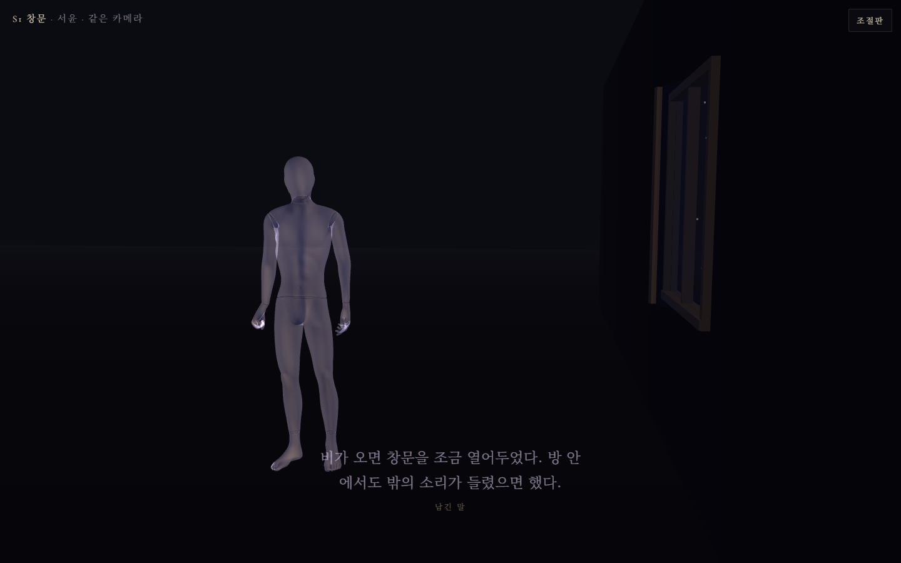
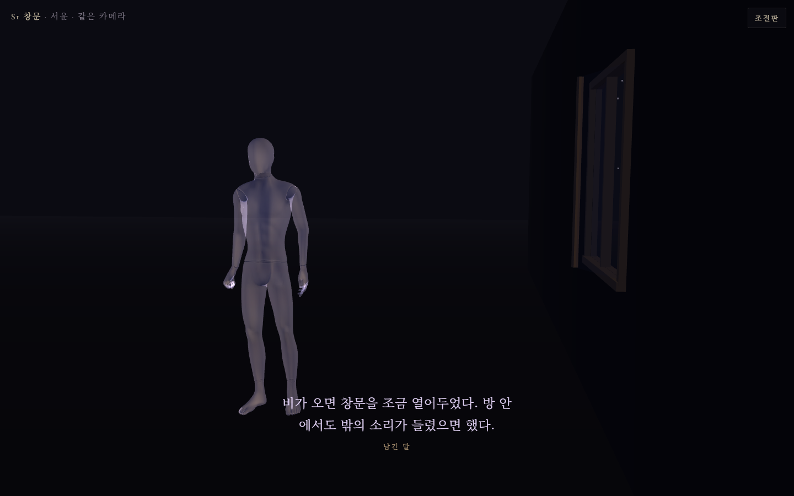
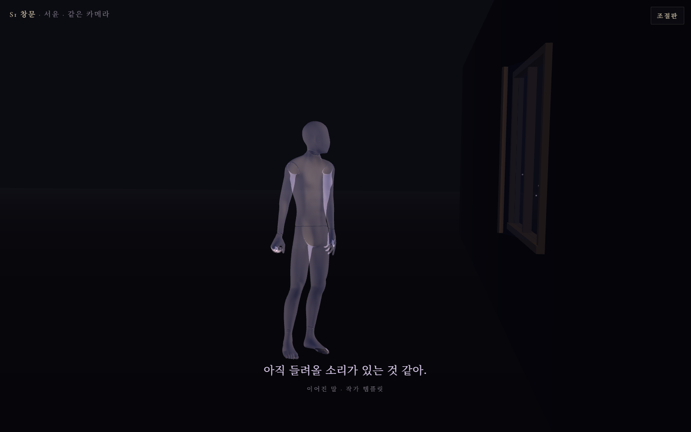
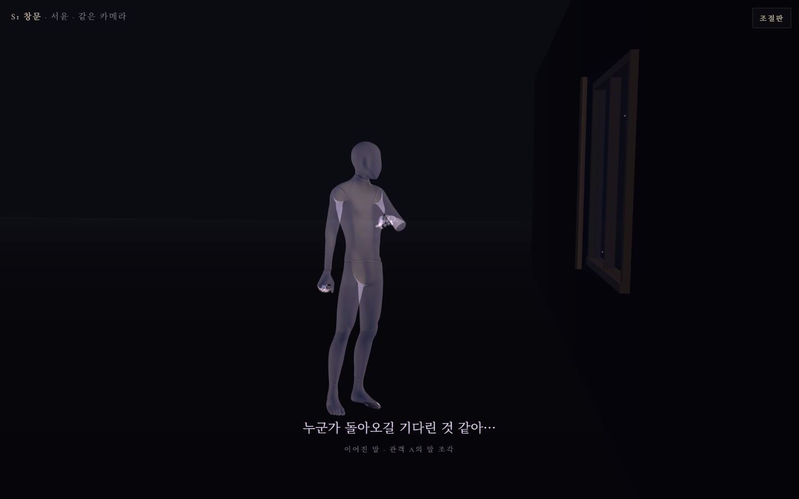
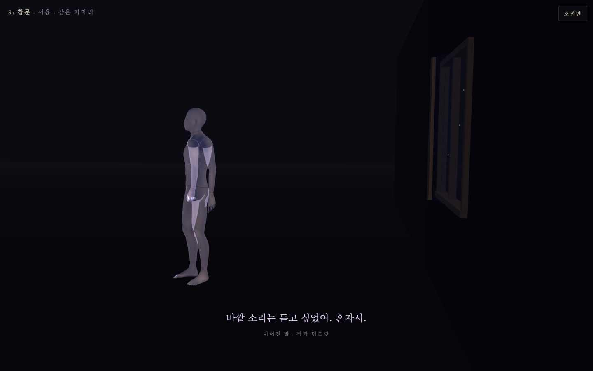
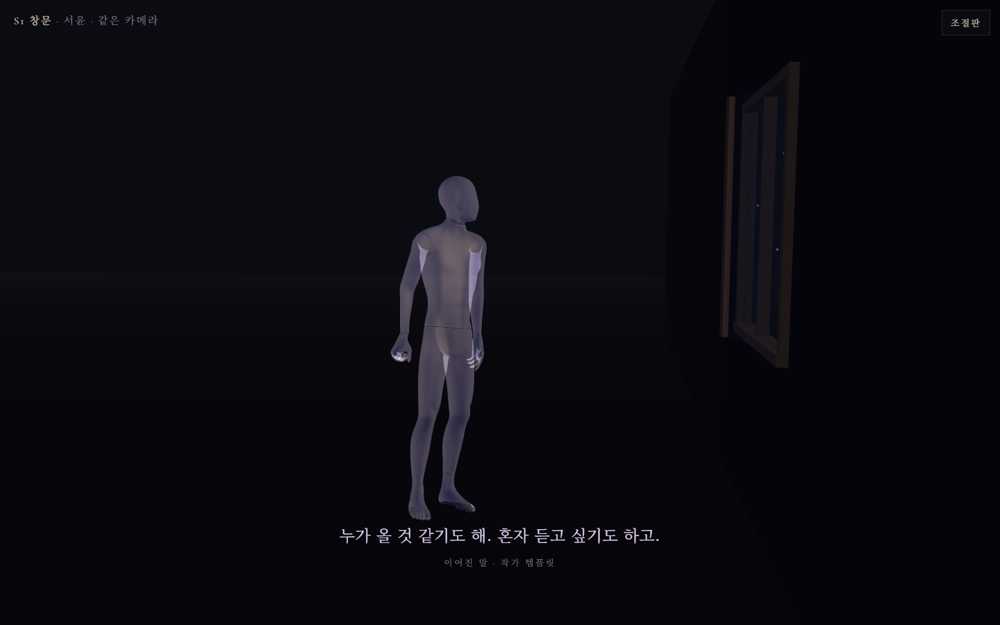
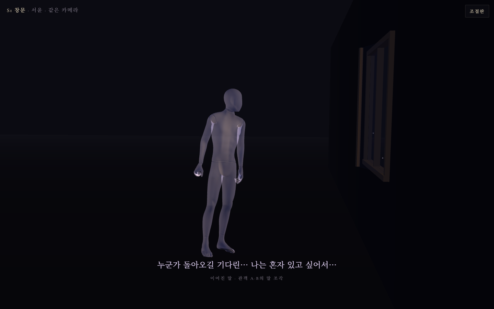
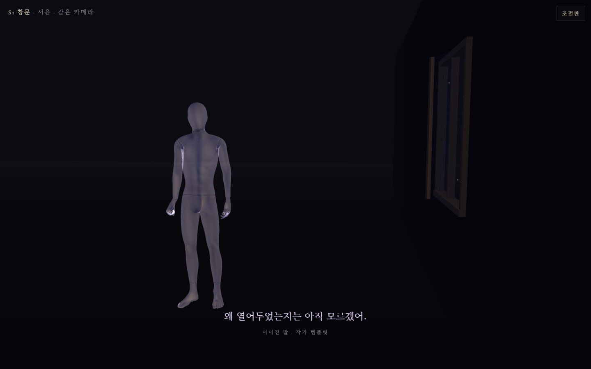
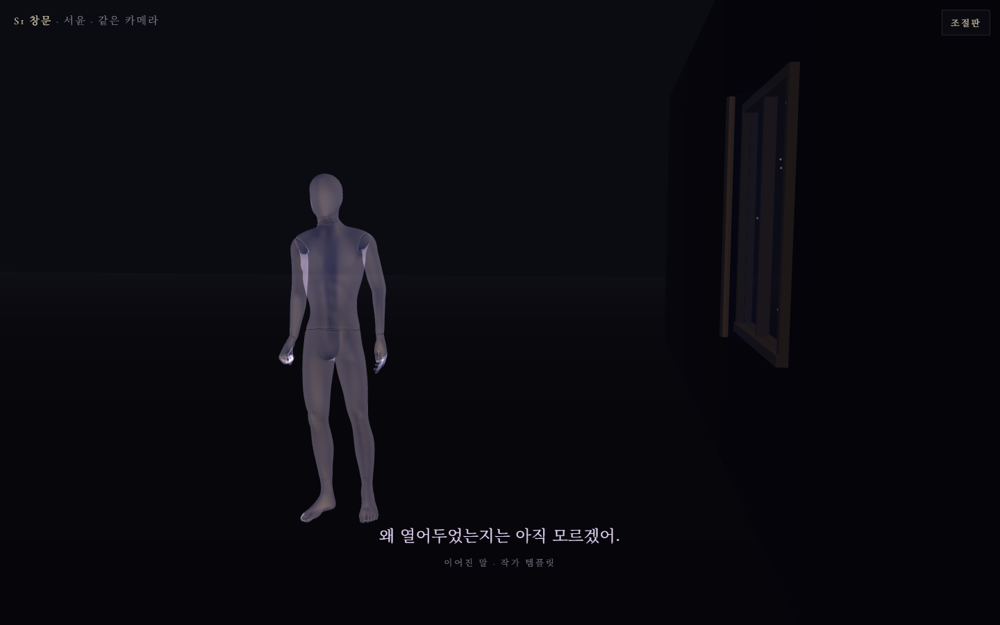

# 생애 전승 T2 — 유령 표현 비교 (2026-09-22)

> 발단: `docs/생애그릇_영생_브레인스토밍-260922.md` §8 — Dropbox `tem life proto.pdf`(생애 전승 시제품 명세 v0.1) 검토 후 권고 "T2만 떼어 먼저". 사용자 결정 = 허구 인물 **서윤**으로 진행(가족 채록은 뒤).
> 명세 15쪽 T2 원문: "기다림·고독·혼합·기본을 같은 카메라에서 비교하는 로컬 장면. 여기서 기다림과 고독의 차이가 읽히지 않으면 저장 범위를 넓히기 전에 대사·거리·방향을 조정한다."
>
> **상태 = 접음 (2026-09-23 사용자 결정 "t2 접어").** §5 판정은 내리지 않음. 후속 실행(§8 방향)은 다른 세션에서 진행 — 이 문서는 기록으로만 보존. 본 코드 0줄 수정 · 서버 0 · 저장 0 · 분류기 0.
> **9-23 추가: §8** — 지형 고정 전제를 바꾸는 개정 방향(공간 연결·재방문·갈래·판본 저장 중심). 다른 세션 산출, 결정 아님.

---

## 0. 결과 한 줄

실험 페이지 `test/life-t2-test.html` 하나로 유령 하나·창문 하나·같은 카메라 앞에서 다섯 상태(기본·기다림·고독·혼합·유보)를 **작가 템플릿 판**과 **관객 말 조각 판** 두 벌로 나란히 캡처했다(정지 12장 + 혼합 교대 영상 1편, 콘솔 오류 0). 자세는 세 축(옆 기울기·고개 돌림·몸 돌림)과 물러남으로 갈리고, 전환은 2.5초 지수 접근으로 느리게 간다. 판정은 §5의 세 질문에 사용자가 답하는 것으로 끝난다.

---

## 1. 무엇을 만들었나

| 항목 | 내용 |
|---|---|
| 파일 | `test/life-t2-test.html` (신규 1개, 약 330줄). 선례 `test/ghost-mannequin-test.html`(로더·재질) + `test/horizon-wave-test.html`(조절판 틀) |
| 여는 법 | 저장소 루트에서 `npx vite --port 5173` → `http://127.0.0.1:5173/test/life-t2-test.html` (유령 모델 `/test/ybot.fbx` 로컬, three.js r128 CDN) |
| 화면 | 유령(ybot, Take 001 차분한 standing) 원점 · 창문 벽 x=2.1 (오른쪽, 한 짝 0.35rad 열림, 창 너머 비) · 카메라 고정(잠금 해제 시 끌어서 둘러보기) · 하단 자막(말 + 출처 라벨 "남긴 말"/"이어진 말 · …") |
| 조절판 | 상태 5칩 · 조각 판 켜기 + 관객 A/B 말 입력 · 자세 수치 7종 슬라이더(기울기·고개·몸·창가로 다가감·물러남·교대 주기·전환 시간) · 고개 축(Y/Z/X)·방향 뒤집기 · 카메라 잠금/시점 처음으로 · **상태줄에 유령 몸의 실제 회전·위치 실시간 표시**(안 움직이는 것 같을 때 폭 문제인지 정지인지 가르는 용도) |
| 자동화 훅 | `window.__t2 = { ready, setMode, setFragment, setInputs, setPanel, setParam, getMode, line, pose, settled }` |
| 캡처 | playwright(저장소 devDependency, 헤드리스 SwiftShader) 스크립트로 12장 + 영상. MCP 브라우저는 다른 세션이 점유 중이라 미사용 |

**판 두 벌의 차이** — 템플릿 판은 명세 7쪽 신규 대사 그대로. 조각 판은 관객 A("누군가 돌아오길 기다린 것 같아.")·B("나는 혼자 있고 싶어서 그랬다고 봐.")의 말을 현행 `js/core/drift_lines.js` 규칙(재대화 18자 / 혼잣말 12자 + "…")으로 깎아 유령 입에 넣는다. 자세는 두 판이 동일 — **말의 출처만 다르다.** 분류기는 없고 상태는 사람이 칩으로 고른다.

## 2. 잠금값과 출처

| 값 | 수치 | 출처 |
|---|---|---|
| 조명 ambient/key/fill | 0x1a1828 1.3 / 0xc4a882 0.7(창 쪽) / 0x3a4a80 0.3 | `tem_af_strata_terrain.js` (horizon-wave-test 와 동일) |
| 유령 재질 | grey 128 · opacity 0.7 · Additive·DoubleSide·depthWrite=false | `lumen_scene_mannequins.js` DEFAULTS |
| 옆 기울기 상한 | 0.18 rad | `lumen_scene_mannequins.js` driftLeanFactor |
| 자세 폭 (1차, 9-22) | 기울기 0.06 rad · 고개 0.6 · 몸 0.35 · 물러남 0.25 m | 명세 7쪽 제안값 — 사용자 첫 확인 "몸이 안 달라지는데" → 폐기 |
| 자세 폭 (2차, 9-23, 현행) | 기울기 0.12 rad · 고개 0.9 · 몸 0.8(46°) · **창가로 다가감 0.45 m**(신설) · 물러남 0.7 m · 교대 8 s · 유보 ±0.03 rad | 작가 결 "넓게". 계산값=실제 렌더값 대조로 코드 결함 아님을 확인한 뒤 폭만 키움 |
| 전환 | 2.5 s 지수 접근(95% 도달) | 작가 결 "느리고 넓고 무겁게"(260809). 명세의 500 ms 경계 보간은 채택 안 함 |
| 카메라 | pos (1.35, 1.55, 4.1) → tgt (0.8, 1.1, 0), FOV 42 | 1차 캡처에서 창이 잘려 조정 |

## 3. 상태 5종 — 실측 (전환 완료 시점)

좌표 약속: 창 = +x. 몸 돌림(+) = 창 쪽. 옆 기울기(−) = 창 쪽.

| 상태 | 말(템플릿 판) | 말(조각 판) | 옆 기울기 | 고개 | 몸 돌림 | 물러남 z |
|---|---|---|---|---|---|---|
| 기본 | 비가 오면 창문을 조금 열어두었다. 방 안에서도 밖의 소리가 들렸으면 했다. | (동일 — 남긴 말) | 0 | 0 | 0 | 0 |
| 기다림 | 아직 들려올 소리가 있는 것 같아. | 누군가 돌아오길 기다린 것 같아… | −0.12 | +0.90 (창) | +0.80 = 46° (창) | **창가로 x +0.45**, z −0.13 |
| 고독 | 바깥 소리는 듣고 싶었어. 혼자서. | 나는 혼자 있고 싶어서 그랬다고… | 0 | −0.27, 아래로 0.22 | −0.80 = −46° (등 돌림) | **뒤로 z −0.70**, x −0.35 |
| 혼합 | 누가 올 것 같기도 해. 혼자 듣고 싶기도 하고. | 누군가 돌아오길 기다린… 나는 혼자 있고 싶어서… | 기다림 ↔ 고독 자세 8초 교대 (말은 고정) | | | |
| 유보 | 왜 열어두었는지는 아직 모르겠어. | (템플릿 그대로) | ±0.03 sin, 6.5 s | ±0.12 sin | ±0.03 sin | 0 |

## 4. 캡처

폴더 `docs/생애전승_T2_스크린샷/` (1440×900, 헤드리스 SwiftShader — 실제 GPU 화면과 밝기·안티앨리어싱이 조금 다를 수 있음).

| | 템플릿 판 | 조각 판 |
|---|---|---|
| 기본 |  |  |
| 기다림 |  |  |
| 고독 |  |  |
| 혼합 (창 쪽 위상) |  |  |
| 혼합 (안쪽 위상, 8.6 s 뒤) |  |  |
| 유보 |  |  |

- 조절판 열린 첫 화면: `00_조절판.png`
- 혼합 교대 영상(템플릿 판, 22초, 교대 2회): `혼합_교대_템플릿.webm`

1차 캡처(명세 제안값)는 사용자 첫 확인에서 "몸이 안 달라지는데"로 반려됐다. 계산값과 실제 렌더값(`__t2.actual()`)을 대조해 코드 결함이 아님을 확인한 뒤 폭을 키워 재캡처한 것이 위 표다. 2차에서는 기다림 = 창가로 한 걸음 나가 몸을 창 쪽으로 돌림, 고독 = 등을 돌리고 방 안쪽으로 물러남(옆모습·작아짐)으로 자막 없이도 갈린다(참고, 판정 아님). 혼합은 8초마다 두 자세를 오가며 말은 한 문장 고정. 창 너머 비는 창 구멍 안에서만 점으로 보인다.

## 5. 사용자 판정 — 세 질문

> 9-23 사용자 1차 확인: 2차 폭에서 **"오 달라지네"** — 몸 변화가 눈에 들어옴. 아래 세 질문의 답은 아직.

캡처(또는 페이지를 직접 열어)를 보고 답한다.

1. **기다림과 고독이 설명 없이 구분되는가?** — 자막을 가리고 몸만 봐도 다른 사람으로 읽히는가.
2. **혼합이 "둘 다 있다"로 읽히는가, "고장 났다"로 읽히는가?** — 영상 22초.
3. **템플릿 판과 조각 판 중 어느 쪽이 "관객이 다녀갔다"로 읽히는가?** — 같은 자세, 말만 다름. 조각 판은 관객의 실제 문장이 잘려 들어간 것.

| 답 | 다음 |
|---|---|
| 1 아니오 | 조절판 수치(기울기·고개·몸·물러남)와 대사를 고쳐 재캡처. 저장 쪽으로 안 감 |
| 1 예 + 3 조각 판 | 저장은 기존 자산으로 최소판 — `ghost_variants`에 다중 출처 칸 1개 추가·`run_journals` 사건·`scenes.meta.record.utterances` 원문. 명세의 표 6개는 안 짓는다 |
| 1 예 + 3 템플릿 판 | "변이 지점은 사람"(RECORD v4 §3-3) 원칙과 충돌 — 명세 경로를 그때 다시 논의 |
| 2 고장 | 교대 주기·전환 시간 조정 또는 혼합을 "두 발화 교대"로 바꿔 재캡처 |

## 6. 알려진 한계

- **고개 돌림 축**은 Mixamo 머리 뼈의 국소 Y축이라고 가정했다(`mixamorig1Head`). 캡처에서 창 쪽으로 도는 것으로 보이나, 반대면 조절판 "고개 방향 뒤집기" 또는 축 선택으로 바로잡는다.
- **유보** 상태는 명세 7쪽 표에는 있지만 사용자가 요청한 4상태 밖이다. 비교용으로 넣었고 빼도 무방.
- 혼합의 **말은 한 문장 고정**이고 몸만 교대한다(명세 7쪽). 사용자 확장안 §5-B "서로 다른 발화가 번갈아"는 미구현 — 2번 판정에 따라.
- 조각 판의 조각 규칙은 현행 `drift_lines.js`를 **그대로** 쓴다(18자 + "…"). 그래서 "그랬다고 봐"가 "그랬다고…"로 잘린다. 이 잘림 자체가 현행 무대의 결이다.
- 헤드리스 렌더(SwiftShader)라 실제 GPU 화면과 밝기가 다를 수 있다. 판정은 가능하면 페이지를 직접 열어서.
- 지형·별이엔진·전이·저장 전부 없음. T2는 "표현이 읽히는가"만 본다.
- **명세 7쪽 제안값은 무대 거리(4 m)에서 안 읽힌다** — 몸 20°·물러남 25 cm는 사용자 화면에서 "안 달라진다". 46°·70 cm + 다가감 45 cm 가 첫 통과 폭. 저장 단계로 가더라도 이 폭을 기준으로.

## 7. 파일

| 구분 | 경로 |
|---|---|
| 신규 | `test/life-t2-test.html` |
| 신규 | `docs/생애전승_T2_스크린샷/` (png 13 + webm 1) |
| 신규 | 이 문서 |
| 수정 | `docs/생애그릇_영생_브레인스토밍-260922.md` §7 (포인터 1줄) |
| 미수정 | 본 코드 전부. 롤백 = 위 신규 파일 삭제 |

---

## 8. 개정 방향 — 공간·전승 구조와의 결합 (다른 세션 산출, 2026-09-23 저장)

> 사용자가 다른 세션에서 받아 온 글을 원문 그대로 보존한다. **결정 아님.** 이 절은 위 §1~§7(지형 고정·유령 표현만 비교)의 전제를 바꾸자는 제안이다. 브레인스토밍 문서 §5-A "아이디어 28"·§5-B 구현안·§8 명세 검토와 이어서 읽을 것.

**응. 지금 이야기한 '기억마다 다른 공간을 만들고, 방문자가 지나간 관계에 따라 퀼트가 형성되는 구조'에 적용할 수 있어.** 그러면 앞의 생애·전승 아이디어들이 실제 공간에서 일어나는 사건이 돼.

둘을 합친 작품의 구조는 이렇게 잡을 수 있어.

**한 사람이 삶의 장면들을 남긴다 → 다른 사람이 그 장면들을 연결하며 그 사람을 이해한다 → 그 이해가 공간과 유령에 흔적을 남긴다 → 다음 사람은 그 흔적까지 만나 자기 판본을 만든다.**

여기서 생애를 담는 기능은 TEM의 새로운 사용법이고, 이를 가능하게 하는 공간·전승 시스템은 다른 기억에도 공통으로 사용할 수 있어.

가장 중요한 건 **'한 사람의 생애', '그 생애를 읽은 경로', '다음 사람에게 남기는 판본'을 구분하는 것**이야.

| 구성 | 담는 것 | 공간에서 나타나는 모습 |
| --- | --- | --- |
| 당사자가 남긴 기록 | 장면, 말, 사물, 질문 | 기억 공간을 만드는 재료 |
| 기억 공간 | 특정 장면의 장소와 감각 | 방, 들판, 바닷가, 소리만 있는 공간 등 |
| 방문자의 경로 | 방문 순서, 재방문, 대화와 해석 | 이번 방문에서 이어지는 공간과 전이 |
| 전승 판본 | 경로를 거치며 생긴 변화와 연결 | 다음 방문자가 물려받는 세계의 한 상태 |
| 출처와 계보 | 누가 무엇을 남기고 바꿨는지 | 공간의 흔적을 거슬러 확인하는 기능 |

당사자의 첫 서술도 하나의 판본이야. 그것을 보존하면 이후의 해석이 **누구의 어떤 말에서 생겼는지** 확인할 수 있어.

그리고 **방문자의 경로가 자기만의 기억이 된다는 말과, 그 경로를 다음 사람에게 물려준다는 말은 양립해.** 다음 방문자는 앞사람의 연결과 흔적을 물려받고, 거기서 다른 길을 선택할 수 있으니까.

구체적인 장면으로 설명해볼게.

어떤 사람이 세 가지 기억을 남겼다고 하자.

* **부엌:** 누군가에게 밥을 해주던 기억.
* **비 오는 방:** 창문을 조금 열어놓던 기억.
* **역:** 어떤 사람을 보내던 기억.

그리고 "언젠가 내 이야기를 바다에 데려가 줘"라는 요청도 남겨.

첫 방문자는 **부엌 → 비 오는 방 → 역**으로 가. 그 사람은 이 생애를 '계속 누군가를 기다린 사람'으로 읽어. 그 해석이 충분히 대화에서 드러났다면, 방의 빗소리가 역에 들어온 뒤에도 이어지고, 역의 사물 유령은 떠나는 열차보다 누군가 도착할 쪽을 향하게 할 수 있어.

이 방문이 끝나면 저장되는 건 공간 세 개의 배치와 함께, **어떤 연결을 통해 기다림이라는 읽기가 생겼는지**야.

두 번째 방문자는 그 판본에서 출발해 **역 → 부엌 → 비 오는 방 → 역**으로 돌아와. 이 사람은 같은 인물을 '떠나는 사람을 붙잡지 않고 보내준 사람'으로 이해할 수 있어. 마지막 역에는 첫 방문자가 남긴 기다림과 두 번째 방문자가 남긴 놓아줌이 함께 존재해.

**같은 역에 돌아왔지만, 거기까지 온 관계 때문에 다르게 만나는 거야.** 네가 말한 경로와 기억의 관계가 여기서 작동해.

세 번째 방문자는 실제로 바다에 다녀온 뒤, 자기 경험을 남겨. 그러면 생애 공간에 바다가 추가될 수 있어. 그 바다에는 다음과 같은 계보가 붙어.

> 당사자가 남긴 요청에서 시작해, 방문자가 다녀온 경험으로 생긴 공간.

당사자는 생전에 이 바다에 가지 않았어. 그런데 그 사람이 남긴 말이 누군가를 움직였고, 그 결과가 다시 그 사람의 이야기로 돌아온 거지. **네가 이야기한 '죽은 뒤에도 이야기가 새로운 사건을 겪는다'를 실제 상호작용으로 구현하는 지점이야.**

앞의 28개 아이디어도 이 구조 안에서 여러 기능으로 연결돼.

| 아이디어 묶음 | 적용 방식 |
| --- | --- |
| 자기 유령을 생전에 만나기·돌아온 사람이 자기 전설 만나기 | 당사자가 다른 사람들의 판본에 방문하고, 자기 반응을 새로운 기록으로 남김 |
| 여러 사후 생애·용서하지 않은 기억·소수의 판본 | 관계별로 갈래를 보존하고, 방문자가 다른 갈래를 만날 수 있게 함 |
| 열린 유언·미래의 질문·미완성된 일 | 기억에 응답 가능한 요청을 붙이고, 응답에서 새 공간이나 연결이 생기게 함 |
| 습관의 전승·살아 있는 사람도 물들기 | 남의 기억을 만난 경험이 방문자 자신의 생애 공간에 새로운 장면으로 생김 |
| 세 사람이 만든 문장·이름 없는 영향 | 생성된 표현에 기여한 기록들을 연결하고, 표면에서는 문장·소리·사물의 성질로 나타냄 |
| 부재·귀환·급하게 챙기는 생애 꾸러미 | 적은 기록으로 시작하고, 당사자의 현재 상태가 미정인 채로도 보존·방문·추가가 가능하게 함 |
| 망각·끝내기를 선택하기·기억 돌보기 | 표현의 흐려짐, 공개·전승 범위, 보관과 복구의 이력을 각각 다룰 수 있게 함 |

여기서 특히 조심해서 설계해야 할 부분이 **'변형을 무엇으로 표현할 것인가'**야.

매번 해석이 달라질 때마다 방 전체를 새로 생성하면, 방문자는 무엇이 변했고 왜 변했는지 붙잡기 어려워져. 처음에는 기억 공간의 기본 모습을 유지하면서 다음 요소를 변화시키는 편이 좋아.

* 어느 기억으로 이어질 수 있는가.
* 이전 공간의 소리나 사물이 어디까지 따라오는가.
* 같은 장소에 어느 방향으로 도착하는가.
* 유령이 어떤 말과 자세를 이어받는가.
* 재방문했을 때 어떤 흔적을 다시 만나게 되는가.

새로운 경험이 실제로 추가됐을 때 바다 같은 새 공간을 생성하는 거야. 이렇게 하면 **'기존 기억을 다르게 읽은 것'과 '이야기에 새로운 사건이 생긴 것'이 서로 다른 공간적 변화를 갖게 돼.**

또, 여러 사람의 해석을 하나의 평균으로 만들면 앞에서 이야기한 '여러 사후 생애'가 약해져. 딸이 기억하는 엄마와 친구가 기억하는 그 사람은 각자 이어질 수 있어야 해. 두 갈래가 만나는 경우에도 그 차이가 느껴지도록 접점을 만들어야 하고.

그래서 저장의 기본 단위도 **'가장 최근의 맵 하나'에서 '계보를 가진 판본들'로 확장하는 게 맞아.** 각 판본에는 출발한 판본, 방문 경로, 바뀐 요소, 새로 더해진 기록이 남아야 해. 다음 방문자는 그중 한 판본을 이어받고 새로운 갈래를 만들 수 있어.

앞서 만든 생애 시제품 명세도 이 방향에 맞춰 바꿔야 해. 그 명세는 지형을 고정해놓고 유령의 의미 변화를 확인하는 데 초점을 뒀어. 지금은 **공간의 연결과 전승 자체가 핵심 상호작용**이 됐으니, 방문 경로·재방문·갈래·판본 저장을 중심에 놓는 개정이 필요해.

첫 시제품은 범위를 이렇게 잡겠어.

**세 기억 공간, 한 인물, 응답 가능한 요청 하나, 이어서 방문하는 세 사람.**

그 안에서 다음 경험이 끝까지 돌아가게 만드는 거야.

1. 첫 방문자가 세 공간을 연결하고 해석의 흔적을 남긴다.
2. 두 번째 방문자가 그 판본을 이어받아 다른 순서로 걷고, 한 공간을 재방문한다.
3. 세 번째 방문자가 요청에 응답해 새로운 공간 하나를 더한다.
4. 저장한 판본을 다시 열었을 때 연결·변화·출처가 그대로 복원된다.

이 정도면 '생애를 담는 그릇'이라는 사용법과 네가 새로 제안한 퀼트 구조를 한 번에 검증할 수 있어. 연구에서도 **같은 삶의 장면들이 경로와 전승에 따라 어떻게 다르게 이해되는지**, 그리고 **어떤 변화까지 사람들이 같은 사람의 이야기로 받아들이는지**를 구체적으로 물을 수 있고.

내가 이 결합에서 중심에 두고 싶은 장면은 이것이야. **누군가 남긴 기억을 방문한 사람이 자기 삶에서 무언가를 하고 돌아왔을 때, 그 경험이 다음 사람이 만날 공간을 바꾸는 것.** 그때부터 TEM 안의 생애는 방문을 받을 때마다 실제로 다음 장을 갖게 돼.
