# 통로 T1 — 회랑에 전이의 모양·길이·폭·결을 준다 (2026-09-23)

> 발단: 현행 무대는 씬을 마치고 지도로 돌아오면 안개 모듈(`js/ui/lumen_spatial_fog.js`)이 "지금 자리 → 새로 열린 핀"으로 안개를 **직선**으로 깎아 회랑을 낸다(반폭 5, 도착 시 3초 개화). 어떤 전이든 늘 같은 결이다. 이 실험은 그 회랑이 **전이 패턴 6종 · 출발/도착 장면의 감정 델타 · 정렬도 · 오염 3축**에 따라 달라질 때 조감과 1인칭에서 어떻게 보이는지 캡처로 남긴다.
> 근거: `docs/씬은_사건이다_결정-260727.md`(패턴 = 중심 이동), `docs/생성형_지형모델_v2-260619.md` §9(라벨 6개만 쓰면 궤적이 뭉개진다), `docs/공간안개_B안_구현-260709.md`(안개 = 벽), CLAUDE.md §6.5 #1(패턴은 반경이 아니라 기하를 바꾼다) · #5(관객은 안개를 본다).
> 선례 형식: `docs/생애전승_T2_유령표현비교-260922.md`.
>
> **상태 = 사용자 판정 대기.** 본 코드 0줄 수정 · 서버 0 · 저장 0 · 별이엔진 0(패턴·정렬도·오염은 사람이 조절판으로 고른다). 판정은 §6의 세 질문에 사용자가 답하는 것으로 끝난다 — 이 문서는 관찰과 수치만 적고 "읽힌다/안 읽힌다"를 단정하지 않는다.

---

## 0. 결과 한 줄

실험 페이지 `test/corridor-t1-test.html` + 순수 규칙 파일 `test/corridor-t1-rules.js` 로, 같은 핀 두 개(A·B, 직선 58.3) 사이에 패턴 6종의 회랑을 결정론(난수 0)으로 파서 조감 17장 + 1인칭 6장을 캡처했다(콘솔 오류 0). 세 렌즈 검토에서 결함 17건이 나와 그중 10건을 고쳐 재촬영했고(마디 튕김·displacement 진입 불가·contradiction 갈고리 삼킴·B 유령 새어 보임 등), 남은 7건은 §5·§7에 정직히 적었다. 길이 규칙이 정렬도에 정확히 따르는 것은 echo_follow 뿐이고, 1인칭에서는 회랑이 "길"보다 "언덕 사이 골"로 보이는 경향이 남아 있다.

---

## 1. 무엇을 만들었나

| 항목 | 내용 |
|---|---|
| 파일 | `test/corridor-t1-test.html` (실험 페이지, 신규) · `test/corridor-t1-rules.js` (회랑 기하 규칙, 순수 함수 `buildPath`, 신규). 선례 `test/life-t2-test.html`(조절판·훅·전환 결) + `test/fog-reveal-test.html`(지형+안개 모듈 단독 구동) + `test/ghost-mannequin-test.html`(유령 재질 — 여기서는 fog-reveal 의 스프라이트 유령을 씀) |
| 여는 법 | 저장소 루트에서 `npx vite --port 5173 --strictPort --host 127.0.0.1` → `http://127.0.0.1:5173/test/corridor-t1-test.html` (three.js r128 전역 빌드, jsdelivr) |
| 화면 | 핀 A(−24,16) 출발 걷힘 원(반경 6, 회색 고리) · 핀 B(26,−14) 도착 개화 원(반경 14, 유령 스프라이트) · 그 사이 회랑. 조감(회랑 전체 자동 프레이밍, OrbitControls) / 1인칭(A 에 서서 첫 마디 방향, WASD·드래그, 이동 벽 = 안개 모듈의 `window.__temSpatialFogConstrain`). 좌상단 힌트 = 출발/도착 장면명 + 뷰 이름. 하단 자막 = 연결사 한 단어 + 출처줄("회랑 입구" / avoidance 는 "벽 앞 · 길은 나지 않는다") |
| 조절판 | 패턴 6칩 · 장면 프리셋 5(빈 방의 창 / 들킨 거짓말 / 첫눈의 마당 / 병실 복도 / 다시 걸려온 전화) 출발·도착 · 정렬도 슬라이더 0..1 · 수준 HIGH/MID/LOW/FIXATED · 오염 발산·수렴·이질 0..1 · 연결사 8종 · 뷰 전환 · 계획선(조감 전용, 기본 꺼짐) · **상태줄에 마디 수·길이 배율(목표/실측)·반폭·델타 원료(dom·side·r2·mN·val) 실시간 표시** |
| 모듈 사용 방식 | 페이지가 지형 파일과 같은 모양의 전역 uniform(`window.__temSpatialFogUniforms`)을 만들고 runtime 심(`getScene/getRenderer/getCamera`)으로 `LumenSpatialFog.attach` — **모듈 0줄 수정**. 회랑 목록·애니메이션·revealAt·이동 벽은 전부 모듈이 담당. 곡선 = 마디마다 `carve()` 를 1.4초 간격으로 순차 호출, 마디별 폭 = carve 직전 `setOptions({corridorRadius})`. 결(가장자리 일렁임·벽 결·이질 얼룩·벽 얇아짐)은 페이지 셰이더 전용 uniform(`_t1*`) |
| 자동화 훅 | `window.__t1 = { ready, setPattern, setPair, setAlignment, setBucket, setCont, setConnective, setView, recarve, settled, state, setPanel, setGuide, caption, revealAt, scanRows, fp:{setPos, setYaw, move} }`. `setX` 는 값만 바꾸고 `recarve()` 를 불러야 다시 판다. `settled()` = 모든 carve/개화 시간 경과 + 결 uniform 2.5초 지수 접근 수렴(오차 <0.01) |
| 캡처 | playwright(저장소 devDependency, 헤드리스 chromium 1440×900) 스크립트 → `docs/통로_T1_스크린샷/` 22장. 각 장면 = 훅 세팅 → `setPanel(false)` → `recarve()` → `settled()` → +0.9초 뒤 촬영. 1인칭 자막 컷은 `setView('fp')` → 2.6초 → `caption()` → 1.6초 |

**패턴 이름은 관객 화면(무대·힌트·자막)에 나오지 않는다.** 조절판·상태줄에만. 연결사 8종은 `js/ui/lumen_dialog_phase1.js` 의 `CONT_CONNECTIVES` 를 페이지 로드 시 그 파일에서 정규식으로 읽어 온다(성공 확인, 실패 시 페이지 사본 폴백).

## 2. 잠금값과 규칙

규칙 정본 = `test/corridor-t1-rules.js` 파일 머리 주석. 아래는 요약.

### 2.1 입력과 델타 → 기하 원료

| 원료 | 식 | 쓰임 |
|---|---|---|
| Δ | to − from (판단 17축: fear sadness anger guilt shame isolation numbness moral_pain helplessness despair \| joy hope relief gratitude love peace comfort) | |
| dom · side | \|Δ\| 최대 축 · sign(Δ[dom]) (+1 왼쪽 / −1 오른쪽으로 휨, 동률은 앞 축) | 휘는 쪽 |
| mN | clamp(\|Δ\|₂ / 1.4, 0, 1) | 곡률·마디 수 |
| val | dom 축의 결(양성 +1 / 음성 −1) | 되돌림 깊이·S자 비대칭 |
| r2 | Δ[sec] / \|Δ[dom]\| ∈ [−1,1] (sec = 둘째 축) | 봉우리 치우침·고리 찌그러짐 |

출처: `docs/감정축_통일_제안_v1-260714.md` 표 A(17축, 앞 10 음성·뒤 7 양성). 장면 프리셋 5는 실 DB 씬이 아니라 가상 벡터.

### 2.2 길이 · 폭 · 결

| 항목 | 식 | 출처 · 실측 유효 범위 |
|---|---|---|
| 길이 L* | L × min(1.6, 1 + 0.75·(1−a)) → a=0.9 ×1.075 / 0.5 ×1.375 / 0.2 ×1.6 | **echo_follow 만 정확 일치**. bridge 는 S자 최소 진폭 때문에 a ≥ 0.52 에서 ×1.36 고정. contradiction(MID)은 되돌림 바닥 때문에 a ≥ 0.5 에서 ×1.55 고정, HIGH 최소 형태 ×1.62 로 상한 초과. displacement·fixation·avoidance 는 미적용 |
| 반폭 w₀ | HIGH 7 / MID 5 / LOW 3.5 / FIXATED 2.5 | MID 5 = 현행 무대(모듈 기본) |
| 수렴 | w = max(1.8, w₀·(1 − 0.3c)) | c=1 → HIGH 4.9 / FIXATED 1.8 |
| 이질 | w_i = max(1.5, w·k_i·(1 + 0.45·h·sin(2.399i + domIdx))) | 마디별 얼룩. 실측 HIGH h=0.9 → 4.17~9.82. **마디별 하한 1.5 는 전체 하한 1.8 과 다름**(검토 지적, 주석에 명기) |
| 결(셰이더) | edgeAmp = (1+2.5d)(1−0.8c) · edgeFreq = 1+1.2d · grain = 0.16+0.5d · heteroBlotch = h × 회랑 언저리 마스크 | 가장자리 일렁임은 **min(0.5·r, r·0.35·edgeAmp)** 로 캡(반폭 절반 초과 금지), 시간항 0.18 ÷ max(1, edgeAmp). 전환 2.5초 지수 접근(T2 와 동일) |
| 연출 | 마디 1.4초 간격 순차 carve(모듈 corridorMs 1600, 앞 마디 진행률 ≈0.97 뒤 다음 시작) → 마지막 마디 뒤 B 개화(regionMs 3000). 입구 자막 = 첫 마디 60%(960ms) 시점 1회 4.5초 | 260809 "느리고 넓고 무겁게". 자막 시점은 **회랑 전체 60% 가 아니라 첫 마디 60%** (검토 지적 후 문구 정정) |
| 출발 걷힘 반경 | 6 (무대 입장 14 와 다름 — 실험 전용) | 9 → 6 으로 낮춤(1인칭 입구 좌우 벽이 화면에 들어오고 갈고리를 원이 안 삼키게) |

### 2.3 패턴 6종 (u = A→B 단위, p = 왼쪽 수직, seedR = 6)

| 패턴 | 형태 | 마디 | 도착 개화 |
|---|---|---|---|
| echo_follow | 활 한 번. off = amp·sin(π·t^γ)·side, 봉우리 0.5 + 0.1·r2 (0.4..0.6 클램프). amp 최소 0.04·mN → 정렬 높으면 거의 직선 | 6 + round(4mN) | 있음 |
| bridge | S자. off = amp·sin(2πt)·(1 + (0.25val + 0.25r2)·cos πt)·side. amp 최소 0.12 + 0.12mN | 4 + round(6mN) | 있음 |
| contradiction | A 에서 B 반대로 dBack = max(seedR + w + 1, s·L·0.45·(val<0 ? 1 : 0.7)) 뚫린 뒤 side 로 bend = s·(0.25+0.35mN)·L 꺾이고 중간점이 bend·(0.35+0.3r2) 더 벌어져 B 로. Catmull-Rom, s ∈ [0.15,1] 이분 탐색(정렬도는 L* 로만) | 5 + round(5mN) | 있음 |
| displacement | A → A2 "목"(반폭 w×0.55) → A2 에서 B 옆(shift/2)까지 평행 → 마지막 마디로 B. shift = side·(6 + 10mN + 8(1−a)) | 3 | 있음 |
| avoidance | 회랑 없음. 벽만 얇아지는 띠 A → K → B, K = 중점 + p·(−side)·L·(0.08 + 0.2mN + 0.12(1−a)) (델타 반대 = 무감 쪽). 띠 반폭 w×1.2, thinAmt = min(0.95, (0.55+0.45(1−a))(0.8+0.3mN)). 이동은 막힘 = "소리만 있는 통로" | 2 | 없음. 유령은 thinAmt×0.55 만큼만 비침 |
| fixation | A 를 지나는 고리. r = clamp(L*/2π, 5, 14), 중심 A + p·side·r, 접선축 r(1+0.3r2) 타원. 끝 = A | 8 + round(6mN) | 없음 |

## 3. 실측 표

기본 조건: 쌍 0→2(빈 방의 창 → 첫눈의 마당), a = 0.7, MID, 오염 0. 원료: dom joy · side +1 · val +1 · r2 −0.917 · mN 0.828. 직선 L = 58.31, 목표 배율 1.225.

| 패턴 | 마디 | 길이 | 배율(목표 1.225) | 반폭 | B 걷힘 | B 유령 불투명도 | 비고 |
|---|---|---|---|---|---|---|---|
| echo_follow | 9 | 71.43 | **1.225** | 5 | 1 | 0.89 | 목표 정확 일치 |
| bridge | 9 | 79.41 | 1.362 | 5 | 1 | 0.70 | S자 최소 진폭으로 초과 |
| contradiction | 9 | 90.33 | 1.549 | 5 | 1 | 0.90 | 되돌림 바닥으로 초과. 갈고리 최대 깊이 A 뒤 ≈14.6 (원 6 밖으로 8.6 ≥ w 5) |
| displacement | 3 | 77.99 | 1.338 | 2.75 / 5 / 5 | 1 | 0.86 | 목 마디 반폭 2.75. 길이 규칙 미적용 |
| avoidance | 2(띠) | 66.92 | 1.148 | — | 0 | 0.35 | thin {amt 0.718, r 6, bend −16.42} |
| fixation | 13 | 61.4 | 1.053 | 5 | 0 | **0.000** | 고리 끝 = A. B 자리에 아무것도 안 비침 |

**정렬도 × echo_follow** (마디 9 고정): a=0.9 → 62.68 ×1.075 / 0.5 → 80.18 ×1.375 / 0.2 → 93.3 ×1.600. 세 값 모두 목표와 일치. 첫 꼭짓점 z: 17.3 → 24.3 → 28.4 (A z=16).

**contradiction × 쌍** (a 0.7 MID): 0→2 dom joy side +1 val +1 r2 −0.917 → 길이 90.33 ×1.549 / 1→3(들킨 거짓말→병실 복도) dom shame side −1 val −1 r2 −0.833 → 90.15 ×1.546 / 2→0 dom joy side −1 val +1 r2 +0.917 → 90.54 ×1.553. **되돌림 점 4개는 1→3 과 2→0 이 0.02 이내로 같다** (둘 다 side −1 이고 되돌림은 바닥값에 걸려 있어서 r2 차이는 중간 불룩에만 남음).

**avoidance × 쌍**: 0→2 bend −16.42 · amt 0.718 · K(−7.45,−13.08) / 1→3 bend +15.57 · amt 0.703 · K(9.01,14.35). 비켜 나는 쪽이 반대.

**오염 발산 × bridge**: d=0 → texture {edgeAmp 1, edgeFreq 1, grain 0.16} / d=0.9 → {3.25, 2.08, 0.61}. 경로·마디·길이는 동일(결만 변화).

**1인칭 걷기 실측** (헤드리스, 0.5 단위 걸음, 이동 벽 통과 여부): displacement A→A2→B2→B 156 걸음 · 막힘 0 · B 도달(거리 0) / bridge 159 걸음 · 막힘 0 · B 까지 0.13 / contradiction 180 걸음 · 막힘 0 · B 까지 0.26.

**마디 이어 파기 동작** (recarve 뒤 0.8/1.5/2.2초 조감 컷, scratchpad 에만): A 에서 이어 자라는 덩어리 하나뿐, 관절에 고립된 원 없음(1.4초 간격 시점 앞 마디 진행률 ≈0.97).

**발산 0.9 잔떨림** (100ms 간격 5쌍, 가로줄 6개 경계 위치 비교): 경계 개수가 같은 줄 6개 중 4개 0px · 1개 3px · 1개 262px(문턱 부근 경계가 나타났다 사라져 짝짓기가 어긋난 측정 오류로 판단, 실제 경계 이동 아님). 수리 보고의 "평균 0.96px" 는 짝짓기 오류 줄을 뺀 값. 통과선 <2px 은 **4/6 줄에서만 확인**.

## 4. 캡처

폴더 `docs/통로_T1_스크린샷/` (1440×900, 헤드리스 SwiftShader — 실제 GPU 화면과 밝기·안티앨리어싱이 조금 다를 수 있음). 조감은 관객 화면이 아니라 검토용이다(§6.5 #5). 관찰은 캡처를 눈으로 열어 적은 것이고 판정이 아니다.

### 4.1 패턴 6종 (같은 쌍·같은 조건)

| 패턴 | 캡처 | 관찰 |
|---|---|---|
| echo_follow | 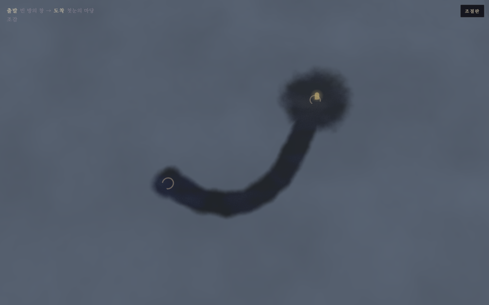 | A 에서 B 로 부드럽게 한 번 휘는 활. 마디 9라 모서리 각 없음. 배가 화면 아래(+z)로 처짐 |
| bridge | 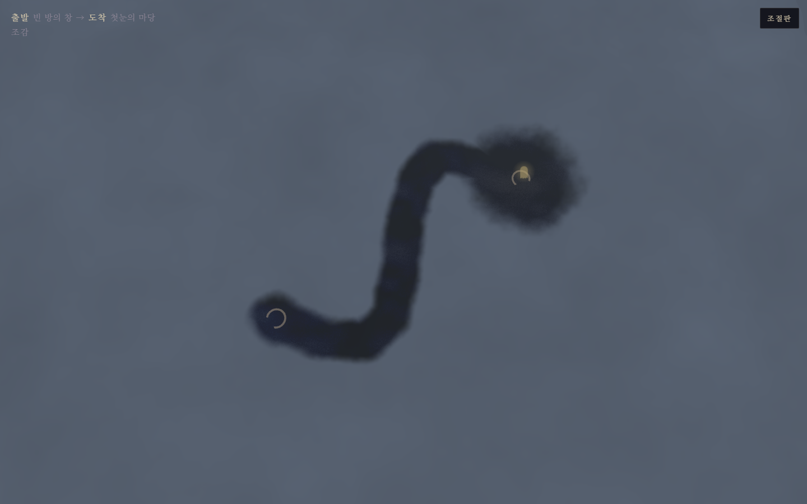 | 뚜렷한 S자 — A 에서 오른쪽으로 나가 위로 꺾여 올라가고 다시 오른쪽으로 꺾여 B 로. echo 와 한눈에 구분 |
| contradiction | 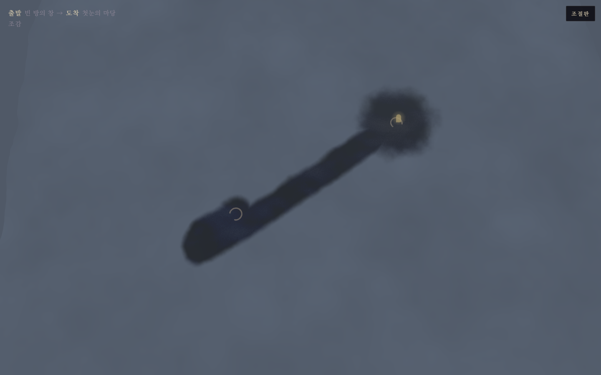 | A 원의 B 반대편(화면 아래·왼쪽)으로 굵은 덩어리가 뻗은 뒤 곧게 B 로. 되돌림은 원 밖으로 확실히 나오지만 "가는 갈고리 선"이 아니라 "A 에 붙은 두꺼운 혹"으로 보임(반폭 5 가 되돌림 깊이 14 에 비해 넓어서) |
| displacement | 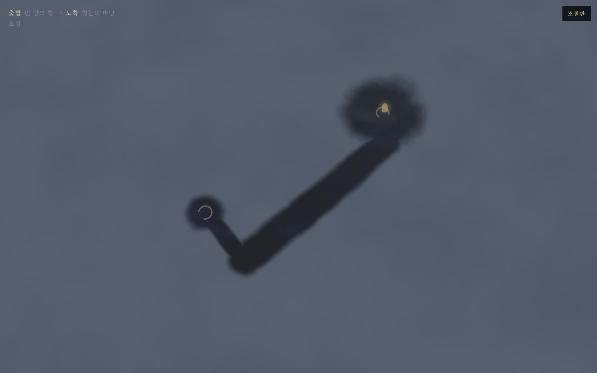 | A 원에서 **좁은 목**이 화면 아래로 내려가 꺾인 뒤 넓은 회랑이 B 옆까지 곧게 가고 마지막에 B 로 든다. 목 덕에 A 와 회랑이 이어져 있음 |
| avoidance | 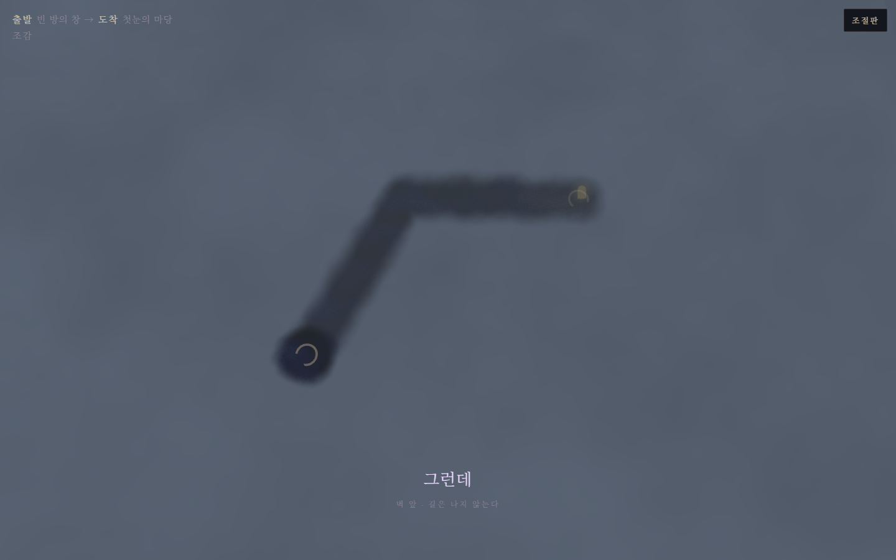 | 회랑은 없고 A 원만 진하다. A 에서 화면 위로 올라갔다 오른쪽으로 꺾여 B 로 가는 ㄱ자 반투명 띠가 배경보다 확실히 어둡게 보임. B 자리에 유령이 흐릿하게 비침. 자막 "그런데 / 벽 앞 · 길은 나지 않는다" |
| fixation | 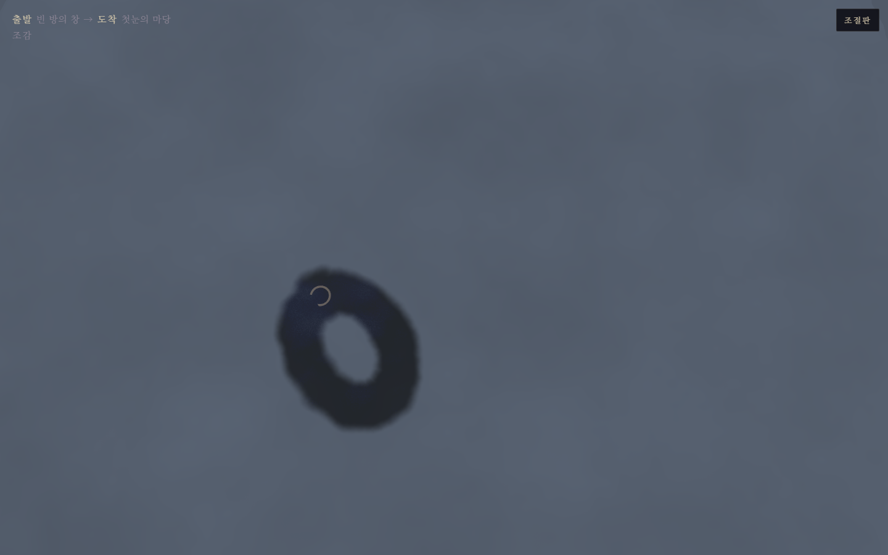 | A 주위 도넛 고리, 가운데 구멍. **B 자리에 아무것도 없음**(수리 전엔 노란 점이 비쳤음). 5종과 즉시 구분 |

### 4.2 같은 라벨 × 다른 쌍 (라벨 단독 아님 증거)

| 조건 | 캡처 | 관찰 |
|---|---|---|
| contradiction 0→2 | 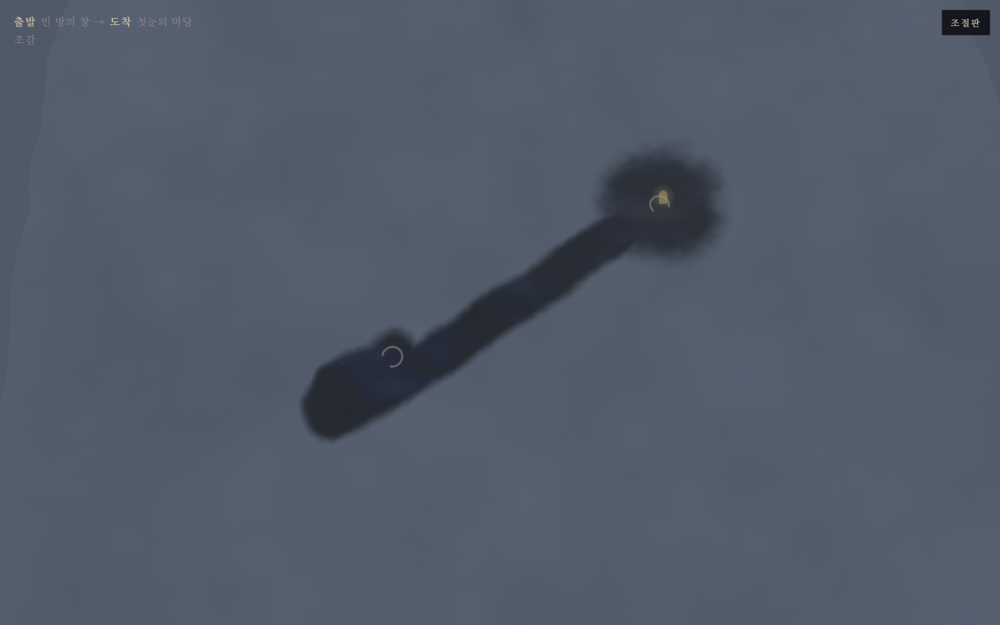 | A 아래·왼쪽으로 혹, 그 뒤 직선 |
| contradiction 1→3 | 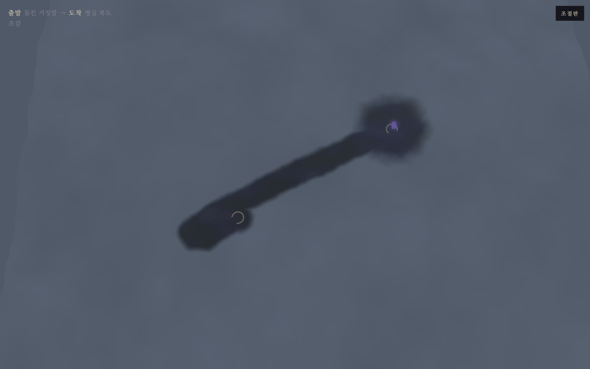 | A 왼쪽·아래로 혹, 직선으로 B. B 유령 보라색(장면 색). **0→2 와 혹 방향 차이가 미세** — 되돌림이 바닥값(seedR+w+1)에 걸려 세 쌍 모두 A 뒤 −x 쪽으로 같은 깊이만큼 나감 |
| contradiction 2→0 | 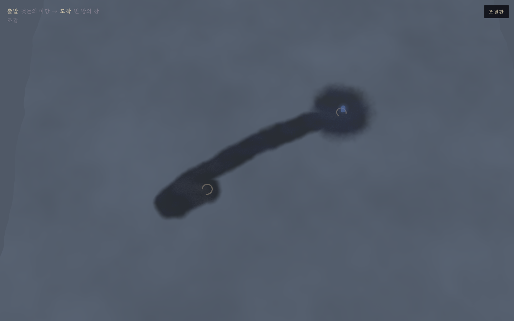 | 1→3 과 되돌림 구간이 거의 같고(점 4개 0.02 이내), 중간 불룩(r2 +0.917)만 다름. 수리 전(되돌림 5/12 로 갈리던 때)보다 세 쌍의 차이가 **줄었다** |
| avoidance 0→2 | 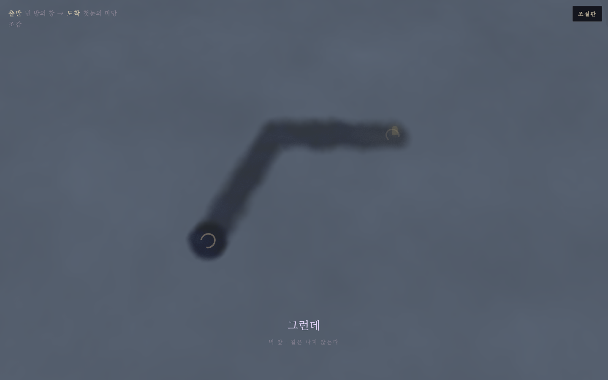 | 띠가 A 에서 위로 올라갔다 오른쪽으로 꺾여 B (bend −16.4) |
| avoidance 1→3 | 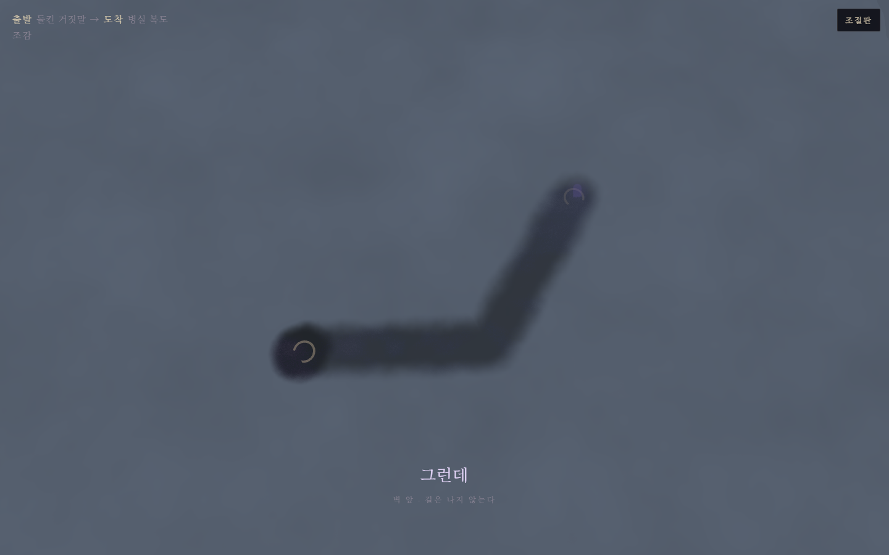 | 띠가 A 에서 오른쪽으로 갔다 위로 꺾여 B (bend +15.6). 0→2 와 비켜 나는 쪽이 반대로 갈림 |

### 4.3 정렬도 × echo_follow

| a | 캡처 | 관찰 |
|---|---|---|
| 0.9 | 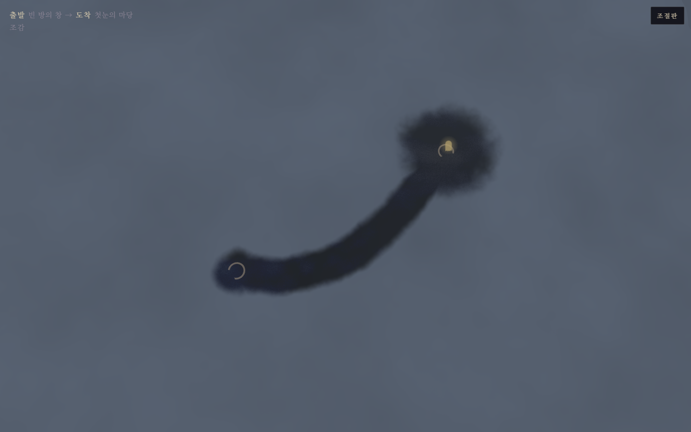 | 거의 직선, 살짝 볼록 |
| 0.5 | 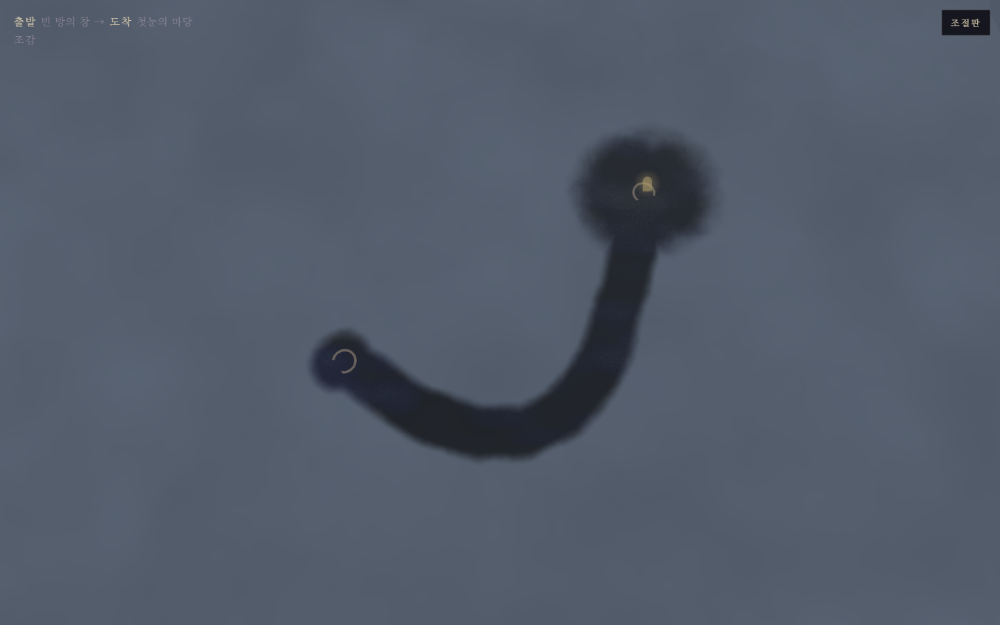 | 아래로 뚜렷하게 처진 활 |
| 0.2 | 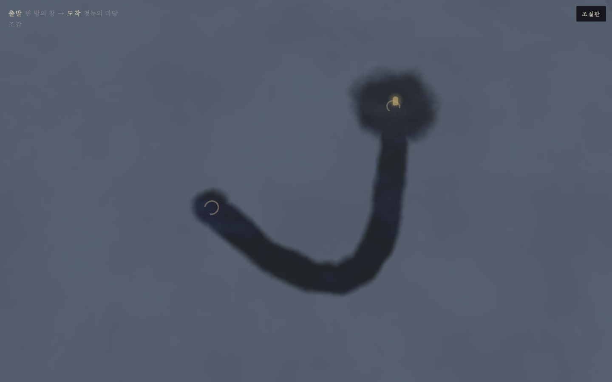 | 크게 처진 J자 활 — B 쪽 팔이 세로로 길게 선다. 세 장을 나란히 두면 정렬도가 낮을수록 길이·처짐이 커짐. 수리 전의 V자 꺾임은 사라짐 |

### 4.4 오염 발산 × bridge (결만 변화)

| d | 캡처 | 관찰 |
|---|---|---|
| 0 | 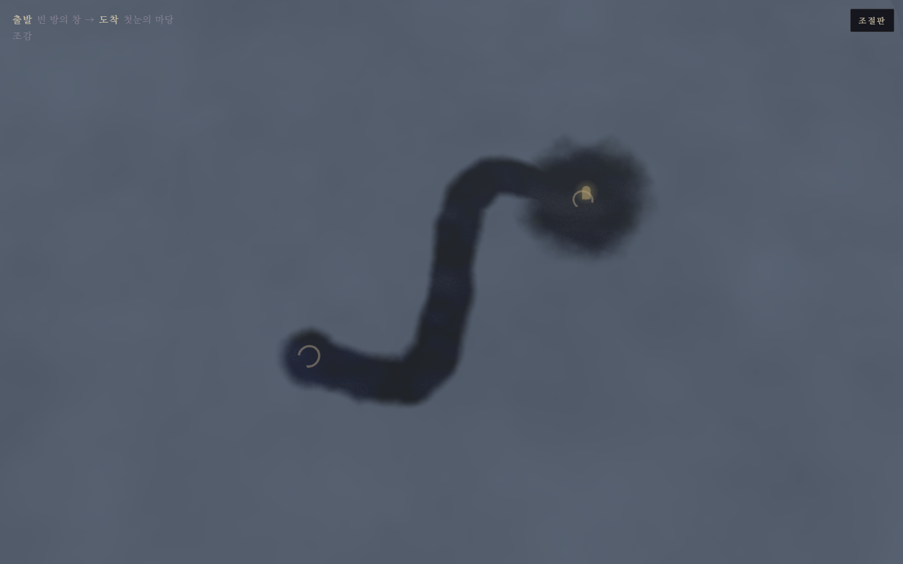 | 매끈한 S자. 가장자리 부드럽고 안개 벽 결 고름 |
| 0.9 | 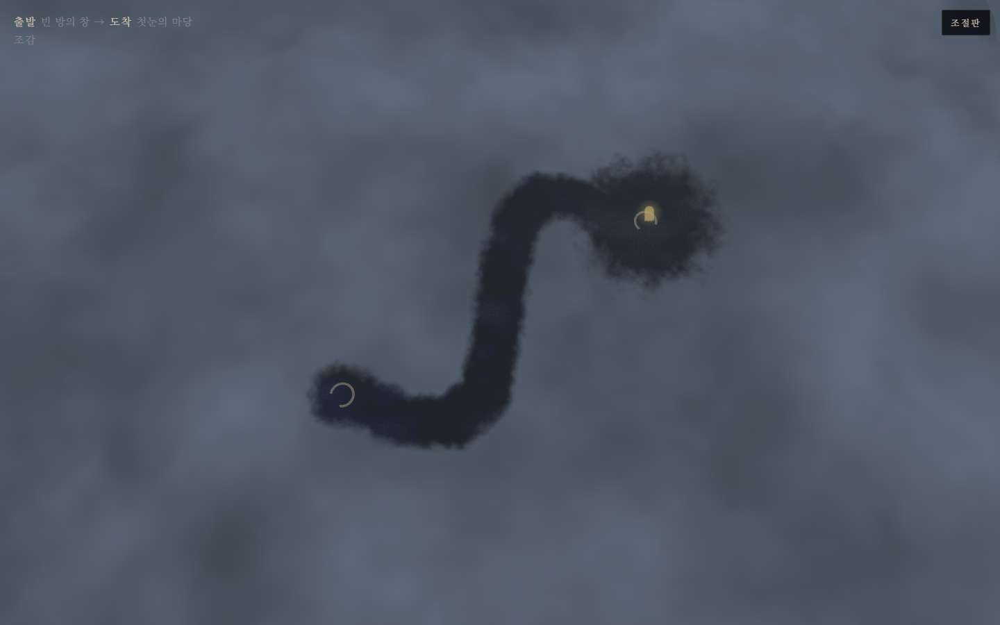 | 같은 S자인데 가장자리가 보풀처럼 너덜해지고 배경 안개 벽도 얼룩덜룩 거칠어짐. 수리 후엔 회랑 코어가 찢기지 않음(캡 덕) |

### 4.5 1인칭 (관객 화면)

| 조건 | 캡처 | 관찰 |
|---|---|---|
| bridge 입구 + 자막 (A 에 서서) | 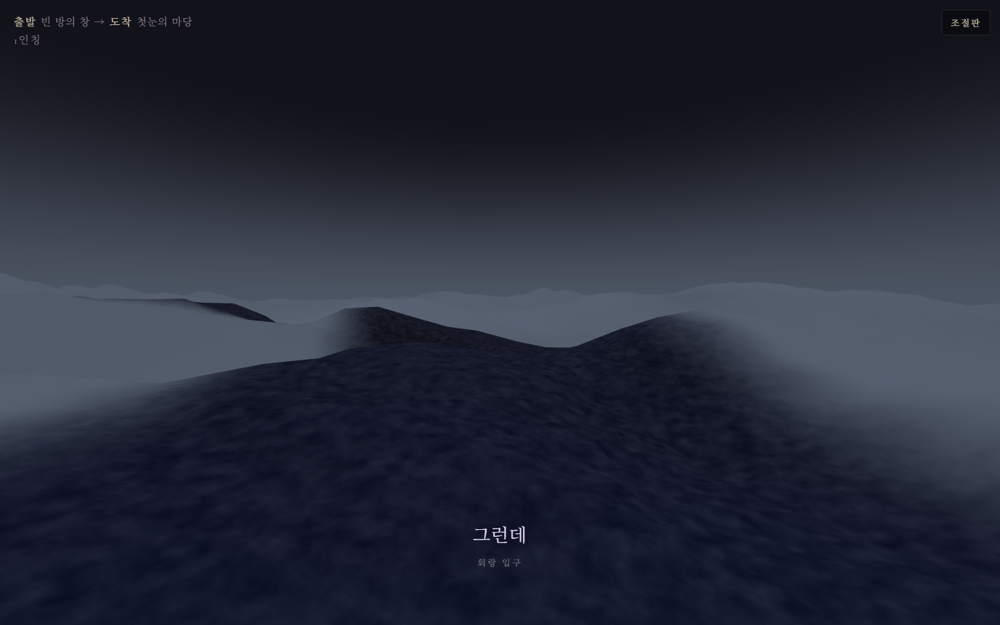 | 하단 큰 글자 "그런데" + 출처줄 "회랑 입구". 앞에 어두운 남색 언덕 두 개 사이 낮은 골, 그 너머 밝은 회색 안개 벽·안개색 지평선. 전체 지도·핀·패턴 이름 없음. 다만 회랑이 "앞으로 열린 길"보다 "언덕 사이 골 + 안개 벽"으로 보임. 좌상단 힌트에 도착 장면명이 떠 있음(§5 잔여) |
| echo_follow (첫 마디 안쪽 6, 다음 꼭짓점 응시) | 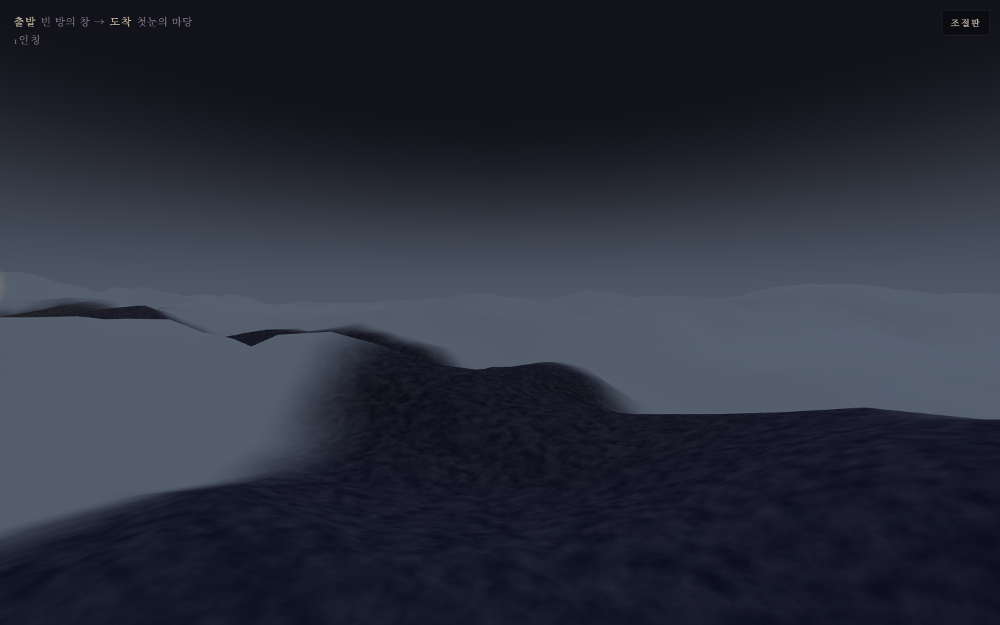 | 어두운 회랑 바닥이 앞으로 뻗다 **왼쪽으로** 휘고 양옆에 안개 벽. 화면 왼쪽 끝에 B 유령이 아주 작게 |
| bridge | 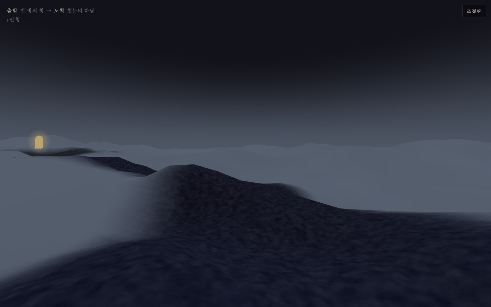 | 회랑 바닥이 앞으로 뻗다 **오른쪽으로** 휨. 왼쪽 지평선에 B 유령(개화 뒤라 보임). echo 와 휘는 쪽이 반대 |
| contradiction | 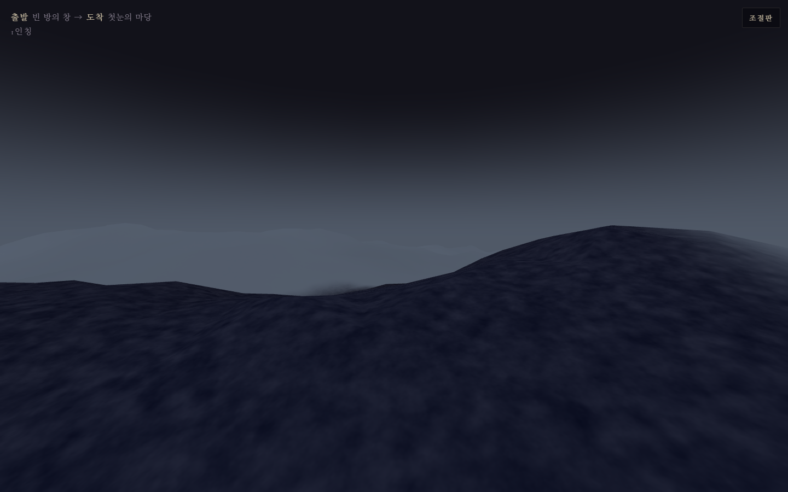 | 넓은 어두운 평지 + 왼쪽 지평선에 안개. 회랑 벽 윤곽이 없어 꺾이는 방향이 거의 안 보임(A 뒤로 넓게 파인 되돌림 구간 안에 서 있어서) |
| displacement | 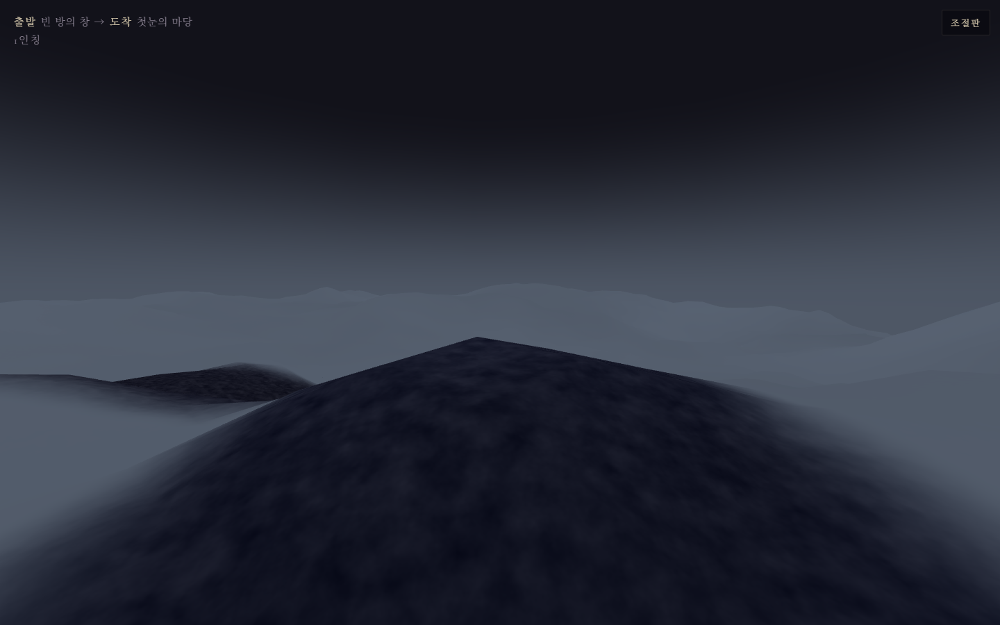 | 정면에 **좁은 능선 같은 목**이 앞으로 뻗고 양옆이 안개, 왼쪽 너머에 넓은 어두운 회랑이 보임 |
| avoidance | 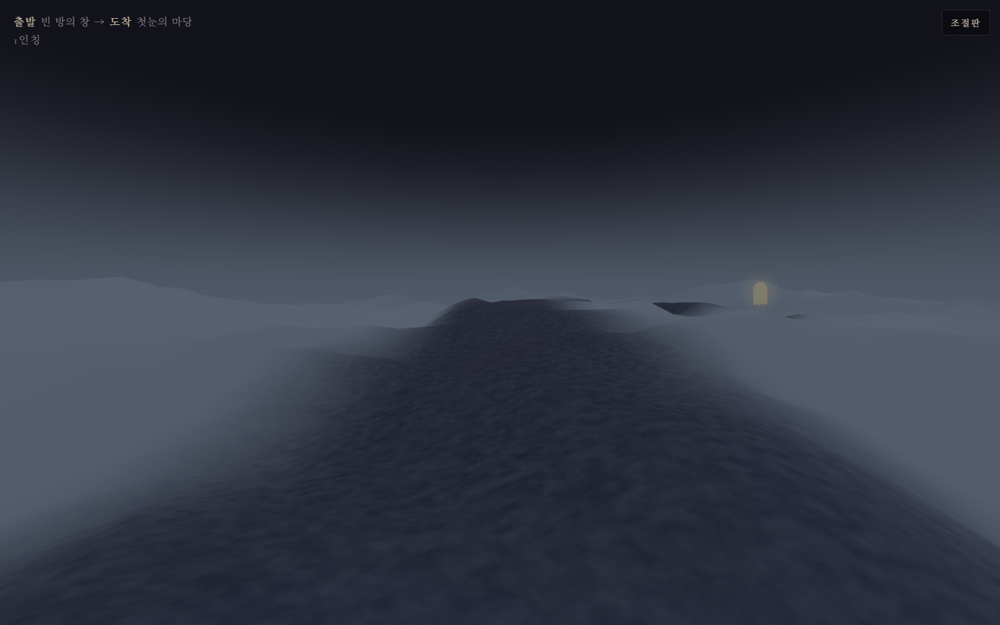 | 얇아진 안개 너머로 어두운 길 같은 띠가 앞으로 뻗고 오른쪽 지평선에 B 유령이 흐릿하게. **걸어갈 수 있는 길처럼 보이지만 실제로는 이동이 막힘** — 조감의 "못 가는 통로"가 1인칭에서는 "길로 보이는데 벽" 이 됨 |

## 5. 검토 결과 (세 렌즈)

세 검토자(원칙 렌즈 / 모션·가시성 렌즈 / 실측 렌즈)가 독립으로 봤고 셋 다 verdict = fix. 겹치는 지적은 합쳤다.

| # | 발견 | 심각도 | 처리 | 결과·잔여 |
|---|---|---|---|---|
| 1 | displacement 는 1인칭에서 회랑에 못 들어감 — 걷힘 원(9) + 반폭(5) < 옆으로 밀린 거리(16.7), 사이 벽에 막힘(실측 A 에서 8 단위에서 정지). 세 렌즈 모두 지적 | high | **수정** — A→A2 "목" 마디(반폭 w×0.55) 추가, 마디 3 | 156 걸음 막힘 0 으로 B 도달. 01-4·06-displacement 재촬영 |
| 2 | 마디 이어 파기가 튕김 — 700ms 간격이라 앞 마디 끝이 닿기 전 관절에 반폭 원이 "툭" 열림(정지 컷엔 안 보임) | high | **수정** — 간격 700 → 1400ms | 0.8/1.5/2.2초 컷에서 고립 원 없음. 총 소요 fixation 13마디 ≈ 18초로 길어짐 |
| 3 | contradiction 되돌림이 A 걷힘 원(9)에 삼켜져 "혹 달린 직선"으로만 보임(0→2 깊이 5 < 9) | high | **수정** — 되돌림 바닥 seedR + w + 1, seedR 9 → 6, (1−a) 항은 L* 로만 | 갈고리가 원 밖으로 8.6 나옴. **부작용: 세 쌍의 되돌림이 바닥값에 걸려 거의 같아짐**(§4.2) — 라벨 단독 증거는 avoidance 쌍·중간 불룩으로만 남음 |
| 4 | avoidance 가 라벨 단독 기하 — 어떤 쌍이든 같은 A→B 직선 띠, §6.5 #1 의 "void/neutral 방향"과도 다름 | medium | **수정** — 띠 A→K→B, K 는 델타 반대쪽, thinAmt·반폭에 mN | 0→2 bend −16.4 / 1→3 +15.6 으로 갈림. 02b 신규 2장 |
| 5 | B 유령·고리가 걷힘 0 이어도 바닥 불투명도 0.12/0.1 로 비쳐 목적지 위치가 샘(§6.5 #5) | medium | **수정** — 바닥 제거, opacity = max(revealAt(B), thinAmt×0.55) | fixation 0.000 (01-6 에서 점 사라짐), avoidance 0.28~0.35 (연출상 비침) |
| 6 | echo_follow 가 활이 아니라 V자로 읽힘(마디 5 + 봉우리 t≈0.32 쏠림), 정렬도 0.2 에서 가장 온순해야 할 패턴이 가장 큰 우회 | medium | **수정** — 마디 6 + round(4mN) (=9), 봉우리 0.5 ± 0.1·r2 | 03 세 장이 점점 처지는 활 하나로 읽힘. 길이 규칙은 그대로 정확 일치 |
| 7 | 발산 0.9 가장자리 일렁임이 반폭보다 커 회랑 코어가 찢기고(보이는 벽 ≠ 걷는 벽), 시간항 ≈1.7Hz 잔떨림 위험 | medium | **수정** — 곱을 min(0.5r, r·0.35·edgeAmp) 로 캡, 시간항 ÷ edgeAmp | 코어 안 찢김. 잔떨림 측정은 4/6 줄 0px·1줄 3px·1줄 측정 오류 — **완전 통과 아님**(§3) |
| 8 | 1인칭 캡처 1장뿐이라 패턴 간 1인칭 비교 불가, 회랑이 "골+안개 벽"으로 보임 | medium | **부분 수정** — 06 비교 세트 5장 신설, seedR 6 으로 입구 벽 노출 | echo/bridge 는 휘는 쪽이 반대로 보임. contradiction 은 방향 거의 안 보임. 05 의 "골+안개 벽" 인상은 그대로 |
| 9 | avoidance 띠가 6종 중 유일하게 놓칠 수 있는 명도(thinAmt 0.485) | medium | **수정** — thinAmt 하한 0.55 → 실측 0.718, 반폭 w×1.2 | 01-5 에서 배경보다 확실히 어두움. 1인칭에서는 오히려 "길처럼" 보임(§4.5) |
| 10 | 길이 규칙 "실측 일치"·"a≳0.85" 문구가 사실과 다름 — echo 만 일치, bridge 는 a≥0.52 불감, contradiction 은 상한 1.6 초과 | medium | **문서만 수정** — rules 머리 주석 §길이 에 유효 범위 명기. 코드는 안 고침(amp 최소 낮추면 S자가 죽음) | §2.2 표 그대로. 상태줄이 목표/실측 병기 |
| 11 | 입구 자막 시점 "회랑 60%" 가 실제로는 첫 마디 60%(960ms 고정, bridge 는 전체의 13%) | low | **문구 정정**만 | 코드 그대로(첫 마디가 열릴 때 = 입구) |
| 12 | 1인칭 힌트에 도착 장면명 상시 노출(회랑 열리기 전에도) | low | **미수정** | §7 잔여. 실험 편의 요소, 무대 이식 시 걷힘 뒤에만 |
| 13 | 반폭 하한이 문서(1.8)와 코드 마디별(1.5)에서 다름 | low | **주석에 명기** | §2.2 표에 병기 |
| 14 | 조감 구도 헐렁(회랑이 화면 폭 35%), 되돌림 깊은 쌍에서 지형 가장자리 노출 | low | **미수정** | 비교 세트는 같은 카메라라 상대 비교는 가능 |
| 15 | 비교 축 일부 캡처 없음 — 수준별 폭(HIGH/LOW/FIXATED), 이질 0.9 폭 얼룩, 동작 중간 프레임 | low | **부분** — 동작 프레임은 scratchpad 에만, 수준별·이질 컷은 안 찍음 | §7 잔여 |
| 16 | contradiction 1.6 상한 초과(HIGH 최소 형태 ×1.62) | low | **의도적 미수정** — "갈고리가 원 밖으로 w 이상"과 "상한 1.6·정렬도 반응"은 같은 A–B 거리(58)에서 양립 불가, 갈고리 가시성을 택함 | 상태줄에 정직 보고 |
| 17 | 안개 모듈 게이트로 유령을 숨기는 대안 | — | **채택 안 함** — 모듈 게이트는 스프라이트 opacity 를 안 만짐 | 페이지에서 revealAt 직접 곱 |

## 6. 사용자 판정 — 세 질문

캡처(또는 페이지를 직접 열어 조절판으로 바꿔 가며)를 보고 답한다. 조감은 검토용이고 관객이 보는 건 1인칭(§4.5)이다.

1. **조감에서 패턴 6종이 설명 없이 서로 갈리는가, 그리고 같은 라벨(contradiction·avoidance)이 쌍에 따라 다르게 보이는가?** — §4.1 여섯 장 + §4.2 다섯 장. 특히 contradiction 세 쌍은 수리 후 되돌림이 거의 같아졌다(§4.2).
2. **1인칭에서 회랑이 "길"로 읽히는가, "언덕 사이 골"로 읽히는가? 그리고 echo(왼쪽)·bridge(오른쪽)의 휘는 쪽 차이가 관객 자리에서 보이는가?** — §4.5 여섯 장. contradiction 은 방향이 거의 안 보이는 상태다.
3. **avoidance 를 "보이지만 못 가는 통로"로 둘 것인가?** — 1인칭(06-avoidance)에서는 걸어갈 수 있는 길처럼 보이는데 이동은 막힌다. 그대로 두면 §6.5 #4(막힐 땐 서사로 감싸기)의 자막 "벽 앞 · 길은 나지 않는다"에 기대게 된다.

| 답 | 다음 |
|---|---|
| 1 아니오 (6종이 안 갈림) | 규칙 파일의 진폭·마디·되돌림 값을 키워 재촬영. 무대 이식 안 감 |
| 1 예 + contradiction 쌍 차이 부족 | 되돌림 바닥을 유지한 채 bend·중간 불룩에 side·r2 를 더 크게 태워 재촬영(§5 #3 부작용 해소). 여전히 실험 페이지 안 |
| 2 골로 보임 | 무대 이식 전에 1인칭 눈높이·안개 벽 대비(우 sky 색 vs 지형)·회랑 벽 셰이딩을 실험 페이지에서 먼저 손봄. 본 코드 안 건드림 |
| 2 길로 보임 + 휘는 쪽 보임 | 무대 이식 설계로 — 단 §7 의 본 코드 수정 항목(셰이더 uniform·호출부 반폭·마디 순차 carve)이 전제. 최소판 = 마디 순차 carve 만(결·얇아짐 없이) |
| 3 그대로 | avoidance 1인칭 띠 명도를 낮추거나(길처럼 안 보이게) 자막 출처줄을 강화. 이동 벽은 유지 |
| 3 바꿈 | avoidance 를 "아주 좁은 회랑(FIXATED 폭)으로 실제로 열되 개화 없음"으로 재정의 → 규칙 파일만 수정 |

## 7. 알려진 한계 · 본 코드 수정이 필요한 항목

**실험 자체의 한계**
- 장면 프리셋 5는 가상 17축 벡터. 실제 별이엔진 출력(패턴·정렬도·오염)은 안 불렀다 — 사람이 조절판으로 고른다. 실 DB 씬으로 돌리면 mN·r2 분포가 다를 수 있다.
- 길이 규칙 L* 는 echo_follow 에만 정확히 성립한다(§2.2). bridge·contradiction 은 형태상 최소 길이가 있어 정렬도가 높을 때 길이가 정렬도에 반응하지 않는다. contradiction HIGH 는 상한 1.6 을 넘는다(×1.62).
- contradiction 세 쌍의 되돌림이 바닥값에 걸려 거의 같다(§4.2·§5 #3). "같은 라벨 다른 기하"는 현재 avoidance 쌍과 contradiction 중간 불룩에서만 성립.
- 1인칭에서 contradiction 은 꺾이는 방향이 거의 안 보이고, 05 입구 컷은 "언덕 사이 골"로 보인다. 카메라 높이·안개 벽 대비 재검토는 미착수.
- avoidance 1인칭은 "길처럼 보이는데 막힘"(§4.5). 의도("소리만 있는 통로")와 관객 경험이 어긋날 수 있다.
- 1인칭 힌트에 도착 장면명이 회랑 열리기 전에도 떠 있다(실험 편의, 관객 화면 기준으로는 정보 노출).
- 발산 0.9 잔떨림 <2px 은 6줄 중 4줄에서만 확인, 1줄 3px, 1줄 측정 오류. 더 정밀한 측정은 안 했다.
- 수준별 폭(HIGH/LOW/FIXATED)·이질 0.9 폭 얼룩 캡처는 없다(실측 수치만 §2.2). 동작 중간 프레임(0.8/1.5/2.2초)은 scratchpad 에만 있고 문서 폴더에 없다.
- 조감 자동 프레이밍이 헐렁하고 되돌림 깊은 쌍(a≤0.7)에서 지형 가장자리(밝은 띠)가 보인다.
- 헤드리스 SwiftShader 렌더라 실제 GPU 화면과 밝기가 다를 수 있다. 판정은 가능하면 페이지를 직접 열어서.

**무대(본 코드)로 옮기려면 수정이 필요한 것** — 이번 실험은 전부 페이지 안에서 해결했고 본 코드는 0줄
- 결 uniform(가장자리 일렁임 배수·주파수·벽 결·이질 얼룩·벽 얇아짐)은 페이지 셰이더 전용 — 본 지형 셰이더(`js/shared/tem_af_strata_terrain.js` `_sfPatchShader`)에 같은 uniform 이 없다.
- avoidance 의 방향성 있는 벽 얇아짐 — 안개 모듈 `setOptions.wallStrength` 는 전역이라 페이지 셰이더(`_t1Thin*`)로 구현했다. 이동 벽은 모듈 revealAt 기준이라 그대로 막힌다.
- 마디별 폭은 carve 직전 `setOptions({corridorRadius})` 로 바꾸는 방식 — 모듈 API 로 가능하지만 `play-test.html` 의 회랑 호출부는 고정 5 를 쓰므로 호출부 수정 필요.
- 마디 순차 carve(1.4초 간격)·B 개화 지연 — 현행 무대는 회랑 1개 직선 + 즉시 개화라 호출부에 순차 로직이 필요.
- 발산이 키운 가장자리 일렁임은 셰이더에만 있고 모듈 revealAt(이동 벽·유령 게이트)에는 노이즈가 없어 보이는 경계와 막히는 벽이 어긋난다 — 무대는 절제값 유지 권장.
- 출발 걷힘 반경 6 은 실험값. 무대 입장 반경 14 에서는 contradiction 되돌림 바닥(seedR + w + 1 = 20)이 더 커져 길이 배율이 더 오른다.
- 연결사 8종은 `lumen_dialog_phase1.js` 가 export 하지 않아 소스를 fetch 해 정규식으로 읽었다. 무대에서는 정식 export 또는 공용 상수로 빼야 한다.

## 8. 파일 목록 · 롤백

| 구분 | 경로 |
|---|---|
| 신규 | `test/corridor-t1-test.html` (실험 페이지) |
| 신규 | `test/corridor-t1-rules.js` (회랑 기하 규칙, 순수 함수) |
| 신규 | `docs/통로_T1_스크린샷/` (png 22 — 조감 16 + 1인칭 6) |
| 신규 | 이 문서 |
| 미수정 | 본 코드 전부(`js/**`, `play-test.html`, `index.html`, `supabase/**`, `tools/**`). 안개 모듈 0줄 |
| 임시(저장소 밖) | scratchpad `t1_capture.mjs` · `t1_fix_capture.mjs` · `t1_review_probe.mjs` · `t1_jitter.mjs` · 결과 JSON · 동작 프레임 png — 세션 종료 시 사라져도 무방 |

롤백 = 위 신규 파일 4묶음 삭제. 다른 파일에 포인터 없음.
